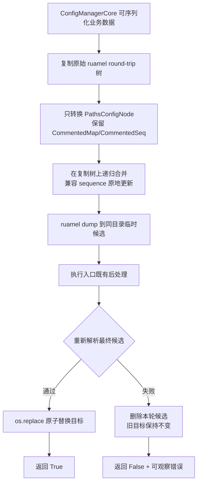
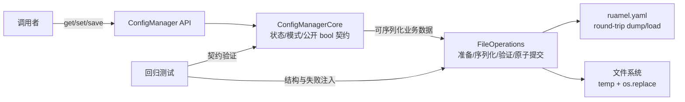
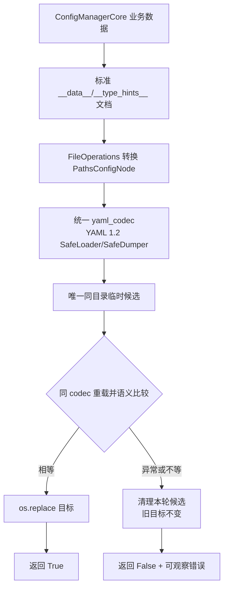
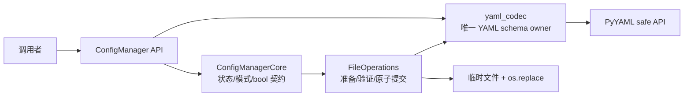

# S1-03 方案决策

## 1. 元信息

| 字段 | 值 |
|---|---|
| Issue / Sprint | `S1-03` / `Sprint01` |
| 来源 | `S1-03_原始需求.md`、已确认 `S1-03_系统诊断.md`、`S1-03_处理记录.md` |
| 登记分类 | `BUG` |
| Session ID | `01a01273-82c8-7e83-a59f-68b289665510` |
| `stage_target` | `issue_worktree / branch=S1-03 / base_commit=1bccbfc12d780595fe85d2d95bb12922997b1263` |
| Issue worktree | `D:\Tony\Documents\invest2025\project\config_manager\.worktrees\S1-03` |
| `target_head` | `3c6f400d0809ee07fde853bd7c1e2f199500be0a` |
| 准入 Sprint HEAD | `1bccbfc12d780595fe85d2d95bb12922997b1263` |
| 当前发布基线 | `master@1ec06a0c74bce9f6039153f6f09e22f3f7e3cc19` |
| 当前产物版本 | `solution-v8-review` |
| 决策状态 | `in_progress / internal_review` |
| 执行模式 | 修改/构建/提交；批准前仅写 Issue worktree 的方案、ADR 草案、治理记录和已授权 Git 索引项，不修改产品代码 |

### confirmation_goal_history

Goal 工具以同一 thread ID 承载连续确认段，以下本地段号保持时序可审计。

| 段 | `goal_id` | objective | `input_locator` | `stage_target` / `target_head` | 结果 |
|---|---|---|---|---|---|
| CG-01 | `01a01273-82c8-7e83-a59f-68b289665510/CG-01` | 复现并定位 S1-03 原始 BUG，形成系统诊断 | `S1-03_原始需求.md` | `S1-03@1bccbfc1` | 诊断取证完成 |
| CG-02 | `01a01273-82c8-7e83-a59f-68b289665510/CG-02` | 消费用户对 `diag-v1` 的确认并处理新增缓存治理输入 | `S1-03_处理记录.md#2026-08-18-时序-3` | `S1-03@1bccbfc1` | 诊断确认；缓存治理转精确范围门禁 |
| CG-03 | `01a01273-82c8-7e83-a59f-68b289665510/CG-03` | 核验全局 ignore、目标范围和破坏性操作安全边界 | `S1-03_处理记录.md#2026-08-18-时序-4` | `S1-03@1bccbfc1` | 7 目录/102 索引项范围冻结 |
| CG-04 | `01a01273-82c8-7e83-a59f-68b289665510/CG-04` | 消费时序 5 授权并推进完整方案到对抗式审查入口 | `S1-03_处理记录.md#2026-08-18-时序-5` | `S1-03@1bccbfc1` | complete；索引移除、v1 候选与 ADR 草案形成 |
| CG-05 | `01a01273-82c8-7e83-a59f-68b289665510/CG-05` | 只读审查 `solution-v1-draft` 的 AR-01..18、SDR-01..05 和防回归范围 | `S1-03_处理记录.md#2026-08-18-时序-8` | `S1-03@1bccbfc1` | complete；`changes_required`，完整 F-01..04 |
| CG-06 | `01a01273-82c8-7e83-a59f-68b289665510/CG-06` | 一次性纠正 F-01..04 并形成新版本 | `S1-03_处理记录.md#2026-08-18-时序-8` | `S1-03@1bccbfc1` | complete at freeze；形成 `solution-v2-review` |
| CG-07 | `01a01273-82c8-7e83-a59f-68b289665510/CG-07` | 只读全量复审 `solution-v2-review` 的完整方案、ADR、范围和防回归闭环 | `S1-03_处理记录.md#2026-08-18-时序-9` | `S1-03@1bccbfc1` | complete；R1 finding 全关闭，新增完整 F-05 |
| CG-08 | `01a01273-82c8-7e83-a59f-68b289665510/CG-08` | 补齐 auto-create 保留基线并形成新版本 | `S1-03_处理记录.md#2026-08-18-时序-9` | `S1-03@1bccbfc1` | complete at freeze；形成 `solution-v3-review` |
| CG-09 | `01a01273-82c8-7e83-a59f-68b289665510/CG-09` | 只读全量复审 `solution-v3-review` 的完整方案、ADR、范围和防回归闭环 | 本文 `solution-v3-review` | `S1-03@1bccbfc1` | complete；`finding_set=[]`、`pass_eligible=true` |
| CG-10 | `01a01273-82c8-7e83-a59f-68b289665510/CG-10` | 写回 v3 审查 pass 并准备唯一整体批准收据 | 本文 `## 11. 最终批准` | `S1-03@1bccbfc1` | complete at display；收据 awaiting_user |
| CG-11 | `01a01273-82c8-7e83-a59f-68b289665510/CG-11` | 消费并验证唯一批准回执，执行批准后 ADR、状态、提交与发布闭环 | `S1-03_处理记录.md#2026-08-18-时序-11` | `S1-03@1bccbfc1` | v3 批准/ADR/Sprint 投影写回完成；结果提交纠正为 `5ef189d`；发布同步发现 Sprint01 并发冲突，v3 发布批准与旧自检失效 |
| CG-12 | `01a01273-82c8-7e83-a59f-68b289665510/CG-12` | 澄清并发 Sprint 状态的唯一正确组合与恢复基线 | `S1-03_处理记录.md#2026-08-18-时序-17` | `S1-03@5ef189d` / `master@bf3bbdf` | complete；用户确认保留 S1-02“实施中”并叠加 S1-03“方案已决策” |
| CG-13 | `01a01273-82c8-7e83-a59f-68b289665510/CG-13` | 按确认口径同步并形成 `solution-v4-review`，完成首轮全量审查 | clarification-v3 / 时序 17 | `S1-03@3c6f400` | complete；唯一 Sprint 冲突已解决；R1=`changes_required`，完整 finding 仅 F-V4-01 |
| CG-14 | `01a01273-82c8-7e83-a59f-68b289665510/CG-14` | 一次性纠正 F-V4-01，形成 `solution-v5-review` 并执行同谱系第二轮只读复评 | 本文 v4 R1 finding set | `S1-03@3c6f400` | complete；R2 全量复评 pass，复评越界门禁 contained，`finding_set=[]` |
| CG-15 | `01a01273-82c8-7e83-a59f-68b289665510/CG-15` | 写回 v5 R2 pass 并生成整体批准帧 | 本文 v5 R2 结果 / 时序 19 | `S1-03@3c6f400` | complete at display；后续严格消费发现 frame19 格式及 sequence 不符合 workflow 6.1，已失效且未消费 |
| CG-16 | `01a01273-82c8-7e83-a59f-68b289665510/CG-16` | 校验时序 20 回复并在旧帧无效时生成唯一合规批准帧 | `S1-03_处理记录.md#2026-08-18-时序-20` | `S1-03@3c6f400` | complete at display；frame16=`awaiting_user`，批准对象与 v5 R2 pass 内容不变 |
| CG-17 | `01a01273-82c8-7e83-a59f-68b289665510/CG-17` | 消费 frame16 的时序 22 严格回复并推进批准后写回、限定提交与发布闭环 | `S1-03_处理记录.md#2026-08-18-时序-22` | `S1-03@3c6f400` / `master@bf3bbdf` | terminal plan v2 在提交前因 Sprint HEAD 漂移失效；零提交、零暂存、零缓存索引改写，转 clarification-v4 |
| CG-18 | `01a01273-82c8-7e83-a59f-68b289665510/CG-18` | 消费 clarification-v4 的时序 28 选择，按最新 Sprint 真源重建完整方案候选 | `S1-03_处理记录.md#2026-08-18-时序-28` | `S1-03@3c6f400` / `master@adc17875` | complete at freeze；保留 S1-02“待验收”并形成 `solution-v6-review`，尚未整体批准 |
| CG-19 | `01a01273-82c8-7e83-a59f-68b289665510/CG-19` | 完成 v6 R1、唯一整改、v7 非重叠基线重绑与同谱系 R2 全量复评 | `S1-03_处理记录.md#2026-08-18-时序-30..32` | `S1-03@3c6f400` / `master@1ec06a0` | complete；F-V6-01/02 关闭，R2 `finding_set=[]`、`pass_eligible=true`、`review_gate=contained` |
| CG-20 | `01a01273-82c8-7e83-a59f-68b289665510/CG-20` | 写回 v7 R2 pass 并生成唯一完整方案批准帧 | 本文 v7 R2 结果 / 时序 32 | `S1-03@3c6f400` / `master@1ec06a0` | complete at display；frame20=`awaiting_user`，未执行批准后动作 |
| CG-21 | `01a01273-82c8-7e83-a59f-68b289665510/CG-21` | 校验时序 34 回复并在非紧邻完整批准帧时生成新批准帧 | `S1-03_处理记录.md#2026-08-18-时序-34..35` | `S1-03@3c6f400` / `master@1ec06a0` | complete at display；frame20 因回复邻接失败而失效，frame21=`awaiting_user`，方案对象不变 |
| CG-22 | `01a01273-82c8-7e83-a59f-68b289665510/CG-22` | 消费时序 36 的复杂度与不用 ruamel 输入，查明兼容事实并推进到唯一需求口径问题 | `S1-03_处理记录.md#2026-08-18-时序-36..37` | `S1-03@3c6f400` / `master@1ec06a0` | complete at question；frame21 因约束变化失效，clarification-v5/Q1=`awaiting_user` |
| CG-23 | `01a01273-82c8-7e83-a59f-68b289665510/CG-23` | 消费时序 38，形成 PyYAML 简化候选并完成首轮内联审查，生成唯一完整方案批准帧 | 本文 `## 14. solution-v8 当前候选` / 时序 38 | `S1-03@3c6f400` / `master@1ec06a0` | complete at display；R1 `finding_set=[]`，frame23=`awaiting_user`，未执行批准后动作 |
| CG-24 | `01a01273-82c8-7e83-a59f-68b289665510/CG-24` | 消费时序 40 的继续指令，恢复正确 v8 Goal 并在 frame23 未能原子消费后换发同方案批准帧 | `S1-03_处理记录.md#2026-08-18-时序-39..40` | `S1-03@3c6f400` / `master@1ec06a0` | complete at display；方案/R1/集合无漂移，frame23 时序失效，frame24=`awaiting_user` |
| CG-25 | `01a01273-82c8-7e83-a59f-68b289665510/CG-25` | 消费 frame24 的时序 41 严格回复并推进批准后写回、限定提交、Sprint 发布与 handoff | `S1-03_处理记录.md#2026-08-18-时序-41` | `S1-03@3c6f400` / `master@1ec06a0` | active；frame24 回执已通过门禁，进入 approval_final/writeback |

当前恢复确认段绑定：旧 v3 Goal 已终止；CG-24 成功换发同方案 frame24 并完成。CG-25 精确绑定 `solution-v8-review / frame24 / 时序41 / S1-03@3c6f400 / master@1ec06a0`；严格回执门禁已通过，批准后动作只能按“ADR final -> 检查单/总结/Sprint 投影 -> Issue 限定提交 -> Sprint 发布 -> handoff”顺序执行。

## 2. 分类输入

### BUG 系统诊断

- 诊断版本/状态：`diag-v1 / confirmed_by_user`。
- 诊断定位：`S1-03_系统诊断.md#结论`、`#首次偏离与数据流`、`#证据链`。
- 第一次用户确认：`S1-03_处理记录.md#2026-08-18-时序-3`；用户原话为 `2，pyc pycache应该从git跟踪移除，因为 ~/.gitignore_global忽略`。
- 冻结失败签名：合法 YAML 经 `set(..., autosave=False) -> save()` 后，`save()` 返回 `True`，文件却出现 `key:   -` 或 `key: &id...   -`，parser 报 `sequence entries are not allowed here`。
- 已确认根因：`CommentedSeq` 被无差别重建为普通 `list`；顶层浅拷贝与嵌套原地合并污染 `_original_yaml_data`，留下普通 list 与父键 sequence 注释元数据的不一致状态；最终候选未经解析就替换目标。

### 用户补充输入

- 用户要求仓库不再跟踪由 `C:\Users\Tony\.gitignore_global` 已覆盖的 `.pyc`/`__pycache__`。
- 时序 5 已明确授权 7 个目标目录的 102 个索引移除；时序 6 已验证 Issue 索引删除 102、范围外 0、跟踪项 0、磁盘缓存保留、项目 `.gitignore` 未修改。后续时序 26 核验根目录和 7 个缓存父目录带 Microsoft directory reparse tag `0x9000601a`，但不是 symlink/junction，规范化路径仍位于同一仓库边界；不得再表述为“非 reparse”。
- 此项是已授权仓库治理，不替代产品 BUG 修复，也不改变产品运行行为。

## 3. 需求与事实

### 目标

1. 合法 YAML 在标准/raw、test/non-test 路径中保存后保持可解析，现有和更新后的 sequence 值正确。
2. 按时序 38 只保证 ConfigManager 可观察的数据语义；注释、样式、锚点/别名和排版允许规范化或丢失。
3. `save() == True` 必须对应已经可重新加载的目标文件；非法候选不得覆盖旧目标。
4. 只在配置库的 `FileOperations` 持久化边界修复，不向消费项目或业务键扩散补丁。
5. 提交已授权的 102 个缓存索引删除项，磁盘缓存仍由全局 ignore 管理。

### 已核验事实

- Python `3.12.9`、ruamel.yaml `0.19.1`、PyYAML `6.0.3`；产品从 S1-03 worktree 导入。PyYAML 已被源码直接使用但未在项目依赖中声明。
- 标准/raw、`test_mode=True/False`、更新/未更新 commented sequence 均复现；普通 sequence 为负对照。
- `02_minimal_output.txt` 证明普通 list 替换会失败，而 sequence 原地更新对照可解析：`in_place_control_valid=True`。
- 重复键文本后处理不是首个偏离点；后处理前已非法，前后文本不变。
- 现有 comment-preservation 测试缺少触发布局，且只查字符串，不重新解析保存产物。
- 现有架构把 YAML 加载/保存和文件安全归给 `FileOperations`；公开 `save()` 使用布尔结果。

### 重大决策

- v7 曾选定“round-trip 根因修复 + 最终候选解析门禁 + 原子替换”，但未消费批准，并已被时序 36 的复杂度/ruamel 约束变化失效。
- solution-v8 选定“集中式 PyYAML YAML 1.2 安全编解码 + 标准数据文档直接输出 + 同 codec 重载比对 + 原子替换”；不再复制、合并或修复 ruamel round-trip 树。
- `save()==True` 仍只对应可重新加载且值正确的目标；非法候选不得覆盖旧文件；不按业务键特判；公开 API 不变。
- 整个包、直接依赖和仓库测试移除 ruamel；raw 输入仍可加载，首次保存允许规范化为标准 `__data__/__type_hints__` 包络。

### 未解决项

- 业务未知项：无；clarification-v5/Q1 已由时序 38 解决。
- 技术阻塞项：无；PyYAML 兼容 resolver、数据往返、安全标签拒绝和失败不覆盖已由 `技术验证/validate_pyyaml_20260818/验证报告.md` 证实。

### 历史章节边界

以下第 4..12 节保留 `solution-v7-review` 的历史候选、审查、批准和下游证据，供比较与防回归使用；它们不再是当前选定方案。当前唯一候选与控制面位于 `## 14. solution-v8 当前候选`；任何冲突以第 14 节为准。

## 4. 业务流程

### 目标流程

```text
调用者修改配置
  -> 调用 save()
  -> 配置库生成并验证 YAML 候选
     -> 合法：原子替换目标，返回 True，调用者可重新加载同值配置
     -> 非法/写入失败：旧目标保持不变，返回 False，并输出可观察错误
```

### business_flow_change_set

| `change_id` | 角色/触发 | 变更前 | 变更后 | 主路径、边界与失败路径 | 业务输出/可观察验收 |
|---|---|---|---|---|---|
| BF-01 | 配置库调用者调用 `save()` | 返回 `True` 可能对应不可解析文件 | `True` 只对应已通过 parser 的目标文件 | 主路径仍为修改后保存；standard/raw 与 test/non-test 同边界；候选非法走失败路径且不覆盖旧文件 | 成功后重新加载和值比对通过；失败时返回 `False`、旧文件字节不变 |
| BF-02 | 仓库维护者运行 Git 工作流 | 缓存文件虽被全局忽略仍已跟踪 | 102 个历史缓存项不再进入后续差异 | 仅索引删除；磁盘和项目 `.gitignore` 不变 | `git ls-files` 对 7 个目录返回 0；代表磁盘文件仍存在 |

## 5. 数据流程

### 数据流程图



### data_flow_change_set

| `change_id` | 数据身份/来源/owner | 输入 -> 转换 -> 输出 | 流向与顺序变化 | 边界、用途、失败恢复 | 关联 ADR/图定位 |
|---|---|---|---|---|---|
| DF-01 | ruamel round-trip 树；来源为加载结果；owner=`FileOperations` | `_original_yaml_data` + 当前业务值 -> 独立深快照、保真转换、递归合并 -> 待 dump 树 | 从“浅拷贝并污染共享嵌套对象”改为“独立树内合并”；兼容 sequence 保持容器身份 | 不跨 `FileOperations`；用于注释/值保真；异常丢弃快照 | `ADR-002`；本节数据流程图 B-D |
| DF-02 | 最终 YAML 候选；来源为 dump+既有后处理；owner=`FileOperations` | 临时候选 -> parser 重新加载 -> 已验证候选 | 在 `os.replace` 前新增强制门禁 | parser 失败时删除候选、旧目标不变、返回失败 | `ADR-002`；本节数据流程图 E-K |
| DF-03 | Git 缓存索引项；来源为仓库 index；owner=Git/仓库治理 | 102 个 tracked `.pyc` -> index removal -> untracked+globally ignored | 不进入产品数据流；已完成 | 仅 7 个已核验目录；磁盘保留；范围外 0 | `S1-03_处理记录.md#2026-08-18-时序-4..6` |

### 数据约束

- `_original_yaml_data` 在一次保存准备过程中只读；合并仅作用于独立快照。
- `CommentedMap`、`CommentedSeq` 和其注释/anchor 元数据不得因 `PathsConfigNode` 转换被无差别降级。
- parser 必须读取所有后处理完成后的最终候选；验证内存对象或前处理文本均不构成提交门禁。
- 主配置成功后可选备份失败不回滚主配置；本次不新增备份 parser 门禁或备份文件行为。
- 只清理本轮可确认创建的临时文件，不删除无法确认归属的文件。

## 6. 系统与技术

### 系统架构图



### module_change_set

| `change_id` | 系统边界/模块/owner | 类型 | 变更前职责/接口/依赖 | 变更后职责/接口/依赖 | 业务影响 | 关联 ADR/图定位 |
|---|---|---|---|---|---|---|
| MC-01 | `src/config_manager/core/file_operations.py` / `FileOperations` | 修改 | 保存准备可能降级 ruamel 容器并污染原始树；最终候选直接 replace | 保真复制与合并；最终候选解析后才能 replace；仍返回 bool | 解决合法 sequence 保存损坏并建立失败安全 | `ADR-001`；系统图 FO |
| MC-02 | `ConfigManagerCore` | 接口不变 | 组装业务数据并调用文件层 | 完全不变；不新增 ruamel 细节 | 调用者无需迁移 | `ADR-001`；系统图 CORE |
| MC-03 | `tests/test_yaml_comments_preservation.py` 及必要的 FileOperations 单元测试 | 修改/新增测试 | 只查部分字符串，缺少重新解析、重复保存和失败安全 | 覆盖标准/raw、test/non-test、更新/未更新/普通 sequence、解析与失败不覆盖 | 防止同类回归 | `ADR-001/002`；系统图 TEST |

依赖方向保持 `调用者 -> ConfigManagerCore -> FileOperations -> ruamel.yaml/os`；无反向依赖、无新共享可变状态、无跨模块公开接口变化。

### technology_choice_set

| `choice_id` | 业务能力 | 候选技术/选定项 | 验证与兼容性 | 成本、性能/安全、运维 | 迁移/退出 |
|---|---|---|---|---|---|
| TC-01 | YAML 注释保真与候选解析 | 沿用 ruamel.yaml `0.19.1`；不引入新库 | 现有运行环境和复现资产已验证 round-trip/parser 能力 | 每次保存新增深复制和解析，各为 `O(n)`；换取旧文件不被非法候选覆盖；无新增运维组件 | 无迁移；若未来替换 YAML 库需独立架构决策 |
| TC-02 | 原子文件替换 | 沿用同目录临时文件 + `os.replace` | 当前代码和 Windows/Python 标准库契约已在用 | 不增加外部依赖；异常路径需清理本轮临时文件 | 无迁移；退出需另行定义跨平台提交机制 |

### 系统边界、职责和接口

- 系统内：`ConfigManagerCore`、`FileOperations`、ruamel.yaml 与配置文件。
- 系统外：消费项目的业务键、具体配置内容和调用者；它们只观察 `save()` 结果与文件内容。
- 接口不变：`ConfigManagerCore.save() -> bool`、`FileOperations.save_config*() -> bool`。
- 新增的是文件层内部不变量和必要私有辅助函数，不新增公共类、参数或配置项。

## 7. 综合分析

### 候选可行性

| 候选 | 根因修复 | 成功/可解析一致 | 注释兼容 | 失败安全 | 成本 | 结论 |
|---|---:|---:|---:|---:|---|---|
| A. 保真复制/合并 + 最终候选解析门禁 + 原子替换 | 是 | 是 | 是 | 是 | 每次保存额外 `O(n)` 复制与解析 | **唯一完整可行，选定** |
| B. 只修复 ruamel sequence 合并 | 是 | 否 | 是 | 否 | 最小 | 排除：仍允许其他非法候选成功覆盖 |
| C. 只增加 parser 门禁 | 否 | 是（失败返回） | 不解决正常保存 | 是 | 小 | 排除：把损坏降级为失败，未恢复功能 |
| D. 全部转普通 dict/list | 表面规避 | 是 | 否 | 部分 | 小 | 排除：回退注释保留承诺 |

`zero_decision_preflight`：候选 A 的技术前提、职责、成本和验收均可定位；不存在 `fail|unknown` 主张，也不存在需要用户补充才能形成候选的空缺。

### 选定方案

1. 在 `_prepare_data_for_save` 入口把 `_original_yaml_data` 深复制为独立 round-trip 树；不再用顶层 `.copy()` 共享嵌套节点。
2. 收窄 `_convert_paths_config_nodes`：只转换真实 `PathsConfigNode`，递归时保留 ruamel 容器的具体类型和注释元数据；普通容器保持原语义。
3. 调整递归合并：mapping 递归，兼容 sequence 在目标容器内更新并返回目标容器；禁止把普通 list 直接赋给带 sequence 注释的父键。
4. 在 `save_config` 的主配置目标和初始化使用的 `save_config_only` 中，把“dump -> 该入口既有后处理 -> parser 验证 -> replace”作为提交顺序。验证失败沿用 bool 失败语义，旧主配置不变并清理本轮临时候选。
5. 可选备份及 `create_backup_only` 不新增 parser 门禁；保持并回归保护现有 best-effort 语义：主文件成功后，备份失败单独报告且不把主结果改为失败。
6. 用契约测试覆盖重复保存、解析、值、注释、容器类型和失败不覆盖；现有公共 API 与依赖声明不变。

### decision_validations

| `validation_id` | 会改变选择的主张 | 证据/最小验证 | 实际结果 | 结论与影响 |
|---|---|---|---|---|
| DV-01 | 根因在 FileOperations 的容器降级与共享树污染 | `S1-03_系统诊断.md#结论`、`04_manager_pipeline_output.txt` | 首次状态偏离和后续非法 dump 已交叉验证 | 支持候选 A；排除业务键补丁 |
| DV-02 | sequence 原地更新能保持触发布局合法 | `02_minimal_output.txt` | `in_place_control_valid=True`；普通替换为 `False` | 支持结构保真合并 |
| DV-03 | parser 门禁必须位于后处理之后 | `03/04` 输出与系统诊断证据链 | 后处理前已非法且后处理未修复 | 门禁读取最终候选，不能只验证内存树 |
| DV-04 | 单一修复要覆盖 standard/raw 与 test/non-test | `01/05/07` 场景输出 | 四种边界均复现相同失败签名 | 修复 owner 固定为共享 FileOperations |
| DV-05 | 缓存删除范围由有效全局 ignore 支撑 | `S1-03_处理记录.md#时序-4..6` | 102 索引删除、范围外 0、磁盘保留、tracked=0 | 已完成；纳入限定提交 |

### 原子交付、依赖与约束

- `business_delivery_gate=keep_single`：用户可独立验收的顶层结果只有“配置保存不再生成非法 YAML，失败不覆盖旧文件”；容器修复与验证门禁任一单独交付都不完整。
- MC-25/MC-26：拆分不会带来独立业务价值或并行收益，反而产生串行兼容窗口；共享状态、同一保存事务和同一验收使其应保持一个 Issue。
- 估算：`3 points`。产品改动集中于一个模块和聚焦测试，无 API/依赖迁移；额外包含已经执行并验证的缓存索引治理。
- 上游依赖：已确认 `diag-v1` 和用户精确缓存授权。
- 下游依赖：设计阶段需把私有辅助函数、失败清理和测试矩阵具体化；无需等待外部系统。
- 约束：Python >=3.12、ruamel.yaml 0.19.1、Windows 同目录原子替换语义、公开 bool 契约、注释保留。

### 排除项

- 消费项目 `my_quant_system` 的配置或业务键修补。
- raw-to-standard anchor/投影重复的独立格式重构。
- 替换 ruamel.yaml、修改 YAML schema、增加新依赖。
- 重写文本重复键后处理器。
- 修改项目 `.gitignore` 或删除磁盘上的缓存文件。

## 8. ADR 与风险

### view_adr_set

| `view` | ADR / 路径 | 状态/拟议动作/作用域 | 图定位 | 生命周期 request/result |
|---|---|---|---|---|
| `system_architecture` | `ADR-001` / `Docs/02_架构决策记录/ADR-001_ConfigManager持久化职责边界.md` | `已接受` / `create`（草案 R2 revise 后 final） / `project` | `## 6. 系统与技术 / 系统架构图` | `S1-03-ADR-FINAL-ARCH-001` / `accepted`，见 ADR `## 生命周期记录` |
| `data_flow` | `ADR-002` / `Docs/02_架构决策记录/ADR-002_YAML候选验证与原子提交顺序.md` | `已接受` / `create`（草案 R2 revise 后 final） / `project` | `## 5. 数据流程 / 数据流程图` | `S1-03-ADR-FINAL-DATA-002` / `accepted`，见 ADR `## 生命周期记录` |

互异性证据：两个 ADR 编号和路径不同；`ADR-001` 只决定模块职责，`ADR-002` 只决定保存事务数据顺序，可独立接受或修订。

### ADR 分析结果

调用：`architecture-design --mode=adr-analysis --source-stage=solution-decision --issue=S1-03`，`analysis_target=drafted`。

- `adr_analysis_status=pass`。
- `ADR-001`：范围为系统职责边界；与现有架构文档一致；高内聚证据为单一 owner/依赖方向决策；低耦合证据为只引用 `ADR-002` 的顺序而不复制；冲突 `none`；推荐 `create`；证据见 ADR 的“背景/决策/高内聚与低耦合证据”。
- `ADR-002`：范围为保存事务数据流；与 S1-03 诊断和现有 `os.replace` 边界一致；高内聚证据为单一准备/验证/提交顺序；低耦合证据为仅引用 `ADR-001` 的 owner；冲突 `none`；推荐 `create`；证据见 ADR 的“背景/决策/高内聚与低耦合证据”。
- 覆盖：`module_change_set=MC-01..03`，`data_flow_change_set=DF-01..03`；其中 DF-03 是仓库索引治理，明确不进入运行时 ADR 范围。
- 未覆盖项、矛盾、阻塞：无。
- R2 草案复核：R1 finding F-01 后由 `architecture-design` 执行两条 `approval_draft/revise`，实际读取收窄后的 ADR-001/002；`analysis_target=drafted` 仍为 `pass`。MC-01..03、DF-01..03 覆盖不变，备份由“新增安全行为”改为 RB-05 保留基线；无新增冲突、未覆盖项或 lifecycle 动作。

### ADR 符合性

| `change_id` | `change_locator` | `adr_clause` | `relation` | `ownership` | `evidence` | `lifecycle_action` | `trigger_owner/state_owner/execution_owner` | `result` |
|---|---|---|---|---|---|---|---|---|
| MC-01 | `module_change_set#MC-01` | `ADR-001#决策 2-4` | implements | FileOperations | 系统诊断代码/架构定位 | create | solution-decision / architecture-design / architecture-design | pass |
| MC-02 | `module_change_set#MC-02` | `ADR-001#决策 1,5` | preserves | ConfigManagerCore | 公开 bool 与依赖方向不变 | create | solution-decision / architecture-design / architecture-design | pass |
| MC-03 | `module_change_set#MC-03` | `ADR-001#结果`、`ADR-002#风险` | verifies | tests | 回归矩阵 | create | solution-decision / architecture-design / architecture-design | pass |
| DF-01 | `data_flow_change_set#DF-01` | `ADR-002#约束/决策 1` | implements | FileOperations | `02_minimal_output.txt` | create | solution-decision / architecture-design / architecture-design | pass |
| DF-02 | `data_flow_change_set#DF-02` | `ADR-002#决策 2-4` | implements | FileOperations | `03/04` 诊断输出 | create | solution-decision / architecture-design / architecture-design | pass |
| DF-03 | `data_flow_change_set#DF-03` | not_applicable | outside_runtime_architecture | Git index | 时序 4-6 | none | solution-decision / Git / solution-decision | pass |

`adr_conformance_status=pass`。

### ADR 生命周期关闭集

| `closure_id` | `target_adr` | `source_change_ids` | `lifecycle_action` | `analysis_locator` | `draft_result` | `draft_reanalysis_locator` | `approval_locator` | `final_result` | `downstream_checklist_ids` | `result` |
|---|---|---|---|---|---|---|---|---|---|---|
| ADRC-01 | ADR-001 | MC-01..03 | create | 本节“ADR 分析结果” | drafted（create + R2 revise） | 本节 R2 `analysis_target=drafted` | `S1-03:solution-v3-review:approval:10` + 时序 11 | accepted | SD-05, SD-10..12, SD-20 | pass |
| ADRC-02 | ADR-002 | DF-01..02 | create | 本节“ADR 分析结果” | drafted（create + R2 revise） | 本节 R2 `analysis_target=drafted` | `S1-03:solution-v3-review:approval:10` + 时序 11 | accepted | SD-04, SD-10..12, SD-20 | pass |

### risk_decision_set

会改变候选选择但尚未被方案吸收的残余风险：`none`。以下风险已经由方案和验收吸收，不需要用户接受为未处置风险：

| 风险 | 事件/影响 | 证据 | 处置/owner | 触发或回退 | 残余结果 |
|---|---|---|---|---|---|
| R-INTERNAL-01 | 深复制/合并仍丢失某类 sequence 注释 | 已确认 comment 元数据机制 | standard/raw、重复保存、注释和值回归；owner=implementation | 任一解析/注释断言失败则不得提交实现 | 被测试门禁吸收 |
| R-INTERNAL-02 | parser 门禁或异常路径覆盖旧文件/遗留 temp | 当前缺少门禁 | 先验证后 replace + 失败注入；owner=implementation | 旧文件字节变化或 temp 未清理即失败 | 被失败安全验收吸收 |
| R-INTERNAL-03 | 每次保存增加复制和解析成本 | 算法分析：两次 `O(n)` | 作为明确取舍纳入整体批准；无新依赖 | 若下游实测出现不可接受延迟，返回方案决策重新比较优化候选 | 低；当前无决策阈值 |

### 工程审计

#### 结构质量

- `scope_id=STRUCT-01`，`scope_kind=module`，`scope_locator=module_change_set#MC-01`，`source_change_ids=MC-01,DF-01,DF-02`。
- 职责：所有 YAML 内部语义和提交安全留在 `FileOperations`；高内聚。
- 依赖方向：不改变 `Core -> FileOperations -> ruamel/os`；低耦合。
- 共享状态：通过深快照消除保存准备对 `_original_yaml_data` 的隐式共享写入。
- 测试隔离：纯容器合并、候选验证和端到端调用链可分层测试；不依赖消费项目。
- 评审边界：一个产品模块 + 聚焦测试；`result=pass`。

#### 异常审计

| `exception_id` | `boundary_locator` | `source_change_ids` | 失败来源 | `strategy` | 外向失败语义/可观察性 | 状态与资源安全 | `swallow_audit` | 下游检查 | 结果 |
|---|---|---|---|---|---|---|---|---|---|
| EX-01 | `FileOperations.save_config*` 候选验证边界 | DF-02 | dump、后处理、parser、replace | translate | 沿用 `False` + 错误信息；不伪报成功 | replace 前失败保持旧目标；清理本轮 temp | 允许转换为 bool，但禁止无信息吞没 | TEST-FAIL-01 | pass |
| EX-02 | `save_config` 可选备份边界 | MC-01 | 既有 backup dump/replace | recover | 主配置已成功时保持主成功，单独报告备份失败 | 不新增失败分支或 parser 门禁 | 符合现有 best-effort 语义；作为保留基线 | TEST-BACKUP-01 | pass |

#### 工程原则

`engineering-principles` Skill 因其“仅限用户显式调用”门禁不适用自动调用；方案 owner 按 SD-18 内联审计，结果为 `pass`：

- 简单性/KISS：沿用 ruamel.yaml、`os.replace` 和 bool 契约；不引入新库、配置项、公开 API 或跨模块协调。
- 可验证性/SMART：AC-01..08 与 TEST-SEQ/RAW/FAIL/BACKUP/REG/GIT 一一映射；原始 `stock`/`category_subscription_order` 场景有直接落点；没有无证据日期或性能数字。
- 可维护性/DRY：容器准备和候选提交不在 Core/消费项目重复实现；具体私有 helper 是否提取由设计按稳定职责决定，不在方案阶段预造抽象。
- 边界/YAGNI/最小改动：产品范围只有 `FileOperations` 及聚焦测试；raw 格式重构、业务键特判、重复键处理器重写和新依赖均排除。
- 失败处理与数据/资源安全：候选验证先于 replace；旧目标保持、bool 失败可观察、仅清理本轮临时文件；主保存与可选备份失败语义分离。
- 可评审性/原子性：一个产品模块、一个业务结果、3 points；缓存索引治理是用户已单独授权并完成的仓库事项，不构成第二个产品交付包。
- 大文件触发审查：`file_operations.py` 总行数低于 1000；预计直接修改的现有测试文件也低于阈值，`large_file_review=not_applicable`。
- 三阶影响：直接结果是合法重复保存；连锁影响是所有 mode 共用安全门禁；系统响应是每次保存增加深复制和解析的线性成本。三者已进入职责、风险和验收，无额外扩张。

#### 对抗式审查

最终状态：`pass`；`assessment_mode=internal_check`；`self_check_goal_id=01a01273-82c8-7e83-a59f-68b289665510/CG-09`。

审查轮次：

| 轮次/版本 | 完整结果 | finding / 处置 |
|---|---|---|
| R1 / `solution-v1-draft` | `changes_required` | F-01..04；独立修改 Goal 一次性形成 v2 |
| R2 / `solution-v2-review` | `changes_required` | F-05 auto-create 影响面；独立修改 Goal 形成 v3 |
| R3 / `solution-v3-review` | `pass` | `finding_set=[]`、`pass_eligible=true`；审查前后对象 hash、HEAD、branch 一致 |

冻结上下文：

- `review_scope`：本段是 v7 历史审查范围；当前 `solution-v8-input` 尚未形成可审查或待整体批准的候选。
- `review_stage=solution-decision`，`granularity_profile=solution_decision`。
- `review_object_set`：方案 `a41b8688...`、ADR-001 `e218504e...`、ADR-002 `04b773c8...`、总结 `51751157...`、处理记录 `a932080d...`、诊断 `f5d0c7f9...`、`S1-03@1bccbfc1`。上述 hash 为 R3 冻结值。
- `review_unit_set`：`U-CAND-A`（完整候选 A）、`U-DECISION`（候选排除与推荐）、`U-ARCH`（架构/ADR）、`U-GIT`（缓存治理）、`U-APPROVAL`（完整批准对象）。
- `stage_boundary`：裁决方案完整性、取舍、边界、成本、风险和计划义务；产品实现、实际测试 RES 和代码工艺属于后续阶段，禁止伪报完成。
- `user_requirement_baseline`：原始需求用户原话与 AC、时序 3 的 diag-v1 确认、时序 3/5 的缓存治理要求与精确授权。
- `execution_constraint_set`：Issue worktree/branch/HEAD、方案契约、ADR 生命周期、全局请求记录与破坏性操作门禁。
- `required_evidence_set`：当前方案正文、系统/数据图、候选比较、ADR 草案与分析、变化集、AC/TEST/RES 义务、影响面、Git 授权/结果和 Goal/branch/hash 证据。

闭环与完备性：

- `requirement_mapping`：原始 sequence 合法性/值/成功一致性 -> AC-01..06 与 TEST-SEQ/RAW/FAIL；`stock/category_subscription_order` -> AC-01/03 与 TEST-SEQ；缓存治理 -> BF-02/DF-03/AC-08/TEST-GIT。
- `implementation_trace=not_applicable`；后续实现义务见设计承接清单和 deferred validations。
- `closure_mapping`：当前到期方案证据完整；未来实现/测试均明确标为 `planned_obligation`。
- `requirement_fidelity=pass`，`closure_result=pass`。
- `expected_review_set=[U-CAND-A,U-DECISION,U-ARCH,U-GIT,U-APPROVAL,AR-01..18,SDR-01..05,RB-01..07,PC-01..03,IMP-01..07]`。
- `evaluated_review_set` 与 expected 相同；`expected-evaluated=[]`，`evaluated-expected=[]`。
- `unverified_boundaries=[]`，`excluded_scope` 与本文排除项一致，`finding_set=[]`。

共享检查结果：

| 检查 | 结果 | 直接依据 |
|---|---|---|
| AR-01 需求保真 / AR-02 闭环 | pass | 原始需求、确认输入、AC/TEST、baseline/impact 双向映射 |
| AR-03 架构 / AR-04 ADR | pass | 两图、MC/DF、互异 ADR-001/002、R2 drafted reanalysis |
| AR-05 结果质量 / AR-07 证据 | pass | confirmed diagnosis、候选排除、decision_validations、可复核资产 |
| AR-06 攻击面 | pass | 状态/网络不适用；文件安全、性能资源、损坏输入、需求/规模边界均有状态和证据 |
| AR-08 语义删除 / AR-09 DRY / AR-10 KISS / AR-11 YAGNI / AR-12 奥卡姆 / AR-14 禁止废话 | pass | 只保留契约必需章节；R1 已删除备份新行为；零新依赖/API/格式重构 |
| AR-13 原子化 / AR-15 高内聚低耦合 / AR-16 范围 | pass | keep_single/3 points、FileOperations 单一 owner、范围扩大/偏离/过度设计均为零 |
| AR-17 代码工艺 | not_applicable | internal_check 固定不评价后续代码工艺 |
| AR-18 防回归 | pass | solution 阶段 RB-01..07、PC-01..03、IMP-01..07 双向无差集；executed set 尚未到期 |

- `architecture_conformance_result=pass`，`adr_conformance_result=pass`，`quality_result=pass`。
- `code_standards_result=not_applicable`：冻结候选无产品代码变更；诊断脚本是已封存证据资产，102 个实际 staged paths 是二进制缓存删除，非代码实现候选。
- `code_craft_result=not_applicable`：internal_check 固定值。
- `regression_result=pass`，`attack_surface_result=pass`，`evidence_result=pass`，`semantic_deletion_result=pass`。
- `principle_results=pass`，`scope_expansion_result=pass`，`scope_deviation_result=pass`，`overdesign_result=pass`。

方案专属自检：

| ID | 结果 | 证据 |
|---|---|---|
| SDR-01 分支隔离 | pass | 方案/ADR/记录与 staged cache removal 全部在 S1-03 worktree，HEAD/branch 冻结 |
| SDR-02 Sprint 零写入 | pass | Sprint/master HEAD 未被本阶段提交或写入；入口前全局门禁创建的 task record 是 stage_target 绑定前的治理元数据，不属于方案产物 |
| SDR-03 变动确认 | pass | BF/DF/MC、两图、ADR 动作、缓存已发生变动和待批准变动均进入当前对象；缓存有时序 5 精确授权 |
| SDR-04 Goal 与发布顺序 | pass | 确认、审查、修改、批准展示 Goal 顺序可定位；用户整体批准前禁止 ADR final、Issue commit 或 Sprint merge |
| SDR-05 审查零修改 | pass | R1/R2/R3 每轮前后冻结 hash、HEAD、branch 一致；整改均在独立修改 Goal |

`preapproval_sync_status=pass`：Issue=`S1-03`、target=`S1-03@1bccbfc1`、artifact=`solution-v3-review`、`adr_analysis_status=pass`、`adr_conformance_status=pass`、R3/SDR 均 pass，候选/输入/提交范围无漂移。

`final_sync_status=pass`：严格回执门禁消费 `approval_frame_id=S1-03:solution-v3-review:approval:10` 与时序 11 后，ADR-001/002 final 状态均为 `accepted`；方案正文、验收、点数、风险与提交范围未发生重确认漂移。

`postapproval_version_validity=invalidated_for_publication`：v3 批准后动作本身与批准内容一致，但首次同步时 `master` 已并发推进 S1-02 状态并与 Sprint01 投影发生文本冲突；按发布契约，v3 当前批准和 R3/SDR 自检不得继续支撑发布。BF/DF/MC、AC-01..08、风险、`keep_single`、缓存范围和 ADR 内容未变化；恢复方向由时序 17 单独确认，并进入 `solution-v4-review`。

## 9. 验收、测试与基线

### 最终验收标准

| AC | 验收 |
|---|---|
| AC-01 | 标准 `__data__` YAML 在 `test_mode=True/False` 中，含第一项前注释的 updated/unchanged sequence 经初始化保存与至少两次显式保存后，每次都可由 ruamel parser 重新加载，值准确且关键注释仍存在；fixture 直接覆盖消费侧 `stock`。 |
| AC-02 | raw YAML 在 `test_mode=True/False` 中满足同样的重复保存、重新加载、值与关键注释断言；不要求在本 Issue 中重构 anchor/投影格式。 |
| AC-03 | 没有触发布局的普通 sequence 负对照继续合法，scalar/mapping 既有行为不回退；fixture 直接覆盖消费侧 `category_subscription_order`。 |
| AC-04 | 每个返回 `True` 的主配置保存产物均已通过最终候选解析；不得出现 `key:   -`、`key: &id...   -` 或等价不可解析结果。 |
| AC-05 | 注入候选解析失败时返回 `False`，旧目标文件字节不变，本轮临时候选被清理；可选备份失败不把已成功主保存改为失败。 |
| AC-06 | `_original_yaml_data` 在准备保存时不被嵌套修改；`CommentedSeq`/注释元数据在重复周期中保持结构一致。 |
| AC-07 | 现有测试套件通过；无公开 API、依赖声明或项目 `.gitignore` 变化。 |
| AC-08 | Git 不再跟踪时序 4 冻结目录中的缓存项；102 个删除项全部在授权范围，磁盘缓存是否存在不影响验收。 |

### TEST / RES 映射

| 测试 ID | 映射 | 计划 | RES 完成判据 |
|---|---|---|---|
| TEST-SEQ-01 | AC-01, AC-03, AC-04, AC-06 | 扩充 `tests/test_yaml_comments_preservation.py` 或等价聚焦用例；同一 fixture 直接包含 commented `stock` 与普通 `category_subscription_order`，参数化 test mode、changed/unchanged/plain control、重复保存 | 两个原始业务键及泛化场景的 parser、值、注释、返回值全部通过 |
| TEST-RAW-01 | AC-02, AC-04 | raw YAML 两种 mode 的端到端保存与重新加载 | 无非法 dash，值/注释满足范围 |
| TEST-FAIL-01 | AC-05 | FileOperations 单元测试注入最终候选解析失败 | `False`、旧字节不变、temp 清理 |
| TEST-BACKUP-01 | AC-05 | 复用或补充既有可选备份失败回归，不新增备份候选验证行为 | 主结果维持成功、错误可观察、既有 backup isolation 语义不变 |
| TEST-AUTOCREATE-01 | AC-07 | 执行/补充 `load_config(auto_create=True)` 通过受改 `save_config` 创建空配置的既有测试 | 返回空配置；新文件可解析且结构仍为 `__data__`/`__type_hints__`；调用次数和错误语义不回退 |
| TEST-REG-01 | AC-07 | 先聚焦后完整 pytest 与项目质量检查 | 全部退出码 0；无非授权差异 |
| TEST-GIT-01 | AC-08 | `git diff --cached --name-status`、`git ls-files`、ignore/磁盘代表检查 | 102/0/ignored/present 与时序 6 一致 |

`deferred_validations`：实现细节、测试实际 RES 和完整套件结果只能在 implementation 的目标代码环境确认；责任阶段=`implementation`，触发条件=实现完成，完成判据=上述 TEST 全通过。不存在延后到生产环境才能判断的业务主张。

### 防回归影响面

`regression_evidence_stage=solution`；本阶段只冻结保留基线、影响关系和下游义务，不宣称未来测试已经通过。

#### regression_baseline_set

| `baseline_id` | 仍应保持的行为/契约 | 直接定位与继续有效依据 | 受影响关系 | owner / planned obligation |
|---|---|---|---|---|
| RB-01 | `ConfigManagerCore.save() -> bool` 的调用方式、成功/失败类型和 Core->FileOperations 依赖方向不变 | `manager.py:327-372`；用户只要求修复成功一致性 | MC-01/DF-02 | Core/FileOperations；TEST-SEQ/FAIL |
| RB-02 | ruamel 注释、mapping/scalar 与普通 sequence 的既有保存行为保持 | `yaml_comments_preservation_design.md`、现有 comment 测试、诊断负对照 | DF-01 | FileOperations；TEST-SEQ/RAW |
| RB-03 | standard/raw 与 test/non-test 的路径和模式语义不变 | 诊断 `01/05/07` 场景、`manager.py` 模式编排 | MC-01/MC-02 | Core/FileOperations；TEST-SEQ/RAW |
| RB-04 | 初始化、watch/autosave 和快速连续修改的保存次数/批处理行为不因 parser 门禁改变 | `tests/01_unit_tests/test_config_manager/test_tc0017_001_frequent_load_save.py` | MC-01；额外线性工作但不新增保存触发 | Core/Autosave/FileOperations；执行该文件 |
| RB-05 | 主配置成功后的可选备份仍为 best-effort；备份失败不把主保存改为失败，test-mode backup isolation 不变 | `file_operations.py:136-150`、`test_tc0012_004_backup_isolation.py` | `save_config` 邻接代码受改动；行为未获批准变化 | FileOperations/TestEnvironment；TEST-BACKUP + 既有隔离测试 |
| RB-06 | 公开依赖、配置 schema、项目 `.gitignore` 和消费项目配置不变 | 原始需求原子边界、本文排除项 | 全部产品变化 | solution/design/implementation；diff 审计 |
| RB-07 | `load_config(auto_create=True)` 仍通过 `save_config` 创建可解析空配置并返回空数据；auto-create 目录/文件行为不变 | `file_operations.py:37-52`、`test_auto_directory_creation.py` 等既有用例 | PC-02 直接改变其调用的主配置提交边界 | FileOperations；TEST-AUTOCREATE-01 |
| RB-08 | Sprint 发布不得回退其他 Issue 已发布状态；S1-02 的“待验收 / 5 点”保持由 Sprint 真源拥有 | `master@1ec06a0`、时序 28 与 `Sprint01.md` | PC-04 只叠加 S1-03 状态并重算统计 | solution-decision/Sprint writer；update-backlog 校验与发布前 diff 审计 |
| RB-09 | 发布不得覆盖、删除或提交主工作树的范围外修改；缓存索引移除不得额外删除磁盘上仍存在的缓存 | `master@1ec06a0` 主工作树 180 个 dirty 路径；与当前 141 个发布路径按 Windows 大小写不敏感规则相交 96 个且全为缓存（16M+80D），非缓存交集 0 | PC-03 在主分支落地时必须先形成精确缓存基线提交 | solution-decision/Git；发布前后路径集合、暂存区与缓存存在性/哈希审计 |

`approved_change_set` 在 v7 中曾投影 PC-01..04，但 frame21 未消费且已由时序 36 失效。当前没有 approved change set：PC-03 的 102 缓存授权事实与 PC-04 的 Sprint 真源事实保留，产品 PC-01/02 必须等待 Q1 后重建并重新批准。

#### declared_impact_set / discovered_impact_set

| `impact_id` | 变化/消费关系与生产定位 | 独立发现证据 | 声明结果与 planned obligation |
|---|---|---|---|
| IMP-01 | `ConfigManagerCore.save -> FileOperations.save_config` | `rg` 定位 `manager.py:368` | 已声明 MC-01/02；TEST-SEQ/RAW/FAIL |
| IMP-02 | 初始化 `_save_config_only -> FileOperations.save_config_only` | `manager.py:198,406-426`；诊断首次状态偏离 | 已声明 DF-01/02；TEST-SEQ/RAW |
| IMP-03 | watch/autosave/批处理间接调用保存边界 | `test_tc0017_001_frequent_load_save.py` 直接 patch 两个 save 方法 | 新补齐 RB-04；implementation 执行该文件 |
| IMP-04 | 可选备份是 `save_config` 邻接路径，独立备份由 `create_backup_only` 调用 | `file_operations.py:136-150,178-198`、`manager.py:517` | 新补齐 RB-05；明确不改变独立备份行为，执行 backup isolation |
| IMP-05 | 现有注释保留测试与本次触发 fixture | `tests/test_yaml_comments_preservation.py`、诊断 `06_existing_comment_test.xml` | 已声明 MC-03；扩充 parser/值/注释断言 |
| IMP-06 | `config_manager.py` 另有同名 `_deep_update_yaml_data`，但真实引用搜索只有其定义 | `rg` 结果：生产调用集中于 `core/file_operations.py`，legacy 方法无调用 | 排除；不得顺手修改 legacy 文件 |
| IMP-07 | `FileOperations.load_config(auto_create=True)` 在文件不存在时直接调用受改 `save_config` | `file_operations.py:37-52`；引用搜索显示内部直接调用 | 新补齐 RB-07；执行 auto-create 聚焦测试并映射 AC-07 |
| IMP-08 | `Sprint01.md` 同时被 update-backlog、smart-recommend 和阶段 handoff 消费；并发状态必须保持唯一真源 | `master@1ec06a0`、恢复 merge `3c6f400`、update-backlog 校验 3/0/0；时序 28 明确最新口径；`adc17875..1ec06a0` 只新增两份 S1-02 报告 | RB-08/PC-04；发布前核验 S1-02=待验收、S1-03=方案已决策及统计，无其他业务字段差异 |
| IMP-09 | 最终 Sprint worktree 仍跟踪与 Issue 删除集合完全相同的 102 个缓存项，其中 96 个已有未提交修改/删除，会直接阻止普通合并 | `master` tracked-cache=102；commit `5ef189d` deleted-cache=102；双向差集为空；当前发布集合 141、主工作树 dirty 180，大小写不敏感交集 96=16M+80D 且非缓存交集 0；会话 task record 不在发布集合 | RB-09/PC-03；批准后、首次 Sprint→Issue 同步前，在 `master` 仅提交这 102 个缓存索引删除，再同步与发布 |

当前 solution 阶段 `declared_impact_set` 与独立 `discovered_impact_set` 已双向闭合；`executed_regression_set=not_due`。`unapproved_decision_set=[]`，`impact_reconciliation_result=pass`。implementation 必须从实际 changed paths 重新发现影响面并执行到期验证，不能复用本表替代取证。

#### regression_mapping

| 候选变化 | 批准变化 | 保留基线 | 当前阶段证据 | 下游义务 |
|---|---|---|---|---|
| PC-01 | CommentedSeq/共享树根因修复 | RB-02, RB-03, RB-06 | 诊断与候选比较 | TEST-SEQ/RAW + diff 审计 |
| PC-02 | 主配置最终候选解析门禁 | RB-01, RB-04, RB-05, RB-07 | 数据流、异常审计、直接调用发现 | TEST-FAIL、频繁保存、backup isolation、TEST-AUTOCREATE |
| PC-03 | 缓存 index removal | RB-06, RB-09 | 时序 4-6；IMP-09 精确集合/冲突证据 | TEST-GIT；批准后主分支精确缓存基线提交与发布前后零干扰审计 |
| PC-04 | Sprint 状态投影 | RB-08, RB-09 | 时序 28、当前 `master@1ec06a0`、Sprint 校验 | 最终同步/发布前复核 S1-02=`待验收`、S1-03=`方案已决策`、US-001=`进行中`、总点数 10、规范统计与范围外 dirty 路径均未变化 |

双向差集：`candidate_change - mapped=[]`，`baseline - mapped=[]`；`regression_result=pass`（solution 阶段到期证据）。

### 基线映射

| 基线对象 | 来源 | owner | 输出/检查 |
|---|---|---|---|
| 业务目标 | 原始需求 + 已确认诊断 + 本文“目标” | solution-decision | AC-01..08；stock/category_subscription_order 直连 TEST-SEQ-01 |
| 数据与触发布局 | 系统诊断证据链 | FileOperations | DF-01..02 / TEST-SEQ-01, TEST-RAW-01 |
| 架构与约束 | 现有架构文档 + ADR-001/002 草案 | architecture-design | MC-01..03 / ADRC-01..02 |
| 阶段输入 | diag-v1、时序 3/5 用户确认 | solution-decision | SD-02 |
| 阶段输出 | `solution-v8-review` 完整候选、R1 pass 与唯一 frame24；frame23/v7 仅作历史证据 | solution-decision | SD-07/19/20 |
| 缓存治理 | 时序 4 范围 + 时序 5 授权 + 时序 6 结果 | solution-decision/Git | AC-08 / TEST-GIT-01 |

## 10. 方案决策阶段检查单

| ID | 适用 | 状态 | `confirmation_basis` / 正式证据 |
|---|---|---|---|
| SD-01 CONTEXT | 是 | pass | `## 1. 元信息`；Issue worktree/branch/HEAD 与本地恢复确认段 CG-23 绑定 |
| SD-02 INPUT | 是 | pass | confirmed diag-v1、缓存精确授权、时序 36 简化约束与时序 38 数据语义选择均已消费 |
| SD-03 BUSINESS_FLOW | 是 | pass | BF8-01..04 完整描述保存、规范化和 Git index 可观察变化 |
| SD-04 DATA_FLOW | 是 | pass | DF8-01..04 与 14.4 数据流图覆盖 load、dump、比较、替换和失败恢复 |
| SD-05 SYSTEM_ARCHITECTURE | 是 | pass | MC8-01..07 与 14.5 架构图固定单一 codec owner 和依赖方向 |
| SD-05A TECHNOLOGY | 是 | pass | TC8-01..04；PyYAML 6.0.3 八组探针与 30 标量矩阵通过 |
| SD-06 PROTOTYPE | 否 | not_applicable | 无前端/视觉范围 |
| SD-07 DECISION | 是 | pass | E 是唯一完整可行候选；F/G/H 的否定均有可复核证据 |
| SD-08 CANDIDATE | 是 | pass | 14.2 完成完整互斥比较，最小等价路径为集中式 PyYAML codec |
| SD-09 ATOMIC | 是 | pass | `keep_single / 3 points`；单一持久化边界与共享状态不宜拆成顶层 Issue |
| SD-10 ADR_VIEW | 是 | pass | `view_adr_set` 恰含系统架构 ADR-001 与数据流程 ADR-002 |
| SD-11 ADR_CONFORMANCE | 是 | pass | current/drafted 两轮分析及补充 reanalysis 均 pass |
| SD-12 ADR_CLOSURE | 是 | pass | 两个 `approval_draft/revise` 与 frame24 后的 `approval_final/revise` 均成功；ADR-001/002 的 v8 修订已接受 |
| SD-13 BASELINE | 是 | pass | R8-01..05 固定数据语义、失败安全、无消费侧补丁和 102 精确集合 |
| SD-14 ENGINEERING | 是 | pass | solution-v8 R1 的 AR-01..18 与 SDR-01..05 全量通过，`finding_set=[]` |
| SD-15 STRUCTURE | 是 | pass | codec、状态 owner、文件事务 owner 与 facade 职责互斥且依赖单向 |
| SD-16 EXCEPTION | 是 | pass | 非法标签、重复 key、未声明类型、解析/比较/替换失败均有 fail-closed 义务 |
| SD-17 RISK | 是 | pass | 规范化、raw 包络迁移、安全类型边界和 O(n) 保存成本均进入批准对象 |
| SD-18 PRINCIPLES | 是 | pass | KISS/YAGNI/DRY/奥卡姆和范围规模门禁均通过，无更小等价正确候选 |
| SD-19 APPROVAL | 是 | pass | frame24 与时序 41 的精确 `1` 构成当前 `solution-v8-review` 唯一已消费批准收据；定位见 14.14 |
| SD-20 HANDOFF | 是 | pass | ADR final 与 Sprint 投影已写回；限定提交、Sprint 发布和 handoff 按 14.15 继续 |
| SD-21 RETURN | 是 | pass | frame24 已由时序 41 消费；完成限定提交、Sprint 发布和 handoff 后只返回 `outcome=completed / next_action=none`，不调度下游阶段 |

历史 v3 首次批准集合为 `affected_checkpoint_ids=reconfirmation_set=[SD-03,SD-04,SD-05,SD-05A,SD-09,SD-12,SD-13,SD-17,SD-19]`；仅作为已消费收据的历史证据。

solution-v8 的 `affected_checkpoint_ids=[SD-03,SD-04,SD-05,SD-05A,SD-07,SD-08,SD-09,SD-10,SD-11,SD-12,SD-13,SD-14,SD-15,SD-16,SD-17,SD-18,SD-19,SD-20,SD-21]`；按用户可见变化及其依赖闭包，`reconfirmation_set=[SD-03,SD-04,SD-05,SD-05A,SD-09,SD-12,SD-13,SD-17,SD-19]`。时序 38 只解决语义口径，不替代本集合的完整方案批准；不得复用 v7 R2 或 frame21。

## 11. 最终批准

### 历史 v3 完整批准对象

- `artifact_version=solution-v3-review`；已完成 R1 F-01..04、R2 F-05 整改与 R3 全量复审，并曾由用户整体批准；该收据作为历史证据保留，但因后续发布冲突不再授权当前发布。
- `selected_option=A`：结构保真准备 + 最终候选解析门禁 + 原子替换。
- 业务/数据/系统变化：BF-01..02、DF-01..03、MC-01..03。
- 技术取舍：沿用 ruamel.yaml/os；每次保存增加深复制和解析的 `O(n)` 成本。
- 交付：`keep_single / 3 points`；无拆分 Issue。
- ADR 动作：用户整体批准授权 `ADR-001 create`、`ADR-002 create`，`approval_final` 已接受。
- 验收：AC-01..08；性能无独立数值门槛，采用正确性优先和既有测试超时边界。
- `accepted_risk_ids=[]`；无要求用户接受的未处置残余风险。

### decision_brief

- 审查：R1 找到 4 项、R2 找到 1 项，均在独立 Goal 完整纠正；R3 对 `solution-v3-review` 全量复审通过，`finding_set=[]`。
- 解决结果：修复 commented sequence 容器/注释元数据不一致及共享原始树污染；主配置最终候选解析通过后才原子替换。
- 可观察行为：`save()==True` 时主配置可重新加载且 sequence 值正确；候选非法时返回 `False`、旧主配置不变；`stock/category_subscription_order` 直接纳入验收。
- 推荐优势：根因与 FileOperations owner 一致；standard/raw、test/non-test 共用；公开 API、依赖和备份语义不变。
- 成本/交付：`keep_single / 3 points`；每次主配置保存增加深复制和解析的线性 CPU/内存；无前置依赖。
- ADR：整体批准同时授权 `ADR-001 create` 与 `ADR-002 create` 从提议中转为已接受。
- 仓库治理：批准对象包含已按时序 5 授权执行的 102 个缓存索引删除项；磁盘缓存与项目 `.gitignore` 不变。
- 残余风险：无待用户接受的未处置风险；若后续实测线性开销不可接受，返回方案决策重选，不在实施中擅自优化。
- 性能验收：没有事实依据设定数值阈值；实现阶段用频繁保存/watch/autosave 既有测试与测试超时边界验证无行为回退。
- 提交：只提交方案/诊断/ADR/记录/技术验证资产、必要 Sprint 状态投影和授权的 102 个删除项；本阶段不提交产品代码或正式测试。

### 历史 v3 批准状态

- 状态：`approval_status=invalidated_for_publication_by_merge_conflict`；历史批准收据曾有效消费，当前不得用于发布。
- `pending_confirmation_subject=S1-03 solution-v3-review 完整方案：selected_option=A；keep_single/3 points；BF-01..02、DF-01..03、MC-01..03；ADR-001/002 create；AC-01..08；限定提交范围`。
- `approval_frame_id=S1-03:solution-v3-review:approval:10`
- `approval_frame_locator=紧邻用户时序 11 之前的最终 assistant 批准帧；显示同一 approval_frame_id`
- `approval_session_id=01a01273-82c8-7e83-a59f-68b289665510`
- `approval_artifact_version=solution-v3-review`
- `approval_subject=<上述 pending_confirmation_subject>`
- `approval_reconfirmation_set=[SD-03,SD-04,SD-05,SD-05A,SD-09,SD-12,SD-13,SD-17,SD-19]`
- `allowed_approval_reply=1|同意|确认`
- `approval_reply_locator=Docs/01_Sprint记录/Sprint01/S1-03/S1-03_处理记录.md#2026-08-18-时序-11`
- `approval_locator=approval_frame_id=S1-03:solution-v3-review:approval:10 + approval_frame_locator=紧邻用户时序11之前的最终assistant批准帧 + approval_reply_locator=Docs/01_Sprint记录/Sprint01/S1-03/S1-03_处理记录.md#2026-08-18-时序-11`
- `approval_receipt_status=consumed`
- 批准人原话/定位：Tony 回复 `1`；`S1-03_处理记录.md#2026-08-18-时序-11`。

### 历史 v3 decision_backlog_projection 与失效证据

- 唯一投影：`issue_id=S1-03`、`expected_status=方案已决策`、`approved_points=3`、`split_mode=keep_single`、批准定位为上述 `approval_locator`。
- v3 Issue 投影：`status=方案已决策`、`points=3`，与历史批准投影逐项一致。
- 并行 Sprint 事实：`master@5b00438` 已由 S1-02 发布唯一规范统计载体；旧 Issue 基线的初次失败由 `clarification-v2 / resolved_by_evidence` 关闭，不产生新增用户决策。
- 写入结果：以当前 Sprint 真源为基线运行 `update-backlog update_status` 成功；3 个 Issue、0 警告、总点数 10，统计为待办 0、方案已决策 2、进行中 1。
- 差异复核：相对 `master@5b00438`，Sprint01 只包含 S1-03 的“待办 -> 方案已决策”和对应统计重算；ID、标题、优先级、点数、依赖、Phase 与详情均未改变。

### solution-v4-review 首轮评审结果

- `artifact_version=solution-v4-review`；冻结 target=`S1-03@3c6f400d0809ee07fde853bd7c1e2f199500be0a`，branch=`S1-03`。
- 冻结对象 hash：方案 `d735886503fbbf9c98b16245bf256a04ced33508`、总结 `6157c52e04e0dc47d4d4559e2f52972f7a1aed71`、澄清 `86da5633d5c75642db7dd2da7a0786752ae022f7`、处理记录 `7b2262596a107d6b49f8b4818d84d6f0476858af`、Sprint01 `def20d47df618fe53c3fb4b041a10d25e16297c7`、ADR-001 `4f35b90bdae90c4f49f6b60ecbd221d3fafd7613`、ADR-002 `f765147076899855aab607aec7fbc06c24664335`。
- `review_lineage_id=S1-03-solution-v4-publication-recovery`；`lineage_origin=explicit_user_reprocess_after_v3_publication_conflict`；`review_round=1`、`remediation_count=0`。
- `expected_review_set=[U-CAND-A,U-DECISION,U-ARCH,U-GIT,U-HANDOFF,U-APPROVAL,AR-01..18,SDR-01..05,RB-01..08,PC-01..04,IMP-01..08]`；`evaluated_review_set` 与 expected 相同，双向差集为空。
- 审查期间只运行 Git/文本/共享 helper 的只读检查；上述 hash、HEAD 与 branch 在 finding 集合形成前保持冻结。

| finding | review unit / 检查 | 事实与影响 | 最小纠正 |
|---|---|---|---|
| F-V4-01（blocking） | U-GIT/U-HANDOFF/U-APPROVAL；AR-02/05/06/07/16/18；SDR-04 | `master@bf3bbdf` 仍跟踪与 Issue 删除集合完全相同的 102 个缓存项；主工作树 180 个 dirty 路径与 142 个发布路径按 Windows 大小写不敏感规则相交 96 个，全部为缓存（16M+80D），非缓存交集 0。v4 只声明最终 merge，未给出保护这些已有修改并落地 PC-03 的可执行步骤，普通发布会被工作树覆盖门禁阻止。 | 在最终批准之后、第一次 Sprint→Issue 同步之前，先在 `master` 只把冻结的同一 102 项从索引移除并单独提交；执行前后验证 HEAD/暂存区/集合/磁盘缓存/范围外 dirty 不变，再同步与发布。 |

R1 结论：`outcome=changes_required`、`pass_eligible=false`、`finding_set=[F-V4-01]`。AR-01/03/04/08..15 通过，AR-17=`not_applicable`；SDR-01/02/03/05 通过；产品方案、ADR、AC、点数、Sprint 投影与 v3 confirmation basis 均无新增问题。完整 finding 集合形成后才结束只读评审并进入一次整改批次。

### solution-v5-review 修订候选

- 冲突恢复基线仍为：用户时序 17 确认 `master@bf3bbdf894681159e568953728cb31efb8078af3`、`S1-02=实施中`、`S1-03=方案已决策`，统计为 `待办 0 | 方案已决策 1 | 实施中 1 | 进行中 1`；恢复 merge=`3c6f400d0809ee07fde853bd7c1e2f199500be0a`，其父提交是 `5ef189d` 与 `bf3bbdf`，Sprint 校验 3 个 Issue/0 警告/0 修正。
- 产品方案 A、BF-01..02、DF-01..03、MC-01..03、ADR-001/002、AC-01..08、`keep_single / 3 points`、性能取舍和缓存授权集合完全不变。v5 仅补齐 F-V4-01 暴露的发布可执行性。
- `artifact_version=solution-v5-review`；本整改版本在合规批准帧签发前曾处于等待用户状态；时序 17 不是本版本整体批准，该历史状态已由 frame16/时序 22 的已消费严格回执封口。
- `affected_checkpoint_ids=[SD-19,SD-20]`；`SD-20` 是内部发布检查点，`reconfirmation_set=[SD-19]`；其他整体批准项沿用未变化的 v3 confirmation basis。

#### 批准后的主分支缓存基线提交门禁

只有 v5 第二轮全量复评通过并消费新的严格批准收据后，才允许执行以下顺序：

1. 先在 Issue branch 形成 v5 方案结果提交；主工作树仍保持零写入。
2. 再验证 Sprint `master` HEAD 仍精确为 `bf3bbdf894681159e568953728cb31efb8078af3`、暂存区为空；若 HEAD 或暂存区漂移，停止且不写主工作树，返回方案决策重新核验。
3. 从已批准提交 `5ef189d^..5ef189d` 的 102 个 `D` 缓存路径取得冻结集合，并与 `master` 当前 tracked-cache 集合双向比较；必须恰为 102、双向差集为空。发布路径与主工作树 dirty 的大小写不敏感交集必须仍只有该集合内缓存，非缓存交集必须为 0。
4. 对当前磁盘仍存在的缓存记录存在性与内容 hash；以 102 个冻结路径作为逐项普通参数执行仅索引移除，不使用目录 glob、不删除磁盘文件、不暂存其他路径。
5. 验证暂存区恰为 102 个 `D` 缓存路径、范围外暂存为 0；磁盘缓存存在性/hash 与步骤 4 前一致；全部非缓存 dirty 路径及内容状态不变。任一检查失败时，只把这 102 个精确路径恢复到本轮操作前的索引状态，停止并报告，不继续 commit/merge。
6. 验证通过后在 `master` 单独提交缓存索引基线；该提交只含 102 个 `D`，不含方案文档、Sprint01、产品代码、测试或任何既有用户修改。
7. 以该新 Sprint HEAD 执行第一次 Sprint→Issue 同步；因两侧删除集合相同，预期无内容冲突。同步后重跑 Sprint 校验、tracked-cache=0、发布集合/主 dirty 交集和非缓存零交集检查；任何漂移使当前批准对发布失效。
8. 按既定顺序完成 summary-only 封口提交，再把 Issue 合并回 Sprint。发布前再次证明 incoming 非缓存路径与主工作树 dirty 的大小写不敏感交集为 0；不 reset、clean、stash、覆盖或提交范围外修改。

#### v5 修改批次与第二轮复评输入

- `modification_batch_id=S1-03-solution-v5-batch-01`；稳定输入上界为时序 17 加 R1 F-V4-01；允许修改文件仍仅为方案正文、方案总结、需求澄清和处理记录。
- `review_lineage_id=S1-03-solution-v4-publication-recovery`；`first_review_artifact_version=solution-v4-review`、`current_artifact_version=solution-v5-review`、`review_round=2`、`remediation_count=1`。
- `finding_consumption_map`：F-V4-01 -> RB-09、IMP-09、PC-03 regression mapping 与“批准后的主分支缓存基线提交门禁”；没有顺手修改产品候选、ADR、验收、点数或 Sprint 状态。
- 第二轮范围保持完整 `review_scope` 与 `review_unit_set=[U-CAND-A,U-DECISION,U-ARCH,U-GIT,U-HANDOFF,U-APPROVAL]`；必须重新执行 AR-01..18、SDR-01..05、RB-01..09、PC-01..04、IMP-01..09，不能只复核 finding。
- 复评越界比较基线为上述 v4 R1 正式 finding 与冻结 hash；F-V4-01 的纠正证据应归为 `covered_by_first`。任何 v4 首轮已存在且当时证据充分的新负面单元均为 `first_review_omission`，必须停止且不得生成批准帧。
- `pre_review_closure_result=pass`；`expected_review_set=[U-CAND-A,U-DECISION,U-ARCH,U-GIT,U-HANDOFF,U-APPROVAL,AR-01..18,SDR-01..05,RB-01..09,PC-01..04,IMP-01..09]`；R2 已完成，`next_action=await_strict_approval_receipt`。

#### v5 R2 全量复评结果

- R2 冻结对象 hash：方案 `5ace8b639fb983b8a472699a1dc666d56acbe485`、总结 `5127beaead4f60dbc90caced64fa243b9547acdb`、澄清 `0f7f814e5e85cbb4420f8af86fa4c3d8a09d0af9`、处理记录 `71152fe5414a56e5829011b66b6c118379b201d0`、Sprint01 `def20d47df618fe53c3fb4b041a10d25e16297c7`、ADR-001 `4f35b90bdae90c4f49f6b60ecbd221d3fafd7613`、ADR-002 `f765147076899855aab607aec7fbc06c24664335`。
- 冻结 Git：Issue=`S1-03@3c6f400d0809ee07fde853bd7c1e2f199500be0a`、Sprint=`master@bf3bbdf894681159e568953728cb31efb8078af3`，主分支暂存区为空；复评前后全部 hash、HEAD 与 branch 一致。
- `evaluated_review_set` 与 expected 完全相同，`expected-evaluated=[]`、`evaluated-expected=[]`；`unverified_boundaries=[]`、`finding_set=[]`、`pass_eligible=true`。

| 检查 | 结果 | 直接依据 |
|---|---|---|
| AR-01 需求保真 / AR-02 闭环 | pass | 原始 BUG、诊断确认、缓存授权、时序 17、BF/DF/MC、AC/TEST、RB/PC/IMP 和批准后发布门禁双向闭合 |
| AR-03 架构 / AR-04 ADR | pass | 产品职责与两图未变；ADR-001/002 内容相对 v3 结果无差异且均保持 accepted；无新增 ADR 动作 |
| AR-05 结果质量 / AR-07 证据 | pass | confirmed diagnosis、候选排除、v4 R1 finding、102 集合双向差集、96 缓存交集与主暂存区零变动均可复算 |
| AR-06 攻击面 | pass | 文件/Git、损坏输入、性能资源、模式、规模与失败恢复均有 owner、失败门禁和可观察结果；网络/数据库不适用 |
| AR-08 语义删除 / AR-09 DRY / AR-10 KISS / AR-11 YAGNI / AR-12 奥卡姆 / AR-14 禁止废话 | pass | 只补一个发布基线步骤并复用原 102 集合；无新依赖/API/格式、无缓存 glob 扩张、无范围外清理 |
| AR-13 原子化 / AR-15 高内聚低耦合 / AR-16 范围 | pass | 产品仍 keep_single/3 points/FileOperations owner；缓存基线提交只实现已批准 PC-03，并与产品交付隔离 |
| AR-17 代码工艺 | not_applicable | `assessment_mode=internal_check`，本阶段没有产品代码实现 |
| AR-18 防回归 | pass | RB-01..09、PC-01..04、IMP-01..09 双向无差集；执行态测试仍明确为 implementation 的 planned obligation |

| SDR | 结果 | 直接依据 |
|---|---|---|
| SDR-01 分支隔离 | pass | 当前所有方案修订只在 S1-03 worktree；Issue HEAD/branch 冻结 |
| SDR-02 Sprint 零写入 | pass | `master` 始终为 `bf3bbdf`，暂存区为空；R2 只读取证，缓存基线提交明确延后到新批准消费之后 |
| SDR-03 变动确认 | pass | 产品变化、ADR 历史状态、PC-03/04、主分支缓存基线动作、限定提交和失败恢复全部进入批准对象 |
| SDR-04 Goal 与发布顺序 | pass | R1 finding→一次整改→R2→批准展示可定位；结果提交→主缓存基线提交→首次同步→summary-only→最终发布顺序完整 |
| SDR-05 审查零修改 | pass | R2 冻结 hash、HEAD、branch 前后一致；R2 结果在完整 finding 集合形成后才写回 |

- `architecture_conformance_result=pass`、`adr_conformance_result=pass`、`quality_result=pass`、`regression_result=pass`、`attack_surface_result=pass`、`evidence_result=pass`、`semantic_deletion_result=pass`。
- `principle_results=pass`、`scope_expansion_result=pass`、`scope_deviation_result=pass`、`overdesign_result=pass`；`code_standards_result=not_applicable`、`code_craft_result=not_applicable`。
- 复评比较单元 CU-01（F-V4-01 根因、触发和发布阻断）=`covered_by_first`，直接定位为 v4 R1 F-V4-01 与 v5 finding consumption map；CU-02（RB-09/IMP-09 与精确主缓存基线正向闭环证据）=`introduced_after_first`，直接定位为 v5 一次整改。`first_review_omission=[]`、`comparison_unverified=[]`、`review_gate=contained`。
- R2 结论：`outcome=pass`、`finding_set=[]`、`pass_eligible=true`。F-V4-01 已关闭；没有第二个整改批次，也没有阻止生成批准帧的复评越界。

#### v5 当前批准对象与严格回执

- `selected_option=A`：独立 round-trip 树快照、保真容器合并、最终候选 parser 门禁、`os.replace` 原子替换；BF-01..02、DF-01..03、MC-01..03、AC-01..08、`keep_single / 3 points` 完整不变。
- ADR-001/002 已由历史有效 v3 整体批准转为 accepted，v5 不创建、不替代、不废弃 ADR；其内容与适用边界继续有效。
- PC-03/仓库治理：最终批准授权在 Issue 结果提交后，按本文八步门禁于 `master@bf3bbdf` 只提交冻结同一组 102 个缓存索引删除；保留磁盘现存缓存，不提交或覆盖其他 180 个 dirty 路径。
- PC-04/Sprint 投影：保持 S1-02=`实施中 / 5`、S1-03=`方案已决策 / 3`、US-001=`进行中 / 2`，总点数 10，统计 `待办0 | 方案已决策1 | 实施中1 | 进行中1`；其他字段不变。
- `pending_confirmation_subject=S1-03 solution-v5-review 完整恢复方案：产品方案 A 与 BF-01..02/DF-01..03/MC-01..03、ADR-001/002 accepted、AC-01..08、keep_single/3 points 沿用；PC-03 在批准后先于首次同步于 master 仅提交冻结 102 个缓存索引删除，PC-04 保留 S1-02=实施中并发布 S1-03=方案已决策；限定提交与零干扰门禁`。
- 历史无效帧：`approval_frame_id=S1-03:solution-v5-review:approval:19`、`approval_reply_locator=S1-03_处理记录.md#2026-08-18-时序-20`、`approval_receipt_status=invalidated_by_frame_contract`；最近 assistant 帧没有显示 workflow 6.1/6.2 强制的精确选项“`1. 批准当前完整方案`”，且 `confirmation_sequence=19` 不等于 `confirmation_goal_history` 的下一序号 16，因此时序 20 的 `1` 未消费、未授权批准后动作。
- `approval_frame_id=S1-03:solution-v5-review:approval:16`
- `approval_frame_locator=S1-03_处理记录.md#2026-08-18-时序-21 + 当前回合最终 assistant 批准帧；显示同一 ID 与精确选项“1. 批准当前完整方案”`
- `approval_session_id=01a01273-82c8-7e83-a59f-68b289665510`
- `approval_artifact_version=solution-v5-review`
- `approval_subject=<上述 pending_confirmation_subject>`
- `approval_reconfirmation_set=[SD-19]`
- `allowed_approval_reply=1|同意|确认`
- `required_display_option=1. 批准当前完整方案`
- `approval_reply_locator=docs/01_Sprint记录/Sprint01/S1-03/S1-03_处理记录.md#2026-08-18-时序-22`
- `approval_locator=approval_frame_id=S1-03:solution-v5-review:approval:16 + approval_frame_locator=S1-03_处理记录.md#2026-08-18-时序-21及其紧邻下一条assistant批准帧 + approval_reply_locator=docs/01_Sprint记录/Sprint01/S1-03/S1-03_处理记录.md#2026-08-18-时序-22`
- `approval_receipt_status=consumed`、`approval_status=approved`；frame19/时序 20 继续作为无效历史，禁止复用。
- `approval_consumption_validation=pass`：唯一 awaiting 收据、Session、Issue、版本、对象、`reconfirmation_set=[SD-19]`、精确回复、相邻帧、R2/SDR、Issue/Sprint HEAD、主分支零暂存和 102 路径双向集合均在写入前复核一致。
- `decision_backlog_projection`：`issue_id=S1-03`、`expected_status=方案已决策`、`approved_points=3`、`split_mode=keep_single`；批准定位为上述 v5 严格回执。
- `preapproval_sync_status=pass`：v5 R2、ADR、Sprint 校验、Issue/Sprint HEAD、四文件候选、主分支零暂存、102 集合和发布零干扰门禁一致；`result_commit=pending`，后续动作严格按批准后的八步顺序执行。
- `approved_draft_keys=[]`、`formal_issue_ids=[]`：`keep_single` 不执行 draft formalization，不创建或关闭其他 Issue。
- `final_sync_status=pass`：ADR-001/002 的工作树 hash 分别仍为 `4f35b90bdae90c4f49f6b60ecbd221d3fafd7613`、`f765147076899855aab607aec7fbc06c24664335`，与 v5 R2 冻结值一致，状态均为 `accepted`；v5 没有新增、修订、替代、归档或迁移动作，因此复用已完成的 v3 `approval_final` 结果，不重复执行生命周期写入。
- `backlog_writeback_status=pass`：Sprint01 hash 仍为 `def20d47df618fe53c3fb4b041a10d25e16297c7`；实际值为 S1-03=`方案已决策/P1/3`、S1-02=`实施中/P2/5`、US-001=`进行中/P1/2`、总点数 10，统计 `待办0/方案已决策1/实施中1/进行中1`，与批准投影完全一致，差异集合为空，故不调用 `update-backlog`。
- `postapproval_version_validity=pass`：批准后只写回收据、检查点和恢复元数据；产品候选、输入、流程、架构、ADR、拆分、AC、风险、缓存授权集合和提交范围没有变化，v5 R2 与 `SDR-01..05` 继续有效。
- `postapproval_version_validity=invalidated_for_publication_by_sprint_drift`：在 terminal 提交前，Sprint `master` 先后前进到 S1-02 实施 merge `2b998fb3cab60af1f334ca53b130f7a02763ffc2` 和待验收状态 `adc178756f26ebe4a40f7dbf8dfadad3bfd5a41b`；PC-04 的 S1-02=`实施中` 已不再是当前真源。产品方案、ADR、AC、点数和缓存集合未变，但 Sprint 投影必须重新确认。

### solution-v6-review 重建候选

- `artifact_version=solution-v6-review`；输入为 clarification-v4 的时序 28 选择与当前 `master@adc178756f26ebe4a40f7dbf8dfadad3bfd5a41b`。用户选择立即按最新真源重建，不等待 S1-02 验收结束；该回复不是 v6 整体批准。
- 完整产品候选不变：`selected_option=A`，BF-01..02、DF-01..03、MC-01..03、accepted ADR-001/002、AC-01..08、`keep_single / 3 points`、性能取舍、102 个精确缓存授权集合和零干扰边界全部沿用。
- v6 唯一业务变化是 PC-04：保留 S1-02=`待验收 / 5`，叠加 S1-03=`方案已决策 / 3`，US-001 保持 `进行中 / 2`；总点数 10，规范统计为 `待办0 | 方案已决策1 | 进行中1 | 待验收1`，其余状态计数为 0，其他字段不变。
- `affected_checkpoint_ids=[SD-19,SD-20]`；`SD-20` 是内部发布检查点，`reconfirmation_set=[SD-19]`。v5 frame16/时序 22 保留为历史有效收据但不授权 v6；其余未变化产品决策沿用既有 confirmation basis，并随 v6 完整对象重新整体批准。
- `review_lineage_id=S1-03-solution-v6-sprint-recovery`；`lineage_origin=explicit_user_reprocess_after_v5_sprint_drift`，引用 v5 terminal-v2 的时序 27 失败证据与时序 28 恢复选择；`first_review_artifact_version=solution-v6-review`、`current_artifact_version=solution-v6-review`、`review_round=1`、`remediation_count=0`。
- 当前发布证据：Issue=`S1-03@3c6f400d0809ee07fde853bd7c1e2f199500be0a`、Sprint=`master@adc178756f26ebe4a40f7dbf8dfadad3bfd5a41b`，两边暂存区为空；Sprint 校验为 Issue 3、警告 0、变更 0；主分支 tracked-cache=102 与 commit `5ef189d` 的 102 个 `D` 缓存集合双向差集为空；Issue tracked-cache=0。
- 当前零干扰证据：发布集合 141 个路径，主工作树 dirty 181 个路径，Windows 大小写不敏感交集 96 个，恰为 16M+80D 缓存，非缓存交集 0；主工作树全部既有修改继续排除。

#### v6 评审前闭环攻击

| 攻击 | 结果 | 证据与门禁 |
|---|---|---|
| 需求/假设反例 | pass | 若把 S1-02 回退到“实施中”会抹去 `adc17875` 已发布进度；时序 28 明确选择保留“待验收”，v6 投影不回退 |
| 依赖/顺序反例 | pass | S1-02 与 S1-03 无显式前置依赖；结果提交、主缓存基线、首次同步、summary-only、最终发布顺序固定，任一 HEAD/暂存漂移先停止 |
| 失败与恢复反例 | pass | 缓存基线任一集合/磁盘/范围外校验失败时只恢复本轮 102 个精确索引项；Sprint 再漂移时批准对发布失效，不 reset/clean/stash |
| 性能/资源反例 | pass | 产品仍增加每次主配置保存一次深复制和一次 parser 验证，CPU/峰值内存 `O(n)`；无证据设数值阈值，implementation 以既有超时与频繁保存回归实测 |
| 非功能/回归反例 | pass | RB-01..09、PC-01..04、IMP-01..09 双向覆盖；网络与数据库访问不适用，文件原子性、注释、模式、备份、auto-create、Git 零干扰均有 owner 和验证义务 |

`pre_review_closure_result=pass`；`expected_review_set=[U-CAND-A,U-DECISION,U-ARCH,U-GIT,U-HANDOFF,U-APPROVAL,AR-01..18,SDR-01..05,RB-01..09,PC-01..04,IMP-01..09]`。R1 前 `approval_status=pre_review`、`approval_receipt_status=not_issued`；只有本谱系评审 pass 后才能签发新帧。

#### v6 批准后的发布顺序

1. 先在 Issue branch 只提交批准后的 v6 方案结果；批准前不暂存、不提交。
2. 在主工作树验证 HEAD 仍精确为 `adc178756f26ebe4a40f7dbf8dfadad3bfd5a41b`、暂存区为空、Sprint 状态仍为时序 28 口径；任一漂移停止并重建基线。
3. 从 `5ef189d^..5ef189d` 取得 102 个精确 `D` 缓存路径，与主分支 tracked-cache 双向比较，并重新核验发布路径/dirty 交集只有该缓存集合。
4. 记录磁盘仍存在缓存的存在性/hash，只按 102 个冻结路径执行仅索引移除；不使用目录 glob、不删除磁盘文件、不暂存其他路径。
5. 暂存区必须恰为 102 个 `D`；磁盘缓存、非缓存 dirty 和范围外状态不变。失败时只恢复本轮 102 个精确索引项并停止。
6. 在 `master` 单独提交只含 102 个 `D` 的缓存基线；不含 Sprint、方案、产品、测试或用户其他修改。
7. 以新 Sprint HEAD 完成首次 Sprint→Issue 同步并应用 v6 PC-04，复核 Sprint 校验、tracked-cache=0、发布交集与非缓存零交集；漂移则批准对发布失效。
8. 完成 summary-only 封口后再把 Issue 合并回 Sprint；最终 incoming 非缓存路径与主 dirty 交集必须为 0，不 reset、clean、stash、覆盖或提交范围外修改。

#### v6 R1 全量评审结果

- R1 冻结对象 hash：方案 `f1caad82bdcf6061adfddadbc94da45358f8d69a`、总结 `33e472697904f3b403c323959967bf80c61bf0c2`、澄清 `d8b33578f25c520367c4161b85aa19f5a6b23872`、处理记录 `75fc2aefe48670897d05b1437258755d250f69f1`、Sprint01 `50bdaec9f61b918ddb243451f0cc88e05ed1ce4d`、ADR-001 `4f35b90bdae90c4f49f6b60ecbd221d3fafd7613`、ADR-002 `f765147076899855aab607aec7fbc06c24664335`。
- 冻结 Git：Issue=`S1-03@3c6f400d0809ee07fde853bd7c1e2f199500be0a`、Sprint=`master@adc178756f26ebe4a40f7dbf8dfadad3bfd5a41b`；两边暂存区为空。评审期间全部 hash、HEAD 与 branch 保持一致，完整 finding 集合形成前零写入。
- `review_lineage_id=S1-03-solution-v6-sprint-recovery`、`review_round=1`、`remediation_count=0`；`evaluated_review_set` 与 expected 完全相同，双向差集为空；数据库与网络访问不适用，文件/Git/损坏输入/性能资源/模式/规模边界全部执行。

| finding | review unit / 检查 | 事实与影响 | 最小纠正 |
|---|---|---|---|
| F-V6-01（blocking） | U-HANDOFF/U-APPROVAL；AR-02/05/07/18；SDR-03/04 | v6 产品段已切到时序 28，但当前 `approved_change_set`、SD-02/14/18/19/20/21 和“当前 v5”检查点仍保留 v5/clarification-v4 未完成口径，导致批准对象和下一门禁自相矛盾。 | 在一个整改批次内把所有当前控制字段重绑时序 28、`master@adc17875`、v7 R2 与新的严格批准帧；历史 v5 段保持历史身份。 |
| F-V6-02（blocking） | U-GIT/U-HANDOFF；AR-05/06/07/16；SDR-03 | 当前输入段仍称 7 个缓存目录“非 reparse”，但时序 26 和本轮 `fsutil` 证明根目录及缓存父目录带 Microsoft directory reparse tag `0x9000601a`。已核验它们不是 symlink/junction，规范化路径未逃逸仓库；错误标签会削弱破坏性操作安全证据。 | 删除“非 reparse”断言，写明实际 tag、非 symlink/junction、逻辑/真实路径同仓库边界；102 个精确路径及仅索引语义不变。 |

R1 结论：`outcome=changes_required`、`pass_eligible=false`、`finding_set=[F-V6-01,F-V6-02]`。产品方案 A、ADR-001/002、AC-01..08、`keep_single / 3 points`、102 路径集合与八步发布顺序无其他 finding；完整 finding 集合形成后才进入唯一整改批次。

### solution-v7-review 一次整改候选

- `modification_batch_id=S1-03-solution-v7-batch-01`；稳定输入上界为时序 28 加 R1 F-V6-01/02；允许修改文件仍仅为方案正文、方案总结、需求澄清和处理记录。
- `finding_consumption_map`：F-V6-01 -> 当前 `approved_change_set`、SD-02/14/18/19/20/21、affected/reconfirmation 状态与 v7 门禁；F-V6-02 -> 用户补充输入和 Git 安全证据。没有修改产品候选、ADR、验收、点数、缓存集合、磁盘保留要求或发布顺序。
- `review_lineage_id=S1-03-solution-v6-sprint-recovery`；`first_review_artifact_version=solution-v6-review`、`current_artifact_version=solution-v7-review`、`review_round=2`、`remediation_count=1`。
- `candidate_rebase_id=S1-03-solution-v7-rebase-01`：首次 R2 冻结后，主暂存区短暂出现并由外部 S1-02 流程自行提交两份报告，`master adc17875 -> 1ec06a0`；该提交不含 Sprint01、产品文件、缓存或 S1-03 发布路径。v7 在 R2 形成结果前重绑新 HEAD，dirty 由 181 变为 180，发布集合/96 缓存交集/非缓存零交集不变；不计为第二个 finding 整改批次，R2 必须从新冻结点完整重跑。
- R2 必须再次完整执行 `review_scope` 与 `review_unit_set=[U-CAND-A,U-DECISION,U-ARCH,U-GIT,U-HANDOFF,U-APPROVAL]`、AR-01..18、SDR-01..05、RB-01..09、PC-01..04、IMP-01..09；不能只复核 F-V6-01/02。
- 复评越界基线为 v6 R1 正式 finding 与冻结 hash。F-V6-01/02 的纠正证据应归为 `covered_by_first`；任何 v6 R1 已存在且证据充分的新负面单元均为 `first_review_omission`，必须停止且不得签发批准帧。
- `pre_review_closure_result=pass`、`approval_status=pre_review`、`approval_receipt_status=not_issued`；`next_action=full_rereview`。
- v7 对前述八步顺序的当前覆盖：步骤 2 的 expected Sprint HEAD 改为 `1ec06a0c74bce9f6039153f6f09e22f3f7e3cc19`，主暂存区仍必须为空；其他步骤不变。

#### v7 R2 全量复评结果

- R2 新冻结对象 hash：方案 `3cfb90fbdb7cdd1f9280e17bed4b8afa48f56fa2`、总结 `b9bdef2919d8ebf2a7483b2d143a82fa6f6c004c`、澄清 `d8b33578f25c520367c4161b85aa19f5a6b23872`、处理记录 `981c74b011993dcf5f231a5a8d1d4999eaf77d1f`、Sprint01 `50bdaec9f61b918ddb243451f0cc88e05ed1ce4d`、ADR-001 `4f35b90bdae90c4f49f6b60ecbd221d3fafd7613`、ADR-002 `f765147076899855aab607aec7fbc06c24664335`。
- 冻结 Git：Issue=`S1-03@3c6f400d0809ee07fde853bd7c1e2f199500be0a`、Sprint=`master@1ec06a0c74bce9f6039153f6f09e22f3f7e3cc19`、两边暂存区为空；复评前后全部 hash、HEAD 与 branch 一致。
- `evaluated_review_set=[U-CAND-A,U-DECISION,U-ARCH,U-GIT,U-HANDOFF,U-APPROVAL,AR-01..18,SDR-01..05,RB-01..09,PC-01..04,IMP-01..09]` 与 expected 完全相同，`expected-evaluated=[]`、`evaluated-expected=[]`、`unverified_boundaries=[]`。

| 检查 | 结果 | 直接依据 |
|---|---|---|
| AR-01 需求保真 / AR-02 闭环 | pass | 原始 BUG、confirmed 诊断、缓存授权、时序 28、BF/DF/MC、AC/TEST、RB/PC/IMP 与批准后八步发布顺序双向闭合 |
| AR-03 架构 / AR-04 ADR | pass | 系统/数据图与产品职责未变；ADR-001/002 hash 稳定且保持 accepted；无新生命周期动作 |
| AR-05 结果质量 / AR-07 证据 | pass | v6 R1 finding、v7 consumption map、1ec06a0 非重叠提交、Sprint 3/0/0、102 双向集合与 180/141/96/0 均可复算 |
| AR-06 攻击面 | pass | 文件/Git、损坏输入、性能资源、模式、规模、reparse 与失败恢复均有 owner/门禁；网络和数据库访问不适用 |
| AR-08 语义删除 / AR-09 DRY / AR-10 KISS / AR-11 YAGNI / AR-12 奥卡姆 / AR-14 禁止废话 | pass | 仅修正当前控制和证据标签；无新依赖/API/格式、无缓存 glob 扩张、无范围外清理或重复 owner |
| AR-13 原子化 / AR-15 高内聚低耦合 / AR-16 范围 | pass | 产品仍 keep_single/3 points/FileOperations owner；缓存基线和 Sprint 投影是已确认发布义务，不扩张产品交付 |
| AR-17 代码工艺 | not_applicable | `assessment_mode=internal_check`，本阶段没有产品代码实现 |
| AR-18 防回归 | pass | RB-01..09、PC-01..04、IMP-01..09 双向无差集；实际测试仍是 implementation 的 planned obligation |

| SDR | 结果 | 直接依据 |
|---|---|---|
| SDR-01 分支隔离 | pass | 当前候选只改 S1-03 worktree 的四份治理文档；Issue branch/HEAD 冻结，产品代码、测试和 ADR 均无工作树修改 |
| SDR-02 Sprint 零写入 | pass | 本阶段未向 master 写 S1-03 产物；`1ec06a0` 是外部 S1-02 两文档提交，Sprint01/产品/缓存均不在其 diff，当前主暂存区为空 |
| SDR-03 变动确认 | pass | 产品变化、accepted ADR、PC-03 102 集合、PC-04 时序 28 投影、reparse 事实、限定提交和失败恢复全部进入当前批准对象 |
| SDR-04 Goal 与发布顺序 | pass | CG-18/19/20/21 可定位；平台旧 blocked Goal 只作恢复边界，结果提交→主缓存基线→首次同步→summary-only→最终发布顺序完整且全部延后到严格回执消费后 |
| SDR-05 审查零修改 | pass | v6 R1 与重绑后的 v7 R2 各自冻结 hash/HEAD/branch；评审期间零写入，整改和候选重绑都在评审结果形成前独立记录 |

- `architecture_conformance_result=pass`、`adr_conformance_result=pass`、`quality_result=pass`、`regression_result=pass`、`attack_surface_result=pass`、`evidence_result=pass`、`semantic_deletion_result=pass`。
- `principle_results=pass`、`scope_expansion_result=pass`、`scope_deviation_result=pass`、`overdesign_result=pass`；`code_standards_result=not_applicable`、`code_craft_result=not_applicable`。
- 复评比较：CU-V7-01（F-V6-01 当前控制面重绑）=`covered_by_first`；CU-V7-02（F-V6-02 reparse 证据纠正）=`covered_by_first`；CU-V7-03（R2 前 `adc17875 -> 1ec06a0` 非重叠基线推进）=`introduced_after_first`，直接证据为两份 S1-02 报告且 planned overlap 为空。`first_review_omission=[]`、`comparison_unverified=[]`、`review_gate=contained`。
- R2 结论：`outcome=pass`、`finding_set=[]`、`pass_eligible=true`。F-V6-01/02 全部关闭；同谱系两轮上限内完成，没有第二个 finding 整改批次。

#### v7 历史批准对象与已失效严格回执

- `selected_option=A`：独立 round-trip 树快照、保真容器合并、最终候选 parser 门禁、`os.replace` 原子替换；BF-01..02、DF-01..03、MC-01..03、AC-01..08、`keep_single / 3 points`。
- 方案比较：B 只修 sequence 合并但缺少成功/可解析门禁；C 只加门禁会把功能损坏降为失败；D 转普通容器会回退注释语义；只有 A 同时修根因、成功一致性、注释兼容和失败安全。
- ADR-001/002 已由历史有效 v3 批准进入 accepted；v7 不创建、替代、废弃或重复写入 ADR，只继续遵守其职责与提交顺序。
- PC-03/仓库治理：严格批准后先提交 Issue 结果，再在 `master@1ec06a0` 按精确门禁只提交 102 个缓存索引删除；磁盘缓存、项目 `.gitignore` 和其他 180 个 dirty 路径保持原样。
- PC-04/Sprint 投影：保留 S1-02=`待验收 / 5`，设置 S1-03=`方案已决策 / 3`，US-001 保持 `进行中 / 2`；总点数 10，规范统计 `待办0 | 方案已决策1 | 进行中1 | 待验收1`，其余状态计数 0。
- 性能与风险：每次主配置保存新增深复制和 parser 验证，CPU/峰值内存为 `O(n)`；无事实依据设独立数值阈值，实现阶段以频繁保存/watch/autosave 和既有测试超时边界实测。并发 Sprint 再漂移、集合不等、暂存非空、reparse 路径逃逸或非缓存交集非零时均停止，不覆盖用户修改。
- `accepted_risk_ids=[]`：没有要求用户接受的未处置风险；上述成本和并发失败门禁已进入方案。
- `pending_confirmation_subject=S1-03 solution-v7-review 完整方案：产品方案 A 与 BF-01..02/DF-01..03/MC-01..03、accepted ADR-001/002、AC-01..08、keep_single/3 points；PC-03 在批准后于 master 仅提交冻结 102 个缓存索引删除并保留磁盘/其他 dirty；PC-04 保留 S1-02=待验收并发布 S1-03=方案已决策；限定提交、八步顺序与零干扰门禁`。
- 历史无效帧：`approval_frame_id=S1-03:solution-v7-review:approval:20`、`approval_reply_locator=S1-03_处理记录.md#2026-08-18-时序-34`、`approval_receipt_status=invalidated_by_reply_adjacency`；时序 34 的 `1` 前一条 assistant 消息只是对时序 33 的状态更新，不是显示完整对象、版本、集合和精确选项的批准帧，因此未消费、未授权批准后动作。
- `approval_frame_id=S1-03:solution-v7-review:approval:21`
- `approval_frame_locator=S1-03_处理记录.md#2026-08-18-时序-35 + 当前回合最终 assistant 批准帧；显示同一 ID 与精确选项“1. 批准当前完整方案”`
- `approval_session_id=01a01273-82c8-7e83-a59f-68b289665510`
- `approval_artifact_version=solution-v7-review`
- `approval_subject=<上述 pending_confirmation_subject>`
- `approval_reconfirmation_set=[SD-19]`
- `allowed_approval_reply=1|同意|确认`
- `required_display_option=1. 批准当前完整方案`
- `approval_reply_locator=pending`
- `approval_locator=pending_until_strict_reply`
- `approval_receipt_status=invalidated_by_constraint_change`、`approval_status=invalidated_by_constraint_change`；用户时序 36 请求更简单且评估不用 ruamel，frame21 不再是当前批准对象。
- 历史 `decision_backlog_projection`：`issue_id=S1-03`、`expected_status=方案已决策`、`approved_points=3`、`split_mode=keep_single`；未获 v7 批准，不是当前投影。
- 历史 `preapproval_sync_status=pass`：只证明 v7 R2 当时的 ADR、Sprint、Git 与零干扰证据一致；时序 36 后不得复用为新候选批准或发布依据。
- `next_action=await_clarification_v5_q1`；先确认“数据一致”或“round-trip 一致”，再重建新版本并重新审查。此前不提交 Issue 结果、不改写缓存索引、不修改 Sprint、不执行同步/发布、不进入 design-plan 或 implementation。

### 限定提交文件

方案决策阶段只提交：

- `Docs/01_Sprint记录/Sprint01/S1-03/` 下原始需求、处理记录、系统诊断、方案总结、方案正文和技术验证资产；
- `Docs/02_架构决策记录/ADR-001_*.md`、`ADR-002_*.md`（用户批准后状态改为已接受）；
- 时序 4/5 授权的 7 个目录内 102 个 `.pyc` Git 删除项；
- 方案流程要求的当前 Sprint 跟踪/状态文档（如实际发生）；
- 不提交产品代码、正式测试、依赖声明、项目 `.gitignore` 或范围外工作树差异。

下游 implementation 的预计代码范围为 `src/config_manager/core/file_operations.py` 与聚焦测试；这不是本阶段提交授权。

## 12. 下游消费

### 历史 v7 设计承接清单

当前 `solution-v8-input` 没有设计承接清单；以下内容只记录 v7 曾计划的下游义务，Q1 回答并形成新方案后必须替换或重新确认。

1. 把“独立 round-trip 树快照”“只转换 PathsConfigNode”“兼容 sequence 原地更新”细化为私有函数契约和容器类型矩阵。
2. 明确 `save_config` 主目标与 `save_config_only` 的候选验证位置、临时文件生命周期和 bool 失败语义；备份只保留既有 best-effort 语义，不新增 parser 门禁。
3. 将 AC-01..08 细化为单元、集成和回归层测试，不依赖消费项目实际配置。
4. 保持 `ConfigManagerCore` 和公开 API 不变；发现必须改变 API/依赖/格式时返回 solution-decision。
5. 消费 ADR-001/002 的最终状态；未 accepted 不得作为已批准架构锁。

### 返回条件

- 新事实证明深复制/保真合并不可行；
- 必须改变公开 API、ruamel 版本/依赖、raw 格式、错误语义或验收；
- 性能实测使每次额外 `O(n)` 复制/解析不可接受；
- 实施需要触及时序 4 以外的缓存或其他破坏性范围；
- ADR 与实现产生无法由设计内修正的冲突。

### 阶段返回约束

方案决策完成后只返回 `issue_id=S1-03 / stage=solution-decision / outcome=<completed|partial_with_legacy> / next_action=none`；不在本 Skill 中调度 design-plan、implementation 或 acceptance。

## 13. 版本历史

| 版本 | 日期 | 状态 | 变化 |
|---|---|---|---|
| `solution-v1-draft` | 2026-08-18 | awaiting_internal_review | 消费 confirmed diag-v1 与缓存授权；形成唯一完整候选、架构/数据图、ADR-001/002 草案、风险/验收/检查单 |
| `solution-v2-review` | 2026-08-18 | awaiting_full_rereview | R1 完整审查后一次性纠正 F-01..04：收窄备份范围、直连原始业务键、补齐回归影响面和恢复定位；推荐方向不变 |
| `solution-v3-review` | 2026-08-18 | approved | R2 全量复审后补齐 `load_config(auto_create=True)->save_config` 的保留基线、直接影响和测试义务；R3 pass，用户通过 `approval:10` + 时序 11 整体批准，方案/ADR 取舍不变 |
| `solution-v4-review` | 2026-08-18 | changes_required | 消费时序 17 并合并 `master@bf3bbdf`；新谱系 R1 发现唯一阻塞 F-V4-01：主工作树缓存 dirty 与发布删除集合相交，但发布步骤未定义安全落地 |
| `solution-v5-review` | 2026-08-18 | invalidated_for_publication | 一次性补齐 RB-09/IMP-09、PC-03 发布映射并由 frame16/时序 22 批准；terminal 提交前 Sprint 真源推进 S1-02 到“待验收”，使明确批准的 PC-04 失效；产品方案、ADR、AC、点数和缓存集合未变 |
| `solution-v6-review` | 2026-08-18 | changes_required | 新谱系 R1 完整发现 F-V6-01/02：当前控制字段未全部切到时序 28，且 reparse 类型描述不准确；产品候选、ADR、AC、点数、102 集合无其他 finding |
| `solution-v7-review` | 2026-08-18 | invalidated_by_constraint_change | 唯一整改批次消费 F-V6-01/02 并由 R2 pass；frame20 因回复邻接失败失效，frame21 随后因时序 36 修改 YAML 一致性与 ruamel 约束而失效，未消费批准 |
| `solution-v8-input` | 2026-08-18 | superseded_by_solution_v8_draft | clarification-v5/Q1 已由时序 38 选择“只保证数据一致”解决；输入版不再是当前候选 |
| `solution-v8-draft` | 2026-08-18 | superseded_by_solution_v8_review | 选定集中式 PyYAML YAML 1.2 安全编解码；现行 ADR 分析后形成 ADR-001/002 修订草案 |
| `solution-v8-review` | 2026-08-18 | internal_review | 两个 ADR 草案已由 `analysis_target=drafted` 复核通过；进入新谱系 R1 全量审查，尚未签发批准帧 |

## 14. solution-v8 当前候选

本节是当前唯一候选。第 4..12 节中的 ruamel round-trip 方案、v7 审查和批准帧只保留历史身份，不得覆盖本节。

### 14.1 决策摘要

- `artifact_version=solution-v8-review`、`selected_option=E`、`split_mode=keep_single`、`estimated_points=3`。
- 目标：不用 ruamel，以更小机制保证标准/raw、test/non-test 路径中的现有和更新 sequence 保存后合法、值正确；`save()==True` 与目标可重新加载一致。
- 核心取舍：只承诺 YAML 数据语义；注释、空行、引号样式、flow/block 样式、anchor 名称和 alias 表达允许规范化或丢失。
- 输出规范：raw YAML 继续可加载；首次成功保存统一写成标准 `__data__/__type_hints__` 包络。该变化只规范化文件布局，ConfigManager 重新加载后的业务键、值、mapping、sequence 和支持的标量类型保持一致。
- 依赖：删除 `ruamel.yaml`，声明 `PyYAML>=6.0` 为直接运行依赖；产品和仓库测试均不得再 import/patch ruamel。
- 公共契约不变：`get_config_manager(...)`、`ConfigManagerCore.save() -> bool`、`FileOperations.save_config*() -> bool` 不新增参数或配置项。

### 14.2 候选比较与选择

| 候选 | 数据语义 | 成功即重载 | 不用 ruamel | 复杂度 | 结论 |
|---|---:|---:|---:|---|---|
| E. 集中式 PyYAML YAML 1.2 安全 codec + 直接 dump + 重载比对 + 原子替换 | 是 | 是 | 是 | 一个 codec owner；无 round-trip 树、合并和文本后处理 | **选定** |
| F. 裸 `yaml.safe_load/safe_dump` 直接替换 | 否 | 可增加 | 是 | 表面最小 | 排除：30 项矩阵中裸 PyYAML 有 11 个标量结果与当前 YAML 1.2 语义不同，且只改 loader 会使字符串 `1e3` 在往返后变成浮点数 |
| G. 保留 ruamel，只修 sequence 合并 | 是 | 需额外门禁 | 否 | 保留原始树、注释元数据和合并分支 | 排除：与时序 36/38 的简化和依赖边界冲突 |
| H. 手写 YAML、正则改文本或 JSON 伪装 YAML | 无可靠保证 | 否 | 是 | 边界和转义分支更多 | 排除：不是更小的正确方案 |

### 14.3 业务流程与变化集

```text
调用者修改配置并调用 save()
  -> ConfigManagerCore 生成标准数据文档
  -> FileOperations 把 PathsConfigNode 转为普通 YAML 数据
  -> YAML codec 写入唯一的同目录临时候选
  -> 同一 codec 安全重载候选并与待保存数据做语义比较
     -> 相等：os.replace 提交目标，返回 True
     -> 序列化/解析/比较/替换失败：旧目标不变，清理本轮候选，返回 False
```

| ID | 变化 | 可观察结果 |
|---|---|---|
| BF8-01 | 保存从“round-trip 合并后直接替换”改为“普通数据直接输出、重载比对后替换” | 合法 sequence 保存成功且可重载；非法候选不能以 `True` 提交 |
| BF8-02 | 文本保真承诺改为数据语义承诺 | 注释、排版和 anchor 表达可能变化；重新加载的业务数据不变 |
| BF8-03 | raw 输入首次保存规范化为标准包络 | `get_raw_yaml_content()` 和 ConfigManager 重载仍返回相同业务数据；文件根布局不再保留 raw 原样 |
| BF8-04 | 102 个已授权缓存项仅从 Git index 移除 | 磁盘缓存与全局 ignore 保持；范围外文件不变 |

### 14.4 数据流程与约束



| ID | 数据 owner | 输入 -> 转换 -> 输出 | 约束与失败恢复 |
|---|---|---|---|
| DF8-01 | `yaml_codec` | YAML 文本 -> YAML 1.2 safe load -> 普通 Python YAML 数据 | 拒绝 Python 对象标签和重复 mapping key；bool/int/float resolver 与当前 ruamel YAML 1.2 代表性语义一致 |
| DF8-02 | `ConfigManagerCore` / `FileOperations` | 业务状态 -> 标准包络 -> 普通 YAML 数据 | 过滤既有系统键污染；只转换真实 `PathsConfigNode`；不携带 comment/anchor 元数据 |
| DF8-03 | `FileOperations` | 普通数据 -> safe dump -> 临时候选 -> safe load -> 语义比较 -> 目标 | loader/dumper 共享 resolver；比较类型和值，mapping/sequence 递归，NaN 采用双方均为 NaN；失败不 replace |
| DF8-04 | Git index | 冻结 102 个 tracked cache 路径 -> index removal | 只处理已授权精确集合；不删除磁盘文件，不修改项目 `.gitignore` |

数据边界：支持字符串 key 的 `dict`、`list/str/int/float/bool/null/date/datetime` 及现有路径转换结果；codec 在 dump 前递归拒绝 tuple、set、自定义对象、非字符串 mapping key 和其他未声明类型，不能安全表达或往返类型不一致的对象使保存失败。mapping 顺序以 `sort_keys=False` 尽量保留，但不属于语义验收；注释、样式和对象引用身份不属于语义验收。

### 14.5 系统架构、模块与接口



依赖方向固定为 `调用者 -> ConfigManagerCore -> FileOperations -> yaml_codec -> PyYAML`；facade 中测试配置和 raw 内容辅助只依赖 `yaml_codec`，codec 不反向依赖 manager/file layer。`ConfigManagerCore` 不再访问 `FileOperations._yaml` 私有实现。

| ID | 模块 / owner | 变更后职责 | 直接范围 |
|---|---|---|---|
| MC8-01 | 新增 `src/config_manager/yaml_codec.py` | 唯一拥有 YAML 1.2 resolver、安全 load/dump 和语义等价比较；无文件路径、备份或业务逻辑 | 新模块 |
| MC8-02 | `src/config_manager/core/file_operations.py` | 直接准备普通数据；用 codec 执行候选写入/重载/比较/替换；删除不再需要的原始 round-trip 树、深合并、anchor/重复键文本后处理和 ruamel 状态 | 修改并做职责减法 |
| MC8-03 | `src/config_manager/config_manager.py` | 测试配置更新、基本/空配置创建和 `get_raw_yaml_content()` 统一调用 codec；不再承诺注释保留 | 修改 |
| MC8-04 | `src/config_manager/core/manager.py` | 保持业务状态与公开 API；备份调用 FileOperations 公共内部边界，不再触碰 `_file_ops._yaml`；序列化预检复用 codec 数据模型而非裸 `safe_dump` | 最小修改 |
| MC8-05 | `pyproject.toml`、`setup.py` | 删除 ruamel 声明，统一声明 `PyYAML>=6.0` | 依赖迁移；实现阶段按 Python 依赖刷新规则校验 |
| MC8-06 | 现有 11 个直接依赖 ruamel 的测试文件及新增 codec 聚焦测试 | 把注释/anchor 文本保真断言改为数据语义、安全、包络规范化和失败安全；所有测试辅助改用 PyYAML/codec | 测试迁移，不保留 ruamel 作为测试依赖 |
| MC8-07 | 当前说明与设计文档 | README、项目 CLAUDE、需求规格、架构设计、两份相关详细设计/需求及两份测试方案改为 PyYAML 数据语义口径；注释保留设计/测试方案明确标为被 solution-v8 取代 | 只改仍作为当前说明的 9 份文档；历史 Sprint、技术验证与 `docs/99_归档` 保留历史原文 |

### 14.6 技术选择

| ID | 选择 | 证据、成本与退出 |
|---|---|---|
| TC8-01 | `PyYAML>=6.0` safe API | 当前 Python 3.12 环境的 6.0.3 已验证；项目源码已有未声明使用。退出需新的技术选型和数据兼容验证 |
| TC8-02 | 当前 ruamel YAML 1.2 bool/int/float resolver 模式同时安装到 SafeLoader/SafeDumper 子类 | 解决 30 项矩阵中裸 PyYAML 的 11 项差异和歧义字符串输出问题；集中在一个 owner，不散落调用点 |
| TC8-03 | 同目录唯一临时候选 + `os.replace` | 沿用现有原子提交方向；先关闭文件再验证和替换；只清理本轮创建的候选 |
| TC8-04 | 标准包络作为唯一保存格式 | 删除 raw/standard 合并状态；raw 仍能加载，首次保存规范化；保留类型提示能力和 `get_raw_yaml_content()` 业务投影 |

性能：每次主配置保存执行一次 dump 和一次 load/递归比较，时间与候选大小为 `O(n)`；不再深复制和合并 round-trip 树，也不再运行重复键文本后处理。没有证据设数值阈值，implementation 以现有性能/压力测试超时边界验证。

### 14.7 ADR 分析输入与生命周期候选

`view_adr_set`：

| ADR | 视图 / 图定位 | 当前状态与冲突 | 推荐动作 |
|---|---|---|---|
| `ADR-001_ConfigManager持久化职责边界.md` | 系统架构；14.5 | owner 与公开 bool 契约仍适用；“round-trip/ruamel/注释保留”约束和方案 3 排除理由与时序 38 冲突 | `revise`：保留职责边界，改为 `yaml_codec/PyYAML` 与数据语义承诺 |
| `ADR-002_YAML候选验证与原子提交顺序.md` | 数据流程；14.4 | 验证后替换顺序仍适用；round-trip 快照/合并/文本后处理步骤与当前候选冲突 | `revise`：保留事务顺序，改为普通数据 dump、同 codec 重载比较、原子替换 |

两个 ADR 仍分别只承载“职责 owner”和“保存事务顺序”，决策边界互异且可独立演进；因此修订比新建第三条合并 ADR 或直接 supersede 更高内聚、低耦合。草案请求固定为：

- `request_id=S1-03-ADR-DRAFT-ARCH-001-V8`、`source_issue=S1-03`、`source_stage=solution-decision`、`design_doc=.../S1-03_方案决策.md`、`phase=approval_draft`、`action=revise`、`target_adr=ADR-001`、`target_scope=project`、`rationale=时序38取消round-trip保真并移除ruamel，职责边界保留但技术约束需更新`、`executor=architecture-design`、`approval_locator=""`。
- `request_id=S1-03-ADR-DRAFT-DATA-002-V8`，字段同上；`target_adr=ADR-002`、`rationale=保存事务仍要求验证后替换，但数据准备和parser从ruamel round-trip改为统一PyYAML YAML 1.2 codec`。

最终批准后仅允许对上述两个已成功形成草案的 ADR 发出 `phase=approval_final/action=revise`，`approval_locator` 必须绑定新的 solution-v8 严格批准回执。

#### 现行 ADR 分析结果

- 调用：`architecture-design --mode=adr-analysis --source-stage=solution-decision --issue=S1-03`；`analysis_target=current`。
- `adr_analysis_status=pass`；现行 ADR 全部覆盖，冲突均有明确迁移动作，`uncovered_adr_set=[]`、`uncovered_module_change_set=[]`、`uncovered_data_flow_change_set=[]`、`blocking_reason=""`。
- ADR-001：状态为已接受、范围为 project；单一决策是 ConfigManager 状态与持久化 owner 分工，14.5 继续遵守该边界。高内聚证据是背景、Decision 和 Consequences 均围绕 owner；低耦合证据是它只引用 ADR-002 的事务顺序。冲突仅在第 35/43..47/63..67 行把 ruamel round-trip 与注释保留写成约束；遵守旧条款会迫使保留用户已排除的复杂度，因此推荐 `revise`，覆盖 MC8-01..06。
- ADR-002：状态为已接受、范围为 project；单一决策是候选验证与目标替换顺序，14.4 继续遵守“验证后替换”。高内聚证据是全文只决定保存事务顺序；低耦合证据是 owner 只引用 ADR-001。冲突在第 34..37、46..50、93、98..104 行固化 round-trip 快照/合并/后处理和 ruamel parser；遵守旧条款会保留已失效算法，因此推荐 `revise`，覆盖 DF8-01..03。
- Git index 的 DF8-04/BF8-04 不属于 YAML ADR 范围，由既有精确授权和发布门禁独立拥有；不要求无关 ADR 同步改写。
- 比较结论：新建合并 ADR 会复制两个独立决策边界；supersede 会把仍正确的 owner/事务原则一并废弃。对原编号各做一次候选修订是最小且可追踪的生命周期动作。

#### ADR 草案结果与复核

- 草案结果 1：`request_id=S1-03-ADR-DRAFT-ARCH-001-V8` -> `status=drafted`、`resulting_adr=ADR-001`、`failure_reason=""`、`owner=architecture-design`、`completed_at=2026-08-18 Asia/Shanghai`；定位 `ADR-001_ConfigManager持久化职责边界.md#solution-v8-修订草案待用户批准不是现行决策`。
- 草案结果 2：`request_id=S1-03-ADR-DRAFT-DATA-002-V8` -> `status=drafted`、`resulting_adr=ADR-002`、`failure_reason=""`、`owner=architecture-design`、`completed_at=2026-08-18 Asia/Shanghai`；定位 `ADR-002_YAML候选验证与原子提交顺序.md#solution-v8-修订草案待用户批准不是现行决策`。
- 复核调用：`architecture-design --mode=adr-analysis --source-stage=solution-decision --issue=S1-03`；`analysis_target=drafted`。已实际读取两个草案目标、14.4/14.5 两张图、`view_adr_set`、MC8-01..06 和 DF8-01..04。
- `adr_analysis_status=pass`；`uncovered_adr_set=[]`、`uncovered_module_change_set=[]`、`uncovered_data_flow_change_set=[]`、`draft_conflict_set=[]`、`blocking_reason=""`。
- ADR-001 草案复核：职责边界保持单一决策；状态/API、schema owner、file transaction owner 的分工都服务持久化职责主题，具体保存顺序只引用 ADR-002。依赖方向与 14.5 一致，MC8-01..06 全部有 owner，无反向依赖或重复 resolver；`result=pass`。
- ADR-002 草案复核：只决定普通数据从 dump 到验证、提交或拒绝的事务顺序；模块 owner 只引用 ADR-001，schema 规则只引用 codec 真源。DF8-01..03 全覆盖，DF8-04 明确不适用该 ADR；`result=pass`。
- 生命周期门禁：批准前两个现行 ADR 状态保持已接受，solution-v8 草案只是待批准候选；新的严格整体回执消费后，才能发出两个 `approval_final/action=revise` 请求。无需 create、supersede、archive 或 migrate。
- 首轮前反例攻击补入“重复 key 拒绝、声明类型验证、manager 预检 owner、当前说明文档迁移”后，重新读取两个 ADR 草案并执行 `analysis_target=drafted`；`draft_reanalysis_id=S1-03-V8-ADR-02`、`adr_analysis_status=pass`。ADR-001 仍只决定 owner，ADR-002 仍只决定事务顺序；新增内容分别归属原边界，MC8-07 为用户可见文档同步而非新架构决定，`draft_conflict_set=[]`。

### 14.8 验收与测试映射

| AC | 验收 | 测试义务 |
|---|---|---|
| AC8-01 | 标准/raw、test/non-test 中已有和更新的 sequence 保存后 parser 可加载，元素、顺序和值正确 | 参数化集成测试覆盖更新/未更新和普通/带注释/带 anchor 输入 |
| AC8-02 | `save()==True` 只对应同 codec 重载并语义相等的目标 | 正常保存后重新加载；注入 dump、load、比较和 replace 失败，断言 False |
| AC8-03 | 候选失败时旧目标字节不变，只清理本轮候选 | 不支持对象、非法标签、强制 parser/replace 异常测试 |
| AC8-04 | 当前 YAML 1.2 标量语义不因移除 ruamel 改变 | 覆盖 30 项已验证矩阵：bool、符号/下划线/前导零/多进制 int、普通/指数/点前导/Inf/NaN float、null、date、sexagesimal 字符串及歧义字符串 dump/load |
| AC8-05 | raw 输入仍可加载；首次保存统一为标准包络，ConfigManager 业务数据与 `get_raw_yaml_content()` 投影一致 | raw load→set→save→clear instance→reload；检查标准包络及逻辑数据 |
| AC8-06 | 注释、样式和 anchor 可规范化，但保存后的安全数据相等 | 将旧 comment/anchor 测试改为 parse-and-compare，不再断言文本保留 |
| AC8-07 | unsafe Python YAML 标签、重复 mapping key 和未声明输出类型被拒绝，不能执行、静默取值或覆盖合法目标 | `!!python/object/apply`、重复 key、tuple/set/自定义对象/非字符串 key 安全回归 |
| AC8-08 | auto-create、watch/autosave、测试配置复制和主成功/备份 best-effort 语义不回退 | 既有相关套件 + FileOperations 定向回归 |
| AC8-09 | 产品、测试、依赖声明和当前说明不存在有效 ruamel/注释保真承诺；PyYAML 直接依赖一致 | `rg ruamel` 对产品/测试/声明为 0；README/CLAUDE/当前需求/架构/设计/测试说明切到数据语义；历史 Sprint、技术验证和归档可保留历史原文 |
| AC8-10 | 消费侧 `stock` 与 `category_subscription_order` 复现场景不再产生非法 sequence | 仓库内等价 fixture 回归；不修改消费项目源码 |
| AC8-11 | 102 个授权缓存 index 删除精确、磁盘保留、范围外 0 | 复核冻结集合、tracked=0、磁盘存在与非缓存差异不变 |

### 14.9 风险、排除项与下游边界

| 风险 | 处置 |
|---|---|
| loader/dumper schema 漂移造成字符串类型变化 | 两者只从 `yaml_codec` 导出并共享 resolver；AC8-04 锁定 |
| raw 保存布局变化被误认为数据丢失 | 批准对象明确首次保存标准化；AC8-05 同时验证文件包络和 ConfigManager 逻辑数据 |
| 旧 comment/anchor 测试继续制造错误兼容承诺 | 全部迁移为数据语义断言；不保留 ruamel 测试依赖 |
| 当前 README/需求/架构/测试文档继续承诺注释保留 | MC8-07 把 9 份当前说明切换或标记取代；历史和归档保留原文以维持审计 |
| 临时候选或 replace 失败污染目标 | 每次唯一候选、验证后 replace、仅清理本轮候选；AC8-02/03 |
| safe schema 拒绝历史自定义 Python 标签 | 作为安全边界明确接受；不兼容 unsafe tag，不提供开关 |

排除：逐字/round-trip 注释和排版保留、anchor 名称/对象身份保留、unsafe Python 标签、消费项目业务补丁、并发多进程保存协议、断电持久性保证、无关模块重构、项目 `.gitignore` 修改、缓存磁盘删除。

下游 design-plan 必须冻结 codec API、resolver/constructor 矩阵、语义比较器、唯一候选生命周期、raw→标准包络迁移和测试替换清单；implementation 必须先写失败测试，再做产品/依赖迁移，并运行完整项目套件。发现必须恢复注释保真、改变公开 API、支持 unsafe tag、扩大缓存范围或改变 Sprint 其他 Issue 时返回 solution-decision。

### 14.10 当前审查状态

- `review_lineage_id=S1-03-solution-v8-pyyaml-simplification`、`review_round=1`、`remediation_count=0`。
- `expected_review_set=[U-REQ,U-TECH,U-DATA,U-ARCH,U-ADR,U-TEST,U-GIT,U-HANDOFF,U-APPROVAL]`。
- ADR 现行分析、两个 `approval_draft/revise` 结果及 `analysis_target=drafted` 复核均已 pass；首轮前四个反例已在未冻结草案闭环，R1 对冻结版本全量审查通过。
- `approval_status=approved`、frame24 收据已消费、`next_action=ADR_approval_final_and_writeback`。

### 14.11 首轮前闭环攻击

#### 冻结颗粒度与对象

- `review_stage=solution-decision`、`granularity_profile=solution_decision`、`assessment_mode=internal_check`。
- `review_object_set=[solution-v8-review#14,方案决策总结,clarification-v5,PyYAML验证脚本与报告,ADR-001-v8-draft,ADR-002-v8-draft,原始需求,confirmed diag-v1]`。
- `review_unit_set=[U-CAND-E,U-DECISION,U-ARCH,U-ADR,U-GIT,U-HANDOFF,U-APPROVAL]`：E 是唯一满足时序 38 的完整可行候选；F/G/H 的可行性否定和推荐理由归 U-DECISION；架构、ADR、Git、阶段交接和批准完整性各自归对应单元。
- `stage_boundary`：裁决完整候选、取舍、架构/ADR 动作、风险、估算和验收义务；产品代码、正式测试和依赖迁移结果均为 `planned_obligation`，不得伪装已实现或已通过。

#### requirement_constraint_set

| ID | 有效基线 / 约束 | 定位 |
|---|---|---|
| R8-01 | 现有和更新 YAML sequence 经 `set()+save()` 后合法、元素和值正确 | 原始需求 33..37、51..54、82..87 |
| R8-02 | `save()==True` 与目标可重新加载一致；失败不覆盖旧合法目标 | 原始需求 37/53/86；时序 38 后仍保留的安全底线 |
| R8-03 | 不在消费项目或具体业务键打补丁；stock/category 场景只作等价回归 | 原始需求 65、67..71、87 |
| R8-04 | 方案显著简化、整个包不用 ruamel，只保证数据语义；注释/格式/锚点允许规范化或丢失 | 时序 36、clarification-v5/Q1 与时序 38 |
| R8-05 | 精确 102 个 pyc/pycache 只从 Git index 移除，磁盘和全局 ignore 语义保持 | 时序 2、4..6；精确授权定位时序 5 |
| C8-01 | 批准前不改产品、依赖、Sprint 或 Git cache index，不暂存、不提交、不发布 | solution-decision/AGENTS 变更边界 |
| C8-02 | ADR-001/002 仅形成 approval_draft；用户整体批准后才能 approval_final/revise | ADR 生命周期协议 |
| C8-03 | 当前 Sprint 基线不得回退 S1-02，发布前重新核验 HEAD/暂存/交集 | clarification-v4 时序 28 与历史发布失败证据 |

已退役标识：`v7 round-trip 注释保真`、`CommentedMap/CommentedSeq 保真合并`、`原始树深快照`、`重复键/anchor 文本后处理`、frame20/21 和 v7 R2 pass。它们只允许出现在显式历史段，不得成为当前候选约束。

#### stage_path_set

- `changed_path_set`（8）：`S1-03_处理记录.md`、`S1-03_方案决策.md`、`S1-03_方案决策总结.md`、`S1-03_需求澄清.md`、ADR-001、ADR-002、`validate_pyyaml_semantics.py`、`验证报告.md`。Git 独立重建结果为 6 个 tracked 修改 + 2 个 untracked 技术验证文件；staged=0。
- `run_only_path_set`：`S1-03_原始需求.md`、`S1-03_系统诊断.md`、Sprint01 真源；`pyproject.toml`、`setup.py`；`src/config_manager/{config_manager.py,config_node.py,core/file_operations.py,core/manager.py}`；11 个直接 ruamel 测试；README、CLAUDE、需求规格、架构设计、YAML 注释详细设计、test_mode 路径设计、path 配置需求、YAML 注释测试方案和性能测试方案共 9 份当前说明。
- `excluded_path_set`：`src/tools/*.py` 与其他裸 PyYAML 测试是独立 parser/fixture 消费者，可继续用 PyYAML 验证候选输出，不是产品 schema owner；历史 Sprint/诊断/技术验证和 `docs/99_归档` 中的 ruamel 文本保留审计身份；主工作树既有大量 dirty 变化属于其他任务，未读取为当前候选且不进入 Issue worktree 写入。
- 三集合互斥；从 Git、验证命令和影响搜索反向重建后，`declared-minus-rebuilt=[]`、`rebuilt-minus-declared=[]`。删除任一 changed path 会丢失输入、候选、ADR 草案或验证证据；删除 run-only 的产品/依赖/消费者类别会使影响面门禁失败。

#### independent_impact_set

| ID | 独立发现 | 候选归属 |
|---|---|---|
| IMP8-01 | `FileOperations` 同时拥有 ruamel load/dump、原始树、深合并、重复键后处理和路径切换重载 | MC8-02、DF8-02/03、AC8-01..03/08 |
| IMP8-02 | facade 有 4 组独立 ruamel 入口：测试配置更新、基本/空配置创建、raw 内容投影 | MC8-03、AC8-05/08 |
| IMP8-03 | manager 直接访问 `_file_ops._yaml`，并另用裸 `safe_dump` 做序列化预检 | MC8-04、ADR-001 draft、AC8-02/07 |
| IMP8-04 | `pyproject.toml/setup.py` 声明 ruamel，但源码已直接使用未声明 PyYAML | MC8-05、TC8-01、AC8-09 |
| IMP8-05 | 11 个测试直接 import/patch ruamel，且 comment/anchor 测试仍断言已退役文本承诺 | MC8-06、AC8-04/06/08/09 |
| IMP8-06 | README、CLAUDE、当前需求/架构/详细设计/测试方案共 9 份仍把 ruamel 注释保真作为当前行为 | MC8-07、AC8-09 |
| IMP8-07 | 其他 PyYAML 工具与测试会独立读取候选，是 parser 兼容和性能/watch 回归消费者，但无需拥有 codec | AC8-01/04/08 的 planned obligations；不改其技术 owner |

`declared_impact_set=[IMP8-01..07]` 与独立搜索结果双向差集为空；没有数据库、网络或消费项目源码变更。

#### 派生一致性与覆盖准备

- `derived_consistency_result=pass`：artifact=`solution-v8-review`、Issue HEAD=`3c6f400d0809ee07fde853bd7c1e2f199500be0a`、Sprint HEAD=`1ec06a0c74bce9f6039153f6f09e22f3f7e3cc19`、changed=8、staged=0、direct-ruamel-tests=11、current-docs-to-update=9、cache-index-authorized=102、points=3、split threshold not reached；所有数量可由 Git/rg/正式记录重算。
- `required_evidence_set`：当前到期实际证据为用户时序 38、confirmed diag-v1、代码/依赖/测试/文档影响搜索、PyYAML 8 组探针与两个 ADR draft/reanalysis；产品修改、测试执行、依赖安装和发布均为后续 `planned_obligation`。
- `coverage_readiness_result=pass`：U-CAND-E/U-DECISION 覆盖 AR-01/02/05..16/18；U-ARCH 覆盖 AR-03/15；U-ADR 覆盖 AR-04；U-GIT/U-HANDOFF/U-APPROVAL 覆盖 AR-01/02/06/07/13/16/18 与 SDR-01..05。AR-17 对 internal_check 固定不适用；网络与数据库有范围证据不适用；文件安全、恶意 YAML、性能资源、需求边界和规模适用且已绑定证据/义务。

#### 反例与聚合结果

- `attack_hypothesis=closure_claim_is_false`。成立反例 CE-PRE-01（裸 PyYAML 重复 key 静默 last-wins）、CE-PRE-02（未声明 tuple/set/key 类型可能隐式表示）、CE-PRE-03（9 份当前说明仍承诺 ruamel/注释保真）、CE-PRE-04（首版 float resolver 比当前 ruamel YAML 1.2 模式更宽，会把 `.5e3` 错误解析为浮点）均在正式 R1 前被候选 owner 纳入同一未冻结草案。CE-PRE-04 已通过静态比对已安装 ruamel resolver，把 bool/int/float 规则收敛为同一完整模式；30 个标量矩阵中裸 PyYAML 有 11 个差异，候选差异为 0。技术探针重新退出 0，ADR draft reanalysis pass。
- 五项 `closure_attack_result`：需求/约束身份=`pass`、阶段路径=`pass`、独立影响发现=`pass`、派生一致性=`pass`、覆盖准备=`pass`。
- `pre_review_closure_result=pass`；`counterexample_set_open=[]`、`unverified_boundaries=[]`。
- 派生 `expected_review_set=[U-CAND-E,U-DECISION,U-ARCH,U-ADR,U-GIT,U-HANDOFF,U-APPROVAL,AR-01..18,SDR-01..05,R8-01..05,C8-01..03,IMP8-01..07,AC8-01..11]`。正式 R1 只能审查本冻结集合，不得在审查 Goal 内修改。

### 14.12 solution-v8 首轮内联对抗审查

#### 审查身份与冻结证据

- `self_check_goal_id=01a01273-82c8-7e83-a59f-68b289665510/CG-23-R1-local`：平台持久 Goal 仍是历史 v3 的 blocked 证据，不能创建第二个 Goal；本地恢复段按同一 Session、Issue、HEAD、版本和冻结对象执行，不把历史 Goal 伪装为当前已更新平台状态。
- `artifact_version=solution-v8-review`、`review_round=1`、`remediation_count=0`、`assessment_mode=internal_check`；审查开始与结束 HEAD 均为 Issue `3c6f400d0809ee07fde853bd7c1e2f199500be0a`、Sprint `1ec06a0c74bce9f6039153f6f09e22f3f7e3cc19`，Issue staged=0。
- `candidate_freeze_hashes`：处理记录=`8d7e551c9133ae96a51773b03cdf7ecc47fd4cfa`；方案决策=`9db2783f815273bb3aca620074750d20de161821`；方案总结=`cb9e7c2e1a68609ee799357adcb10e4871d52522`；需求澄清=`754f90ca2e01e55eb32c5398e158f44f417583dd`；ADR-001=`4be76914c83550f61701d6af903a745e29ebed26`；ADR-002=`554551c51511c4cdaf7b35bcf3d29b7bcf3f1844`；验证脚本=`4089bd8f2c10cb823caa6828cbc21daa90f0ab72`；验证报告=`a98d881a91da7c54bfed7f35e28ee12fda34c1af`；Sprint01 真源只读锚点=`def20d47df618fe53c3fb4b041a10d25e16297c7`。
- 审查期间只执行搜索、Git 状态/哈希/差异检查和验证证据回读，候选 8 路径及 Sprint 锚点的起止哈希相同；本节与批准收据是在审查关闭后由方案 owner 写回，不倒灌为 R1 输入。
- `expected_review_set` 与 `evaluated_review_set` 均为 `[U-CAND-E,U-DECISION,U-ARCH,U-ADR,U-GIT,U-HANDOFF,U-APPROVAL,AR-01..18,SDR-01..05,R8-01..05,C8-01..03,IMP8-01..07,AC8-01..11]`；双向差集均为空。

#### AR-01..18 结果

| 检查点 | 结果 | 反面审查结论与直接证据 |
|---|---|---|
| AR-01 需求保真 | pass | R8-01..05 逐项覆盖诊断、时序 38 和缓存精确授权；没有复活注释保真或消费侧补丁 |
| AR-02 实现闭环 | pass | 当前到期的候选、证据、ADR 草案和验收映射闭合；产品修改与完整测试明确为后续 `planned_obligation` |
| AR-03 架构设计符合性 | pass | 14.4/14.5 图、MC8-01..07、DF8-01..04 与 ADR 草案 owner/依赖一致 |
| AR-04 ADR 符合性 | pass | ADR-001/002 current/drafted/reanalysis 均 pass；批准前仍保持现行状态，不越权 final |
| AR-05 结果质量 | pass | 30 标量、8 组探针与失败不覆盖证实可行性；验证脚本 Ruff 只读检查退出 0、前后 hash 均为 `4089bd8...`，`code_standards_result=pass` |
| AR-06 攻击面覆盖 | pass | 文件事务、安全标签/重复 key/恶意类型、O(n) 资源、raw 边界、用户范围和规模均覆盖；数据库、网络因零触点 `not_applicable` |
| AR-07 证据充分性 | pass | 关键结论分别定位到用户输入、源码/依赖/测试搜索、验证报告、ADR 草案和 Git 只读结果 |
| AR-08 语义删除 | pass | 当前 §14 的机制均映射 R8/AC8；历史章节显式隔离用于审计，不能参与现行候选推导 |
| AR-09 DRY | pass | resolver/安全 schema 只归 codec，文件事务只归 FileOperations，状态与 API 只归 manager；无第二 schema owner |
| AR-10 KISS | pass | E 删除 round-trip 树、深合并和文本后处理；裸 PyYAML F 因 11 项语义差异不是等价更小路径 |
| AR-11 YAGNI | pass | 未引入公开开关、自定义格式、消费侧补丁、并发协议或断电保证 |
| AR-12 奥卡姆剃刀 | pass | 满足数据语义、失败安全和安全边界的候选中，E 的状态与机制最少 |
| AR-13 原子化 | pass | 一个持久化 BUG、单一 owner 链、共同验收和提交边界保持 `keep_single / 3 points` |
| AR-14 禁止废话 | pass | 当前候选只保留行为、owner、证据、取舍、风险、验收和阶段门禁；历史内容有可审计用途 |
| AR-15 高内聚低耦合 | pass | codec 不依赖 manager/file layer；manager 不访问 `_file_ops._yaml`；ADR-001/002 继续分开承载 owner 与事务顺序 |
| AR-16 范围与结论 | pass | 只修改包内 YAML 边界、直接依赖/测试/当前说明和精确缓存索引；不把安全 enablement 扩张为业务需求 |
| AR-17 代码工艺符合性 | not_applicable | `assessment_mode=internal_check` 按契约固定不适用；没有把该结果冒充产品实现质量证明 |
| AR-18 防回归 | pass | `regression_evidence_stage=solution`；批准变化、保留基线、影响集合和后续测试 owner 双向闭合 |

#### 防回归映射

- `approved_change_set`：RC8-01 文本 round-trip 保真退役；RC8-02 raw 首次保存改为标准包络；RC8-03 ruamel 迁移为声明的 PyYAML；RC8-04 unsafe tag、重复 key 和未声明数据类型 fail-closed。前 3 项绑定时序 38 与当前批准对象，第 4 项是安全且可重载承诺的 `required_enablement`。
- `regression_baseline_set`：RB8-01 公开 API/bool 契约；RB8-02 standard/raw 输入与 test/non-test；RB8-03 sequence 元素/顺序/值、系统键过滤和类型提示；RB8-04 auto-create、watch/autosave、测试配置复制、主成功/备份 best-effort；RB8-05 失败不覆盖旧目标；RB8-06 `get_raw_yaml_content()` 逻辑投影与保护字段/路径处理；RB8-07 消费项目零补丁；RB8-08 缓存磁盘和范围外 dirty 不变。
- `regression_mapping`：RC8-01/02 -> AC8-05/06/09；RC8-03 -> AC8-04/09；RC8-04 -> AC8-02/03/07。RB8-01 -> AC8-02/08；RB8-02/03/06 -> AC8-01/04/05/08；RB8-04/05 -> AC8-02/03/08；RB8-07 -> AC8-10；RB8-08 -> AC8-11。
- `declared_impact_set=discovered_impact_set=[IMP8-01..07]`，双向差集为空；`executed_regression_set` 只包含当前到期的 8 组技术探针、Ruff 只读检查和 Git 边界检查，AC8-01..11 的产品测试仍是 implementation 义务。
- `impact_reconciliation_result=pass`、`unapproved_decision_set=[]`、`regression_result=pass`；没有把未来测试写成已执行结果。

#### SDR-01..05 与结论

| 检查点 | 结果 | 证据 |
|---|---|---|
| SDR-01 分支隔离 | pass | 6 个 tracked 草案修改与 2 个 untracked 验证文件全部只在 `S1-03` worktree；主工作树相同方案路径查询为空 |
| SDR-02 Sprint 零写入 | pass | Sprint HEAD 始终为 `1ec06a0...`，Sprint01 真源 hash 始终为 `def20d47...`；既有主工作树 dirty 未被归咎或改写 |
| SDR-03 变动确认 | pass | BF8、DF8、MC8、TC8、ADR revise、AC8、风险、3 points 与 102 精确集合全部进入 14.13 批准对象 |
| SDR-04 Goal 与发布顺序 | pass | 本地 CG-23/R1 绑定同一 Session/Issue/HEAD/version；顺序固定为用户完整批准 -> ADR final/状态写回 -> Issue 限定提交 -> Sprint 合并发布 |
| SDR-05 审查零修改 | pass | 审查起止 HEAD、staged、8 路径 hash 与 Sprint hash 一致；本节只在 R1 关闭后写回 |

`common_review_result=pass`、`solution_owner_review_result=pass`、`finding_set=[]`、`unverified_set=[]`、`pass_eligible=true`。无需整改，不进入 R2；`first_review_artifact_version=current_artifact_version=solution-v8-review`、`remediation_count=0`。

### 14.13 solution-v8 唯一整体批准收据

`pending_confirmation_subject`：

1. 选择 E：新增单一内部 `yaml_codec`，用 PyYAML YAML 1.2 safe loader/dumper、重复 key 拒绝、声明数据树验证和语义比较替代全部 ruamel round-trip 状态、深合并及文本后处理。
2. 保存统一为标准 `__data__/__type_hints__` 包络；raw 仍可加载，但首次成功保存会规范化。只保证可解析的数据语义，注释、空行、引号/flow 样式、anchor 名称、alias 表达和 mapping 排版不保证保留。
3. 候选按“唯一同目录临时文件 -> 关闭 -> 同 codec 重载/比较 -> `os.replace`”提交；失败返回 `False` 并保持旧目标，公开 API 不变。
4. 删除 `ruamel.yaml` 依赖，声明 `PyYAML>=6.0`；迁移 3 个现有产品模块、1 个新 codec、2 份依赖声明、11 个直接 ruamel 测试和 9 份当前说明；历史 Sprint/技术验证/归档原文保留。
5. `keep_single / 3 points`；批准后修订 ADR-001/002，执行 AC8-01..11；仅把已授权的 102 个 pyc/pycache 从 Git index 移除，磁盘、项目 `.gitignore`、范围外 dirty 与其他 Sprint Issue 不变。

- 历史 frame23：`approval_frame_id=S1-03:solution-v8-review:approval:23`、`approval_reply_locator=S1-03_处理记录.md#2026-08-18-时序-39`、`approval_receipt_status=invalidated_by_consumption_interruption`。时序 39 当时紧邻 frame23，但旧 v3 Goal 冲突使该回合未能写入 consumed；其后 assistant 已返回阻塞消息且用户时序 40 不是允许批准回复，禁止跨回合倒推消费。
- 换发前版本核验：Issue=`3c6f400d0809ee07fde853bd7c1e2f199500be0a`、Sprint=`1ec06a0c74bce9f6039153f6f09e22f3f7e3cc19`、staged=0；方案、R1、ADR 草案、批准对象与 `reconfirmation_set` 无实质变化。Issue 相对 Sprint 的删除集合仍为 7 个 `__pycache__` 目录内精确 102 个 `.pyc`，非缓存删除为 0。
- `approval_frame_id=S1-03:solution-v8-review:approval:24`
- `approval_frame_locator=当前回合最终 assistant 批准帧；包含同一 approval_frame_id`
- `approval_session_id=01a01273-82c8-7e83-a59f-68b289665510`
- `approval_artifact_version=solution-v8-review`
- `approval_subject=本节 pending_confirmation_subject 1..5`
- `approval_reconfirmation_set=[SD-03,SD-04,SD-05,SD-05A,SD-09,SD-12,SD-13,SD-17,SD-19]`
- `allowed_approval_reply=1|同意|确认`
- `approval_reply_locator=docs/01_Sprint记录/Sprint01/S1-03/S1-03_处理记录.md#2026-08-18-时序-41`
- `approval_locator=approval_frame_id=S1-03:solution-v8-review:approval:24 + approval_frame_locator=直接紧邻时序41之前的最终assistant批准帧 + approval_reply_locator=docs/01_Sprint记录/Sprint01/S1-03/S1-03_处理记录.md#2026-08-18-时序-41`
- `approval_receipt_status=consumed`

### 14.14 frame24 批准消费结果

- `approval_consumption_validation=pass`：方案文档只有一份 frame24 待消费收据；当前用户消息精确为 `1`，直接紧邻显示相同 frame ID、artifact、完整对象、风险、性能、集合和“`1. 批准当前完整方案`”的批准帧。
- Session=`01a01273-82c8-7e83-a59f-68b289665510`、Issue=`S1-03`、artifact=`solution-v8-review`、Issue HEAD=`3c6f400d0809ee07fde853bd7c1e2f199500be0a`、Sprint HEAD=`1ec06a0c74bce9f6039153f6f09e22f3f7e3cc19`、staged=0、批准对象 1..5 与 `reconfirmation_set=[SD-03,SD-04,SD-05,SD-05A,SD-09,SD-12,SD-13,SD-17,SD-19]` 全部一致。
- R1、AR-01..18、SDR-01..05 仍绑定同一 artifact/HEAD；ADR 草案、验证脚本/报告和 Sprint 锚点 hash 未漂移。102 个删除项仍精确位于 7 个 `__pycache__` 目录，全部为 `.pyc`，范围外删除为 0。
- `confirmation_basis`：SD-03=BF8-01..04；SD-04=DF8-01..04；SD-05=MC8-01..07；SD-05A=TC8-01..04；SD-09=`keep_single / 3 points`；SD-12=ADR-001/002 `approval_final/revise`；SD-13=R8-01..05 + AC8-01..11；SD-17=14.9/批准帧残余风险与 O(n) 性能；SD-19=frame24 + 时序41。上述行统一绑定当前 `approval_locator`。
- `approval_status=approved`；允许的批准后动作仅为本批准对象中的 ADR final、方案状态/点数写回、精确任务提交和 Sprint 发布。产品实施、design-plan input-gate、acceptance、缓存磁盘删除、项目 `.gitignore` 与范围外 dirty 继续不在本阶段授权内。

### 14.15 批准后写回

#### ADR final

- `request_id=S1-03-ADR-FINAL-ARCH-001-V8` -> `status=accepted`、`resulting_adr=ADR-001`、`failure_reason=""`、`owner=architecture-design`、`completed_at=2026-08-18 Asia/Shanghai`。现行内容为职责 owner、统一 `yaml_codec/PyYAML` 依赖方向与公开 bool 契约；v3 正文只保留历史身份。
- `request_id=S1-03-ADR-FINAL-DATA-002-V8` -> `status=accepted`、`resulting_adr=ADR-002`、`failure_reason=""`、`owner=architecture-design`、`completed_at=2026-08-18 Asia/Shanghai`。现行内容为普通数据 dump、同 codec 重载比较、失败拒绝和 `os.replace` 顺序；v3 正文只保留历史身份。
- 两个请求均为 `source_issue=S1-03`、`source_stage=solution-decision`、`phase=approval_final`、`action=revise`、`target_scope=project`、`executor=architecture-design`，并绑定 frame24 + 时序 41 的相同 `approval_locator`；`final_sync_status=pass`。

#### decision_backlog_projection

| Issue | expected_status | approved_points | current_priority | 实际结果 |
|---|---|---:|---|---|
| S1-03 | 方案已决策 | 3 | P1 | pass；Issue worktree 当前行已是 `方案已决策 / P1 / 3` |

- 当前 Sprint 真源 `master@1ec06a0` 的 S1-02 已为“待验收”；Issue worktree 的旧“实施中”及对应统计在批准后写回中同步为该既有真源。相对当前 Sprint 的最终表差异只剩 S1-03 `待办 -> 方案已决策` 和统计重算，S1-02、US-001、总点数、优先级、依赖与 Phase 均不变。
- `update-backlog` 差异计算：S1-03 点数已经是 3、优先级已经是 P1、状态已经是方案已决策，因此没有需要调用 `update_priority` 或 `update_status` 的字段，`changed_paths=[]`；没有用无差异写入重写文件。
- Python 运行上下文：`target_kind=standalone_script`、`python_bin=D:\anaconda3\envs\base_python3.12\python.exe`、probe=`sys.executable/os.name/version -> D:\anaconda3\envs\base_python3.12\python.exe/nt/3.12.9`；环境同步、依赖刷新和 helper 委派均跳过。由于投影零差异，没有执行写入脚本。
- 复读结果：Sprint 总点数 10；3 个 Issue；S1-03 方案已决策 1、S1-02 待验收 1、US-001 进行中 1，其余状态 0；行顺序与表头不变量通过。`decision_backlog_projection_result=pass`。

#### 冻结终态计划

- `terminal_mode=stage`、`issue_id=S1-03`、`stage=solution-decision`、`plan_version=S1-03-solution-v8-terminal-01`；目标为 Issue `S1-03@3c6f400d0809ee07fde853bd7c1e2f199500be0a` 与 Sprint `master@1ec06a0c74bce9f6039153f6f09e22f3f7e3cc19`。
- 当前成果提交的 `task_files` 精确为：Sprint01 跟踪表、S1-03 处理记录/方案决策/方案决策总结/需求澄清、ADR-001/002，以及 `validate_pyyaml_20260818` 下验证脚本和报告；不包含产品代码、正式测试、依赖、项目 `.gitignore` 或范围外文件。
- `post_commit_actions=[main_cache_index_baseline,first_sprint_to_issue_sync,summary_only_closure,issue_to_sprint_publication,handoff_verification,goal_close]`。主缓存基线只消费 commit `5ef189d` 冻结的 102 个 `.pyc` 路径，执行仅索引移除并单独提交；执行前后验证主暂存区、磁盘现存缓存、非缓存 dirty 和范围外状态。
- 首次同步后只允许修改方案决策总结，写入成果提交、首次同步双方 HEAD 与发布判据并形成 summary-only 封口提交；最终发布前必须再次证明 incoming 非缓存路径与主工作树 dirty 交集为 0。全程禁止删除磁盘缓存、reset、clean、stash、覆盖或提交范围外修改。
- `frozen_recommendation.display_markdown=""`、`frozen_recommendation.recommendations=[]`；阶段成功后 `outcome=completed`、`next_action=none`。
