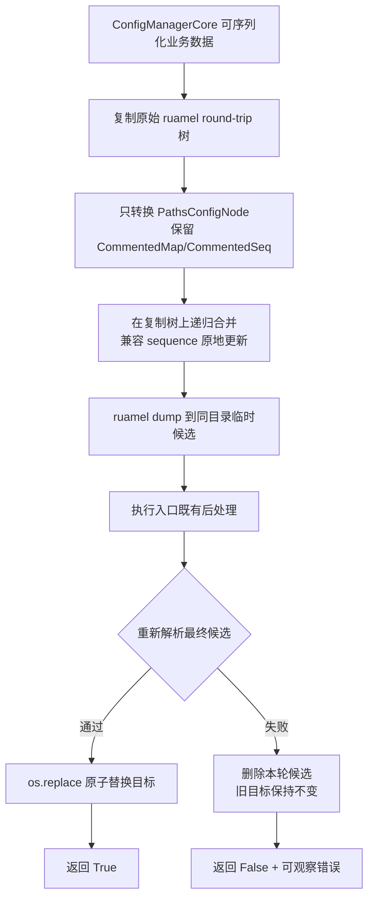
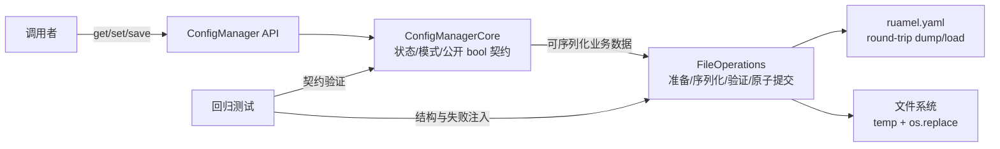

# S1-03 方案决策

## 1. 元信息

| 字段 | 值 |
|---|---|
| Issue / Sprint | `S1-03` / `Sprint01` |
| 来源 | `S1-03_原始需求.md`、已确认 `S1-03_系统诊断.md`、`S1-03_处理记录.md` |
| 登记分类 | `BUG` |
| Session ID | `01a01273-82c8-7e83-a59f-68b289665510` |
| `stage_target` | `issue_worktree / branch=S1-03 / base_commit=1bccbfc12d780595fe85d2d95bb12922997b1263` |
| Issue worktree | `D:\Tony\Documents\invest2025\project\config_manager\.worktrees\S1-03` |
| `target_head` | `1bccbfc12d780595fe85d2d95bb12922997b1263` |
| 准入 Sprint HEAD | `1bccbfc12d780595fe85d2d95bb12922997b1263` |
| 当前产物版本 | `solution-v3-review` |
| 决策状态 | `in_progress / awaiting_user` |
| 执行模式 | 修改/构建/提交；批准前仅写 Issue worktree 的方案、ADR 草案、治理记录和已授权 Git 索引项，不修改产品代码 |

### confirmation_goal_history

Goal 工具以同一 thread ID 承载连续确认段，以下本地段号保持时序可审计。

| 段 | `goal_id` | objective | `input_locator` | `stage_target` / `target_head` | 结果 |
|---|---|---|---|---|---|
| CG-01 | `01a01273-82c8-7e83-a59f-68b289665510/CG-01` | 复现并定位 S1-03 原始 BUG，形成系统诊断 | `S1-03_原始需求.md` | `S1-03@1bccbfc1` | 诊断取证完成 |
| CG-02 | `01a01273-82c8-7e83-a59f-68b289665510/CG-02` | 消费用户对 `diag-v1` 的确认并处理新增缓存治理输入 | `S1-03_处理记录.md#2026-08-18-时序-3` | `S1-03@1bccbfc1` | 诊断确认；缓存治理转精确范围门禁 |
| CG-03 | `01a01273-82c8-7e83-a59f-68b289665510/CG-03` | 核验全局 ignore、目标范围和破坏性操作安全边界 | `S1-03_处理记录.md#2026-08-18-时序-4` | `S1-03@1bccbfc1` | 7 目录/102 索引项范围冻结 |
| CG-04 | `01a01273-82c8-7e83-a59f-68b289665510/CG-04` | 消费时序 5 授权并推进完整方案到对抗式审查入口 | `S1-03_处理记录.md#2026-08-18-时序-5` | `S1-03@1bccbfc1` | complete；索引移除、v1 候选与 ADR 草案形成 |
| CG-05 | `01a01273-82c8-7e83-a59f-68b289665510/CG-05` | 只读审查 `solution-v1-draft` 的 AR-01..18、SDR-01..05 和防回归范围 | `S1-03_处理记录.md#2026-08-18-时序-8` | `S1-03@1bccbfc1` | complete；`changes_required`，完整 F-01..04 |
| CG-06 | `01a01273-82c8-7e83-a59f-68b289665510/CG-06` | 一次性纠正 F-01..04 并形成新版本 | `S1-03_处理记录.md#2026-08-18-时序-8` | `S1-03@1bccbfc1` | complete at freeze；形成 `solution-v2-review` |
| CG-07 | `01a01273-82c8-7e83-a59f-68b289665510/CG-07` | 只读全量复审 `solution-v2-review` 的完整方案、ADR、范围和防回归闭环 | `S1-03_处理记录.md#2026-08-18-时序-9` | `S1-03@1bccbfc1` | complete；R1 finding 全关闭，新增完整 F-05 |
| CG-08 | `01a01273-82c8-7e83-a59f-68b289665510/CG-08` | 补齐 auto-create 保留基线并形成新版本 | `S1-03_处理记录.md#2026-08-18-时序-9` | `S1-03@1bccbfc1` | complete at freeze；形成 `solution-v3-review` |
| CG-09 | `01a01273-82c8-7e83-a59f-68b289665510/CG-09` | 只读全量复审 `solution-v3-review` 的完整方案、ADR、范围和防回归闭环 | 本文 `solution-v3-review` | `S1-03@1bccbfc1` | complete；`finding_set=[]`、`pass_eligible=true` |
| CG-10 | `01a01273-82c8-7e83-a59f-68b289665510/CG-10` | 写回 v3 审查 pass 并准备唯一整体批准收据 | 本文 `## 11. 最终批准` | `S1-03@1bccbfc1` | complete at display；收据 awaiting_user |
| CG-11 | `01a01273-82c8-7e83-a59f-68b289665510/CG-11` | 消费并验证唯一批准回执，执行批准后 ADR、状态、提交与发布闭环 | `S1-03_处理记录.md#2026-08-18-时序-11` | `S1-03@1bccbfc1` | active；批准/ADR/Sprint 投影 pass；进入限定提交与发布预检 |

当前批准消费 Goal objective：`消费并验证 S1-03 的唯一批准回执：绑定 approval_frame_id=S1-03:solution-v3-review:approval:10、用户回复定位 S1-03_处理记录.md#2026-08-18-时序-11、artifact=solution-v3-review、Issue 分支 S1-03 与冻结 HEAD；仅在严格回执门禁、共享契约与 SDR 复核全部通过后，写回已批准状态并执行已批准 ADR 生命周期、Sprint 状态投影、限定提交和安全合并闭环`。

## 2. 分类输入

### BUG 系统诊断

- 诊断版本/状态：`diag-v1 / confirmed_by_user`。
- 诊断定位：`S1-03_系统诊断.md#结论`、`#首次偏离与数据流`、`#证据链`。
- 第一次用户确认：`S1-03_处理记录.md#2026-08-18-时序-3`；用户原话为 `2，pyc pycache应该从git跟踪移除，因为 ~/.gitignore_global忽略`。
- 冻结失败签名：合法 YAML 经 `set(..., autosave=False) -> save()` 后，`save()` 返回 `True`，文件却出现 `key:   -` 或 `key: &id...   -`，parser 报 `sequence entries are not allowed here`。
- 已确认根因：`CommentedSeq` 被无差别重建为普通 `list`；顶层浅拷贝与嵌套原地合并污染 `_original_yaml_data`，留下普通 list 与父键 sequence 注释元数据的不一致状态；最终候选未经解析就替换目标。

### 用户补充输入

- 用户要求仓库不再跟踪由 `C:\Users\Tony\.gitignore_global` 已覆盖的 `.pyc`/`__pycache__`。
- 时序 5 已明确授权 7 个非 reparse 目录的 102 个索引移除；时序 6 已验证：索引删除 102、范围外 0、跟踪项 0、磁盘缓存保留、项目 `.gitignore` 未修改。
- 此项是已授权仓库治理，不替代产品 BUG 修复，也不改变产品运行行为。

## 3. 需求与事实

### 目标

1. 含“mapping key 与第一条有效 sequence 项之间注释”的合法 YAML，在标准/raw、test/non-test 路径中均能重复保存并保持可解析和值正确。
2. 保留 ruamel round-trip 容器与注释语义，不让保存准备过程污染长期 `_original_yaml_data`。
3. `save() == True` 必须对应已经可重新加载的目标文件；非法候选不得覆盖旧目标。
4. 只在配置库的 `FileOperations` 持久化边界修复，不向消费项目或业务键扩散补丁。
5. 提交已授权的 102 个缓存索引删除项，磁盘缓存仍由全局 ignore 管理。

### 已核验事实

- Python `3.12.9`、ruamel.yaml `0.19.1`；产品从 S1-03 worktree 导入。
- 标准/raw、`test_mode=True/False`、更新/未更新 commented sequence 均复现；普通 sequence 为负对照。
- `02_minimal_output.txt` 证明普通 list 替换会失败，而 sequence 原地更新对照可解析：`in_place_control_valid=True`。
- 重复键文本后处理不是首个偏离点；后处理前已非法，前后文本不变。
- 现有 comment-preservation 测试缺少触发布局，且只查字符串，不重新解析保存产物。
- 现有架构把 YAML 加载/保存和文件安全归给 `FileOperations`；公开 `save()` 使用布尔结果。

### 重大决策

- 选定“根因修复 + 最终候选解析门禁 + 原子替换”的完整方案。
- 不改变公开 API、不换 YAML 库、不按业务键特判、不重构 raw 格式或文本重复键后处理器。
- 系统职责和数据流分别形成 `ADR-001` 与 `ADR-002` 草案；只有用户对完整方案整体批准后才接受。
- 原子交付结论：`keep_single`，估算 `3 points`。

### 未解决项

- 业务或技术未知项：无。
- 当前唯一待办决策：完成对抗式审查后，由用户整体批准当前完整版本或修改约束。

## 4. 业务流程

### 目标流程

```text
调用者修改配置
  -> 调用 save()
  -> 配置库生成并验证 YAML 候选
     -> 合法：原子替换目标，返回 True，调用者可重新加载同值配置
     -> 非法/写入失败：旧目标保持不变，返回 False，并输出可观察错误
```

### business_flow_change_set

| `change_id` | 角色/触发 | 变更前 | 变更后 | 主路径、边界与失败路径 | 业务输出/可观察验收 |
|---|---|---|---|---|---|
| BF-01 | 配置库调用者调用 `save()` | 返回 `True` 可能对应不可解析文件 | `True` 只对应已通过 parser 的目标文件 | 主路径仍为修改后保存；standard/raw 与 test/non-test 同边界；候选非法走失败路径且不覆盖旧文件 | 成功后重新加载和值比对通过；失败时返回 `False`、旧文件字节不变 |
| BF-02 | 仓库维护者运行 Git 工作流 | 缓存文件虽被全局忽略仍已跟踪 | 102 个历史缓存项不再进入后续差异 | 仅索引删除；磁盘和项目 `.gitignore` 不变 | `git ls-files` 对 7 个目录返回 0；代表磁盘文件仍存在 |

## 5. 数据流程

### 数据流程图



### data_flow_change_set

| `change_id` | 数据身份/来源/owner | 输入 -> 转换 -> 输出 | 流向与顺序变化 | 边界、用途、失败恢复 | 关联 ADR/图定位 |
|---|---|---|---|---|---|
| DF-01 | ruamel round-trip 树；来源为加载结果；owner=`FileOperations` | `_original_yaml_data` + 当前业务值 -> 独立深快照、保真转换、递归合并 -> 待 dump 树 | 从“浅拷贝并污染共享嵌套对象”改为“独立树内合并”；兼容 sequence 保持容器身份 | 不跨 `FileOperations`；用于注释/值保真；异常丢弃快照 | `ADR-002`；本节数据流程图 B-D |
| DF-02 | 最终 YAML 候选；来源为 dump+既有后处理；owner=`FileOperations` | 临时候选 -> parser 重新加载 -> 已验证候选 | 在 `os.replace` 前新增强制门禁 | parser 失败时删除候选、旧目标不变、返回失败 | `ADR-002`；本节数据流程图 E-K |
| DF-03 | Git 缓存索引项；来源为仓库 index；owner=Git/仓库治理 | 102 个 tracked `.pyc` -> index removal -> untracked+globally ignored | 不进入产品数据流；已完成 | 仅 7 个已核验目录；磁盘保留；范围外 0 | `S1-03_处理记录.md#2026-08-18-时序-4..6` |

### 数据约束

- `_original_yaml_data` 在一次保存准备过程中只读；合并仅作用于独立快照。
- `CommentedMap`、`CommentedSeq` 和其注释/anchor 元数据不得因 `PathsConfigNode` 转换被无差别降级。
- parser 必须读取所有后处理完成后的最终候选；验证内存对象或前处理文本均不构成提交门禁。
- 主配置成功后可选备份失败不回滚主配置；本次不新增备份 parser 门禁或备份文件行为。
- 只清理本轮可确认创建的临时文件，不删除无法确认归属的文件。

## 6. 系统与技术

### 系统架构图



### module_change_set

| `change_id` | 系统边界/模块/owner | 类型 | 变更前职责/接口/依赖 | 变更后职责/接口/依赖 | 业务影响 | 关联 ADR/图定位 |
|---|---|---|---|---|---|---|
| MC-01 | `src/config_manager/core/file_operations.py` / `FileOperations` | 修改 | 保存准备可能降级 ruamel 容器并污染原始树；最终候选直接 replace | 保真复制与合并；最终候选解析后才能 replace；仍返回 bool | 解决合法 sequence 保存损坏并建立失败安全 | `ADR-001`；系统图 FO |
| MC-02 | `ConfigManagerCore` | 接口不变 | 组装业务数据并调用文件层 | 完全不变；不新增 ruamel 细节 | 调用者无需迁移 | `ADR-001`；系统图 CORE |
| MC-03 | `tests/test_yaml_comments_preservation.py` 及必要的 FileOperations 单元测试 | 修改/新增测试 | 只查部分字符串，缺少重新解析、重复保存和失败安全 | 覆盖标准/raw、test/non-test、更新/未更新/普通 sequence、解析与失败不覆盖 | 防止同类回归 | `ADR-001/002`；系统图 TEST |

依赖方向保持 `调用者 -> ConfigManagerCore -> FileOperations -> ruamel.yaml/os`；无反向依赖、无新共享可变状态、无跨模块公开接口变化。

### technology_choice_set

| `choice_id` | 业务能力 | 候选技术/选定项 | 验证与兼容性 | 成本、性能/安全、运维 | 迁移/退出 |
|---|---|---|---|---|---|
| TC-01 | YAML 注释保真与候选解析 | 沿用 ruamel.yaml `0.19.1`；不引入新库 | 现有运行环境和复现资产已验证 round-trip/parser 能力 | 每次保存新增深复制和解析，各为 `O(n)`；换取旧文件不被非法候选覆盖；无新增运维组件 | 无迁移；若未来替换 YAML 库需独立架构决策 |
| TC-02 | 原子文件替换 | 沿用同目录临时文件 + `os.replace` | 当前代码和 Windows/Python 标准库契约已在用 | 不增加外部依赖；异常路径需清理本轮临时文件 | 无迁移；退出需另行定义跨平台提交机制 |

### 系统边界、职责和接口

- 系统内：`ConfigManagerCore`、`FileOperations`、ruamel.yaml 与配置文件。
- 系统外：消费项目的业务键、具体配置内容和调用者；它们只观察 `save()` 结果与文件内容。
- 接口不变：`ConfigManagerCore.save() -> bool`、`FileOperations.save_config*() -> bool`。
- 新增的是文件层内部不变量和必要私有辅助函数，不新增公共类、参数或配置项。

## 7. 综合分析

### 候选可行性

| 候选 | 根因修复 | 成功/可解析一致 | 注释兼容 | 失败安全 | 成本 | 结论 |
|---|---:|---:|---:|---:|---|---|
| A. 保真复制/合并 + 最终候选解析门禁 + 原子替换 | 是 | 是 | 是 | 是 | 每次保存额外 `O(n)` 复制与解析 | **唯一完整可行，选定** |
| B. 只修复 ruamel sequence 合并 | 是 | 否 | 是 | 否 | 最小 | 排除：仍允许其他非法候选成功覆盖 |
| C. 只增加 parser 门禁 | 否 | 是（失败返回） | 不解决正常保存 | 是 | 小 | 排除：把损坏降级为失败，未恢复功能 |
| D. 全部转普通 dict/list | 表面规避 | 是 | 否 | 部分 | 小 | 排除：回退注释保留承诺 |

`zero_decision_preflight`：候选 A 的技术前提、职责、成本和验收均可定位；不存在 `fail|unknown` 主张，也不存在需要用户补充才能形成候选的空缺。

### 选定方案

1. 在 `_prepare_data_for_save` 入口把 `_original_yaml_data` 深复制为独立 round-trip 树；不再用顶层 `.copy()` 共享嵌套节点。
2. 收窄 `_convert_paths_config_nodes`：只转换真实 `PathsConfigNode`，递归时保留 ruamel 容器的具体类型和注释元数据；普通容器保持原语义。
3. 调整递归合并：mapping 递归，兼容 sequence 在目标容器内更新并返回目标容器；禁止把普通 list 直接赋给带 sequence 注释的父键。
4. 在 `save_config` 的主配置目标和初始化使用的 `save_config_only` 中，把“dump -> 该入口既有后处理 -> parser 验证 -> replace”作为提交顺序。验证失败沿用 bool 失败语义，旧主配置不变并清理本轮临时候选。
5. 可选备份及 `create_backup_only` 不新增 parser 门禁；保持并回归保护现有 best-effort 语义：主文件成功后，备份失败单独报告且不把主结果改为失败。
6. 用契约测试覆盖重复保存、解析、值、注释、容器类型和失败不覆盖；现有公共 API 与依赖声明不变。

### decision_validations

| `validation_id` | 会改变选择的主张 | 证据/最小验证 | 实际结果 | 结论与影响 |
|---|---|---|---|---|
| DV-01 | 根因在 FileOperations 的容器降级与共享树污染 | `S1-03_系统诊断.md#结论`、`04_manager_pipeline_output.txt` | 首次状态偏离和后续非法 dump 已交叉验证 | 支持候选 A；排除业务键补丁 |
| DV-02 | sequence 原地更新能保持触发布局合法 | `02_minimal_output.txt` | `in_place_control_valid=True`；普通替换为 `False` | 支持结构保真合并 |
| DV-03 | parser 门禁必须位于后处理之后 | `03/04` 输出与系统诊断证据链 | 后处理前已非法且后处理未修复 | 门禁读取最终候选，不能只验证内存树 |
| DV-04 | 单一修复要覆盖 standard/raw 与 test/non-test | `01/05/07` 场景输出 | 四种边界均复现相同失败签名 | 修复 owner 固定为共享 FileOperations |
| DV-05 | 缓存删除范围由有效全局 ignore 支撑 | `S1-03_处理记录.md#时序-4..6` | 102 索引删除、范围外 0、磁盘保留、tracked=0 | 已完成；纳入限定提交 |

### 原子交付、依赖与约束

- `business_delivery_gate=keep_single`：用户可独立验收的顶层结果只有“配置保存不再生成非法 YAML，失败不覆盖旧文件”；容器修复与验证门禁任一单独交付都不完整。
- MC-25/MC-26：拆分不会带来独立业务价值或并行收益，反而产生串行兼容窗口；共享状态、同一保存事务和同一验收使其应保持一个 Issue。
- 估算：`3 points`。产品改动集中于一个模块和聚焦测试，无 API/依赖迁移；额外包含已经执行并验证的缓存索引治理。
- 上游依赖：已确认 `diag-v1` 和用户精确缓存授权。
- 下游依赖：设计阶段需把私有辅助函数、失败清理和测试矩阵具体化；无需等待外部系统。
- 约束：Python >=3.12、ruamel.yaml 0.19.1、Windows 同目录原子替换语义、公开 bool 契约、注释保留。

### 排除项

- 消费项目 `my_quant_system` 的配置或业务键修补。
- raw-to-standard anchor/投影重复的独立格式重构。
- 替换 ruamel.yaml、修改 YAML schema、增加新依赖。
- 重写文本重复键后处理器。
- 修改项目 `.gitignore` 或删除磁盘上的缓存文件。

## 8. ADR 与风险

### view_adr_set

| `view` | ADR / 路径 | 状态/拟议动作/作用域 | 图定位 | 生命周期 request/result |
|---|---|---|---|---|
| `system_architecture` | `ADR-001` / `Docs/02_架构决策记录/ADR-001_ConfigManager持久化职责边界.md` | `已接受` / `create`（草案 R2 revise 后 final） / `project` | `## 6. 系统与技术 / 系统架构图` | `S1-03-ADR-FINAL-ARCH-001` / `accepted`，见 ADR `## 生命周期记录` |
| `data_flow` | `ADR-002` / `Docs/02_架构决策记录/ADR-002_YAML候选验证与原子提交顺序.md` | `已接受` / `create`（草案 R2 revise 后 final） / `project` | `## 5. 数据流程 / 数据流程图` | `S1-03-ADR-FINAL-DATA-002` / `accepted`，见 ADR `## 生命周期记录` |

互异性证据：两个 ADR 编号和路径不同；`ADR-001` 只决定模块职责，`ADR-002` 只决定保存事务数据顺序，可独立接受或修订。

### ADR 分析结果

调用：`architecture-design --mode=adr-analysis --source-stage=solution-decision --issue=S1-03`，`analysis_target=drafted`。

- `adr_analysis_status=pass`。
- `ADR-001`：范围为系统职责边界；与现有架构文档一致；高内聚证据为单一 owner/依赖方向决策；低耦合证据为只引用 `ADR-002` 的顺序而不复制；冲突 `none`；推荐 `create`；证据见 ADR 的“背景/决策/高内聚与低耦合证据”。
- `ADR-002`：范围为保存事务数据流；与 S1-03 诊断和现有 `os.replace` 边界一致；高内聚证据为单一准备/验证/提交顺序；低耦合证据为仅引用 `ADR-001` 的 owner；冲突 `none`；推荐 `create`；证据见 ADR 的“背景/决策/高内聚与低耦合证据”。
- 覆盖：`module_change_set=MC-01..03`，`data_flow_change_set=DF-01..03`；其中 DF-03 是仓库索引治理，明确不进入运行时 ADR 范围。
- 未覆盖项、矛盾、阻塞：无。
- R2 草案复核：R1 finding F-01 后由 `architecture-design` 执行两条 `approval_draft/revise`，实际读取收窄后的 ADR-001/002；`analysis_target=drafted` 仍为 `pass`。MC-01..03、DF-01..03 覆盖不变，备份由“新增安全行为”改为 RB-05 保留基线；无新增冲突、未覆盖项或 lifecycle 动作。

### ADR 符合性

| `change_id` | `change_locator` | `adr_clause` | `relation` | `ownership` | `evidence` | `lifecycle_action` | `trigger_owner/state_owner/execution_owner` | `result` |
|---|---|---|---|---|---|---|---|---|
| MC-01 | `module_change_set#MC-01` | `ADR-001#决策 2-4` | implements | FileOperations | 系统诊断代码/架构定位 | create | solution-decision / architecture-design / architecture-design | pass |
| MC-02 | `module_change_set#MC-02` | `ADR-001#决策 1,5` | preserves | ConfigManagerCore | 公开 bool 与依赖方向不变 | create | solution-decision / architecture-design / architecture-design | pass |
| MC-03 | `module_change_set#MC-03` | `ADR-001#结果`、`ADR-002#风险` | verifies | tests | 回归矩阵 | create | solution-decision / architecture-design / architecture-design | pass |
| DF-01 | `data_flow_change_set#DF-01` | `ADR-002#约束/决策 1` | implements | FileOperations | `02_minimal_output.txt` | create | solution-decision / architecture-design / architecture-design | pass |
| DF-02 | `data_flow_change_set#DF-02` | `ADR-002#决策 2-4` | implements | FileOperations | `03/04` 诊断输出 | create | solution-decision / architecture-design / architecture-design | pass |
| DF-03 | `data_flow_change_set#DF-03` | not_applicable | outside_runtime_architecture | Git index | 时序 4-6 | none | solution-decision / Git / solution-decision | pass |

`adr_conformance_status=pass`。

### ADR 生命周期关闭集

| `closure_id` | `target_adr` | `source_change_ids` | `lifecycle_action` | `analysis_locator` | `draft_result` | `draft_reanalysis_locator` | `approval_locator` | `final_result` | `downstream_checklist_ids` | `result` |
|---|---|---|---|---|---|---|---|---|---|---|
| ADRC-01 | ADR-001 | MC-01..03 | create | 本节“ADR 分析结果” | drafted（create + R2 revise） | 本节 R2 `analysis_target=drafted` | `S1-03:solution-v3-review:approval:10` + 时序 11 | accepted | SD-05, SD-10..12, SD-20 | pass |
| ADRC-02 | ADR-002 | DF-01..02 | create | 本节“ADR 分析结果” | drafted（create + R2 revise） | 本节 R2 `analysis_target=drafted` | `S1-03:solution-v3-review:approval:10` + 时序 11 | accepted | SD-04, SD-10..12, SD-20 | pass |

### risk_decision_set

会改变候选选择但尚未被方案吸收的残余风险：`none`。以下风险已经由方案和验收吸收，不需要用户接受为未处置风险：

| 风险 | 事件/影响 | 证据 | 处置/owner | 触发或回退 | 残余结果 |
|---|---|---|---|---|---|
| R-INTERNAL-01 | 深复制/合并仍丢失某类 sequence 注释 | 已确认 comment 元数据机制 | standard/raw、重复保存、注释和值回归；owner=implementation | 任一解析/注释断言失败则不得提交实现 | 被测试门禁吸收 |
| R-INTERNAL-02 | parser 门禁或异常路径覆盖旧文件/遗留 temp | 当前缺少门禁 | 先验证后 replace + 失败注入；owner=implementation | 旧文件字节变化或 temp 未清理即失败 | 被失败安全验收吸收 |
| R-INTERNAL-03 | 每次保存增加复制和解析成本 | 算法分析：两次 `O(n)` | 作为明确取舍纳入整体批准；无新依赖 | 若下游实测出现不可接受延迟，返回方案决策重新比较优化候选 | 低；当前无决策阈值 |

### 工程审计

#### 结构质量

- `scope_id=STRUCT-01`，`scope_kind=module`，`scope_locator=module_change_set#MC-01`，`source_change_ids=MC-01,DF-01,DF-02`。
- 职责：所有 YAML 内部语义和提交安全留在 `FileOperations`；高内聚。
- 依赖方向：不改变 `Core -> FileOperations -> ruamel/os`；低耦合。
- 共享状态：通过深快照消除保存准备对 `_original_yaml_data` 的隐式共享写入。
- 测试隔离：纯容器合并、候选验证和端到端调用链可分层测试；不依赖消费项目。
- 评审边界：一个产品模块 + 聚焦测试；`result=pass`。

#### 异常审计

| `exception_id` | `boundary_locator` | `source_change_ids` | 失败来源 | `strategy` | 外向失败语义/可观察性 | 状态与资源安全 | `swallow_audit` | 下游检查 | 结果 |
|---|---|---|---|---|---|---|---|---|---|
| EX-01 | `FileOperations.save_config*` 候选验证边界 | DF-02 | dump、后处理、parser、replace | translate | 沿用 `False` + 错误信息；不伪报成功 | replace 前失败保持旧目标；清理本轮 temp | 允许转换为 bool，但禁止无信息吞没 | TEST-FAIL-01 | pass |
| EX-02 | `save_config` 可选备份边界 | MC-01 | 既有 backup dump/replace | recover | 主配置已成功时保持主成功，单独报告备份失败 | 不新增失败分支或 parser 门禁 | 符合现有 best-effort 语义；作为保留基线 | TEST-BACKUP-01 | pass |

#### 工程原则

`engineering-principles` Skill 因其“仅限用户显式调用”门禁不适用自动调用；方案 owner 按 SD-18 内联审计，结果为 `pass`：

- 简单性/KISS：沿用 ruamel.yaml、`os.replace` 和 bool 契约；不引入新库、配置项、公开 API 或跨模块协调。
- 可验证性/SMART：AC-01..08 与 TEST-SEQ/RAW/FAIL/BACKUP/REG/GIT 一一映射；原始 `stock`/`category_subscription_order` 场景有直接落点；没有无证据日期或性能数字。
- 可维护性/DRY：容器准备和候选提交不在 Core/消费项目重复实现；具体私有 helper 是否提取由设计按稳定职责决定，不在方案阶段预造抽象。
- 边界/YAGNI/最小改动：产品范围只有 `FileOperations` 及聚焦测试；raw 格式重构、业务键特判、重复键处理器重写和新依赖均排除。
- 失败处理与数据/资源安全：候选验证先于 replace；旧目标保持、bool 失败可观察、仅清理本轮临时文件；主保存与可选备份失败语义分离。
- 可评审性/原子性：一个产品模块、一个业务结果、3 points；缓存索引治理是用户已单独授权并完成的仓库事项，不构成第二个产品交付包。
- 大文件触发审查：`file_operations.py` 总行数低于 1000；预计直接修改的现有测试文件也低于阈值，`large_file_review=not_applicable`。
- 三阶影响：直接结果是合法重复保存；连锁影响是所有 mode 共用安全门禁；系统响应是每次保存增加深复制和解析的线性成本。三者已进入职责、风险和验收，无额外扩张。

#### 对抗式审查

最终状态：`pass`；`assessment_mode=internal_check`；`self_check_goal_id=01a01273-82c8-7e83-a59f-68b289665510/CG-09`。

审查轮次：

| 轮次/版本 | 完整结果 | finding / 处置 |
|---|---|---|
| R1 / `solution-v1-draft` | `changes_required` | F-01..04；独立修改 Goal 一次性形成 v2 |
| R2 / `solution-v2-review` | `changes_required` | F-05 auto-create 影响面；独立修改 Goal 形成 v3 |
| R3 / `solution-v3-review` | `pass` | `finding_set=[]`、`pass_eligible=true`；审查前后对象 hash、HEAD、branch 一致 |

冻结上下文：

- `review_scope`：当前待整体批准的完整 S1-03 方案、ADR-001/002 草案、总结/记录/诊断、102 个已授权缓存索引删除项及直接证据。
- `review_stage=solution-decision`，`granularity_profile=solution_decision`。
- `review_object_set`：方案 `a41b8688...`、ADR-001 `e218504e...`、ADR-002 `04b773c8...`、总结 `51751157...`、处理记录 `a932080d...`、诊断 `f5d0c7f9...`、`S1-03@1bccbfc1`。上述 hash 为 R3 冻结值。
- `review_unit_set`：`U-CAND-A`（完整候选 A）、`U-DECISION`（候选排除与推荐）、`U-ARCH`（架构/ADR）、`U-GIT`（缓存治理）、`U-APPROVAL`（完整批准对象）。
- `stage_boundary`：裁决方案完整性、取舍、边界、成本、风险和计划义务；产品实现、实际测试 RES 和代码工艺属于后续阶段，禁止伪报完成。
- `user_requirement_baseline`：原始需求用户原话与 AC、时序 3 的 diag-v1 确认、时序 3/5 的缓存治理要求与精确授权。
- `execution_constraint_set`：Issue worktree/branch/HEAD、方案契约、ADR 生命周期、全局请求记录与破坏性操作门禁。
- `required_evidence_set`：当前方案正文、系统/数据图、候选比较、ADR 草案与分析、变化集、AC/TEST/RES 义务、影响面、Git 授权/结果和 Goal/branch/hash 证据。

闭环与完备性：

- `requirement_mapping`：原始 sequence 合法性/值/成功一致性 -> AC-01..06 与 TEST-SEQ/RAW/FAIL；`stock/category_subscription_order` -> AC-01/03 与 TEST-SEQ；缓存治理 -> BF-02/DF-03/AC-08/TEST-GIT。
- `implementation_trace=not_applicable`；后续实现义务见设计承接清单和 deferred validations。
- `closure_mapping`：当前到期方案证据完整；未来实现/测试均明确标为 `planned_obligation`。
- `requirement_fidelity=pass`，`closure_result=pass`。
- `expected_review_set=[U-CAND-A,U-DECISION,U-ARCH,U-GIT,U-APPROVAL,AR-01..18,SDR-01..05,RB-01..07,PC-01..03,IMP-01..07]`。
- `evaluated_review_set` 与 expected 相同；`expected-evaluated=[]`，`evaluated-expected=[]`。
- `unverified_boundaries=[]`，`excluded_scope` 与本文排除项一致，`finding_set=[]`。

共享检查结果：

| 检查 | 结果 | 直接依据 |
|---|---|---|
| AR-01 需求保真 / AR-02 闭环 | pass | 原始需求、确认输入、AC/TEST、baseline/impact 双向映射 |
| AR-03 架构 / AR-04 ADR | pass | 两图、MC/DF、互异 ADR-001/002、R2 drafted reanalysis |
| AR-05 结果质量 / AR-07 证据 | pass | confirmed diagnosis、候选排除、decision_validations、可复核资产 |
| AR-06 攻击面 | pass | 状态/网络不适用；文件安全、性能资源、损坏输入、需求/规模边界均有状态和证据 |
| AR-08 语义删除 / AR-09 DRY / AR-10 KISS / AR-11 YAGNI / AR-12 奥卡姆 / AR-14 禁止废话 | pass | 只保留契约必需章节；R1 已删除备份新行为；零新依赖/API/格式重构 |
| AR-13 原子化 / AR-15 高内聚低耦合 / AR-16 范围 | pass | keep_single/3 points、FileOperations 单一 owner、范围扩大/偏离/过度设计均为零 |
| AR-17 代码工艺 | not_applicable | internal_check 固定不评价后续代码工艺 |
| AR-18 防回归 | pass | solution 阶段 RB-01..07、PC-01..03、IMP-01..07 双向无差集；executed set 尚未到期 |

- `architecture_conformance_result=pass`，`adr_conformance_result=pass`，`quality_result=pass`。
- `code_standards_result=not_applicable`：冻结候选无产品代码变更；诊断脚本是已封存证据资产，102 个实际 staged paths 是二进制缓存删除，非代码实现候选。
- `code_craft_result=not_applicable`：internal_check 固定值。
- `regression_result=pass`，`attack_surface_result=pass`，`evidence_result=pass`，`semantic_deletion_result=pass`。
- `principle_results=pass`，`scope_expansion_result=pass`，`scope_deviation_result=pass`，`overdesign_result=pass`。

方案专属自检：

| ID | 结果 | 证据 |
|---|---|---|
| SDR-01 分支隔离 | pass | 方案/ADR/记录与 staged cache removal 全部在 S1-03 worktree，HEAD/branch 冻结 |
| SDR-02 Sprint 零写入 | pass | Sprint/master HEAD 未被本阶段提交或写入；入口前全局门禁创建的 task record 是 stage_target 绑定前的治理元数据，不属于方案产物 |
| SDR-03 变动确认 | pass | BF/DF/MC、两图、ADR 动作、缓存已发生变动和待批准变动均进入当前对象；缓存有时序 5 精确授权 |
| SDR-04 Goal 与发布顺序 | pass | 确认、审查、修改、批准展示 Goal 顺序可定位；用户整体批准前禁止 ADR final、Issue commit 或 Sprint merge |
| SDR-05 审查零修改 | pass | R1/R2/R3 每轮前后冻结 hash、HEAD、branch 一致；整改均在独立修改 Goal |

`preapproval_sync_status=pass`：Issue=`S1-03`、target=`S1-03@1bccbfc1`、artifact=`solution-v3-review`、`adr_analysis_status=pass`、`adr_conformance_status=pass`、R3/SDR 均 pass，候选/输入/提交范围无漂移。

`final_sync_status=pass`：严格回执门禁消费 `approval_frame_id=S1-03:solution-v3-review:approval:10` 与时序 11 后，ADR-001/002 final 状态均为 `accepted`；方案正文、验收、点数、风险与提交范围未发生重确认漂移。

`postapproval_version_validity=pass`：批准后动作仅接受 ADR-001/002、写回已批准的 `S1-03=方案已决策 / 3 points` 和同步 Sprint 派生统计；Issue target 仍为 `S1-03@1bccbfc1`，`artifact_version=solution-v3-review`、BF/DF/MC、AC-01..08、风险、`keep_single`、缓存范围和限定提交范围均未改变；相对 `master@5b00438` 的 Sprint01 业务差异只有 S1-03 状态及对应统计。

## 9. 验收、测试与基线

### 最终验收标准

| AC | 验收 |
|---|---|
| AC-01 | 标准 `__data__` YAML 在 `test_mode=True/False` 中，含第一项前注释的 updated/unchanged sequence 经初始化保存与至少两次显式保存后，每次都可由 ruamel parser 重新加载，值准确且关键注释仍存在；fixture 直接覆盖消费侧 `stock`。 |
| AC-02 | raw YAML 在 `test_mode=True/False` 中满足同样的重复保存、重新加载、值与关键注释断言；不要求在本 Issue 中重构 anchor/投影格式。 |
| AC-03 | 没有触发布局的普通 sequence 负对照继续合法，scalar/mapping 既有行为不回退；fixture 直接覆盖消费侧 `category_subscription_order`。 |
| AC-04 | 每个返回 `True` 的主配置保存产物均已通过最终候选解析；不得出现 `key:   -`、`key: &id...   -` 或等价不可解析结果。 |
| AC-05 | 注入候选解析失败时返回 `False`，旧目标文件字节不变，本轮临时候选被清理；可选备份失败不把已成功主保存改为失败。 |
| AC-06 | `_original_yaml_data` 在准备保存时不被嵌套修改；`CommentedSeq`/注释元数据在重复周期中保持结构一致。 |
| AC-07 | 现有测试套件通过；无公开 API、依赖声明或项目 `.gitignore` 变化。 |
| AC-08 | Git 不再跟踪时序 4 冻结目录中的缓存项；102 个删除项全部在授权范围，磁盘缓存是否存在不影响验收。 |

### TEST / RES 映射

| 测试 ID | 映射 | 计划 | RES 完成判据 |
|---|---|---|---|
| TEST-SEQ-01 | AC-01, AC-03, AC-04, AC-06 | 扩充 `tests/test_yaml_comments_preservation.py` 或等价聚焦用例；同一 fixture 直接包含 commented `stock` 与普通 `category_subscription_order`，参数化 test mode、changed/unchanged/plain control、重复保存 | 两个原始业务键及泛化场景的 parser、值、注释、返回值全部通过 |
| TEST-RAW-01 | AC-02, AC-04 | raw YAML 两种 mode 的端到端保存与重新加载 | 无非法 dash，值/注释满足范围 |
| TEST-FAIL-01 | AC-05 | FileOperations 单元测试注入最终候选解析失败 | `False`、旧字节不变、temp 清理 |
| TEST-BACKUP-01 | AC-05 | 复用或补充既有可选备份失败回归，不新增备份候选验证行为 | 主结果维持成功、错误可观察、既有 backup isolation 语义不变 |
| TEST-AUTOCREATE-01 | AC-07 | 执行/补充 `load_config(auto_create=True)` 通过受改 `save_config` 创建空配置的既有测试 | 返回空配置；新文件可解析且结构仍为 `__data__`/`__type_hints__`；调用次数和错误语义不回退 |
| TEST-REG-01 | AC-07 | 先聚焦后完整 pytest 与项目质量检查 | 全部退出码 0；无非授权差异 |
| TEST-GIT-01 | AC-08 | `git diff --cached --name-status`、`git ls-files`、ignore/磁盘代表检查 | 102/0/ignored/present 与时序 6 一致 |

`deferred_validations`：实现细节、测试实际 RES 和完整套件结果只能在 implementation 的目标代码环境确认；责任阶段=`implementation`，触发条件=实现完成，完成判据=上述 TEST 全通过。不存在延后到生产环境才能判断的业务主张。

### 防回归影响面

`regression_evidence_stage=solution`；本阶段只冻结保留基线、影响关系和下游义务，不宣称未来测试已经通过。

#### regression_baseline_set

| `baseline_id` | 仍应保持的行为/契约 | 直接定位与继续有效依据 | 受影响关系 | owner / planned obligation |
|---|---|---|---|---|
| RB-01 | `ConfigManagerCore.save() -> bool` 的调用方式、成功/失败类型和 Core->FileOperations 依赖方向不变 | `manager.py:327-372`；用户只要求修复成功一致性 | MC-01/DF-02 | Core/FileOperations；TEST-SEQ/FAIL |
| RB-02 | ruamel 注释、mapping/scalar 与普通 sequence 的既有保存行为保持 | `yaml_comments_preservation_design.md`、现有 comment 测试、诊断负对照 | DF-01 | FileOperations；TEST-SEQ/RAW |
| RB-03 | standard/raw 与 test/non-test 的路径和模式语义不变 | 诊断 `01/05/07` 场景、`manager.py` 模式编排 | MC-01/MC-02 | Core/FileOperations；TEST-SEQ/RAW |
| RB-04 | 初始化、watch/autosave 和快速连续修改的保存次数/批处理行为不因 parser 门禁改变 | `tests/01_unit_tests/test_config_manager/test_tc0017_001_frequent_load_save.py` | MC-01；额外线性工作但不新增保存触发 | Core/Autosave/FileOperations；执行该文件 |
| RB-05 | 主配置成功后的可选备份仍为 best-effort；备份失败不把主保存改为失败，test-mode backup isolation 不变 | `file_operations.py:136-150`、`test_tc0012_004_backup_isolation.py` | `save_config` 邻接代码受改动；行为未获批准变化 | FileOperations/TestEnvironment；TEST-BACKUP + 既有隔离测试 |
| RB-06 | 公开依赖、配置 schema、项目 `.gitignore` 和消费项目配置不变 | 原始需求原子边界、本文排除项 | 全部产品变化 | solution/design/implementation；diff 审计 |
| RB-07 | `load_config(auto_create=True)` 仍通过 `save_config` 创建可解析空配置并返回空数据；auto-create 目录/文件行为不变 | `file_operations.py:37-52`、`test_auto_directory_creation.py` 等既有用例 | PC-02 直接改变其调用的主配置提交边界 | FileOperations；TEST-AUTOCREATE-01 |

`approved_change_set` 当前是待整体批准的候选变化：PC-01 修复 round-trip 容器准备、PC-02 为主配置建立最终候选解析门禁、PC-03 移除已授权 102 个缓存索引项。其他行为全部属于保留基线。

#### declared_impact_set / discovered_impact_set

| `impact_id` | 变化/消费关系与生产定位 | 独立发现证据 | 声明结果与 planned obligation |
|---|---|---|---|
| IMP-01 | `ConfigManagerCore.save -> FileOperations.save_config` | `rg` 定位 `manager.py:368` | 已声明 MC-01/02；TEST-SEQ/RAW/FAIL |
| IMP-02 | 初始化 `_save_config_only -> FileOperations.save_config_only` | `manager.py:198,406-426`；诊断首次状态偏离 | 已声明 DF-01/02；TEST-SEQ/RAW |
| IMP-03 | watch/autosave/批处理间接调用保存边界 | `test_tc0017_001_frequent_load_save.py` 直接 patch 两个 save 方法 | 新补齐 RB-04；implementation 执行该文件 |
| IMP-04 | 可选备份是 `save_config` 邻接路径，独立备份由 `create_backup_only` 调用 | `file_operations.py:136-150,178-198`、`manager.py:517` | 新补齐 RB-05；明确不改变独立备份行为，执行 backup isolation |
| IMP-05 | 现有注释保留测试与本次触发 fixture | `tests/test_yaml_comments_preservation.py`、诊断 `06_existing_comment_test.xml` | 已声明 MC-03；扩充 parser/值/注释断言 |
| IMP-06 | `config_manager.py` 另有同名 `_deep_update_yaml_data`，但真实引用搜索只有其定义 | `rg` 结果：生产调用集中于 `core/file_operations.py`，legacy 方法无调用 | 排除；不得顺手修改 legacy 文件 |
| IMP-07 | `FileOperations.load_config(auto_create=True)` 在文件不存在时直接调用受改 `save_config` | `file_operations.py:37-52`；引用搜索显示内部直接调用 | 新补齐 RB-07；执行 auto-create 聚焦测试并映射 AC-07 |

当前 solution 阶段 `declared_impact_set` 与独立 `discovered_impact_set` 已双向闭合；`executed_regression_set=not_due`。`unapproved_decision_set=[]`，`impact_reconciliation_result=pass`。implementation 必须从实际 changed paths 重新发现影响面并执行到期验证，不能复用本表替代取证。

#### regression_mapping

| 候选变化 | 批准变化 | 保留基线 | 当前阶段证据 | 下游义务 |
|---|---|---|---|---|
| PC-01 | CommentedSeq/共享树根因修复 | RB-02, RB-03, RB-06 | 诊断与候选比较 | TEST-SEQ/RAW + diff 审计 |
| PC-02 | 主配置最终候选解析门禁 | RB-01, RB-04, RB-05, RB-07 | 数据流、异常审计、直接调用发现 | TEST-FAIL、频繁保存、backup isolation、TEST-AUTOCREATE |
| PC-03 | 缓存 index removal | RB-06 | 时序 4-6 | TEST-GIT |

双向差集：`candidate_change - mapped=[]`，`baseline - mapped=[]`；`regression_result=pass`（solution 阶段到期证据）。

### 基线映射

| 基线对象 | 来源 | owner | 输出/检查 |
|---|---|---|---|
| 业务目标 | 原始需求 + 已确认诊断 + 本文“目标” | solution-decision | AC-01..08；stock/category_subscription_order 直连 TEST-SEQ-01 |
| 数据与触发布局 | 系统诊断证据链 | FileOperations | DF-01..02 / TEST-SEQ-01, TEST-RAW-01 |
| 架构与约束 | 现有架构文档 + ADR-001/002 草案 | architecture-design | MC-01..03 / ADRC-01..02 |
| 阶段输入 | diag-v1、时序 3/5 用户确认 | solution-decision | SD-02 |
| 阶段输出 | 当前完整方案、ADR 草案、限定提交 | solution-decision | SD-19/20 |
| 缓存治理 | 时序 4 范围 + 时序 5 授权 + 时序 6 结果 | solution-decision/Git | AC-08 / TEST-GIT-01 |

## 10. 方案决策阶段检查单

| ID | 适用 | 状态 | `confirmation_basis` / 正式证据 |
|---|---|---|---|
| SD-01 CONTEXT | 是 | pass | `## 1. 元信息`；Issue worktree/branch/HEAD 与 Goal 绑定 |
| SD-02 INPUT | 是 | pass | `## 2. 分类输入`；confirmed diag-v1 与时序 3/5 |
| SD-03 BUSINESS_FLOW | 是 | approved | BF-01..02；批准定位 `approval:10` + 时序 11 |
| SD-04 DATA_FLOW | 是 | approved | 数据流程图、DF-01..03；批准定位 `approval:10` + 时序 11 |
| SD-05 SYSTEM_ARCHITECTURE | 是 | approved | 系统架构图、MC-01..03；ADR-001 accepted；批准定位 `approval:10` + 时序 11 |
| SD-05A TECHNOLOGY | 是 | approved | TC-01..02；零新技术、沿用依据明确；批准定位 `approval:10` + 时序 11 |
| SD-06 PROTOTYPE | 否 | not_applicable | 无前端/视觉范围 |
| SD-07 DECISION | 是 | pass | DV-01..05、deferred_validations、zero_decision_preflight |
| SD-08 CANDIDATE | 是 | pass | 候选 A-D 比较；A 为唯一完整可行候选 |
| SD-09 ATOMIC | 是 | approved | keep_single、3 points、MC-25/26 证据；批准定位 `approval:10` + 时序 11 |
| SD-10 ADR_VIEW | 是 | pass | view_adr_set 恰为互异 ADR-001/002 |
| SD-11 ADR_CONFORMANCE | 是 | pass | ADR 符合性表；`adr_conformance_status=pass` |
| SD-12 ADR_CLOSURE | 是 | approved | ADRC-01..02 final accepted；批准定位 `approval:10` + 时序 11 |
| SD-13 BASELINE | 是 | approved | 基线映射、AC/TEST/RES；批准定位 `approval:10` + 时序 11 |
| SD-14 ENGINEERING | 是 | pass | 本文“工程审计 / 对抗式审查”；CG-09 R3、AR-01..18、SDR-01..05、finding_set=[] |
| SD-15 STRUCTURE | 是 | pass | STRUCT-01；高内聚低耦合证据 |
| SD-16 EXCEPTION | 是 | pass | EX-01..02；bool 翻译、状态/资源安全与 swallow audit |
| SD-17 RISK | 是 | approved | 无待接受残余风险；R-INTERNAL-01..03 已处置；批准定位 `approval:10` + 时序 11 |
| SD-18 PRINCIPLES | 是 | pass | `## 8. ADR 与风险 / 工程审计 / 工程原则`；内联覆盖七维原则与大文件触发审查 |
| SD-19 APPROVAL | 是 | pass | 唯一批准回执已消费；`approval:10` + 时序 11 |
| SD-20 HANDOFF | 是 | ready_for_commit | ADR acceptance、Sprint 状态/点数/统计投影均 pass；待限定提交、首次同步、总结封口与 Sprint 发布 |
| SD-21 RETURN | 是 | pending | 阶段完成后只返回 `issue_id/stage/outcome/next_action=none` |

`affected_checkpoint_ids=[SD-03,SD-04,SD-05,SD-05A,SD-09,SD-12,SD-13,SD-17,SD-19]`。
`reconfirmation_set=[SD-03,SD-04,SD-05,SD-05A,SD-09,SD-12,SD-13,SD-17,SD-19]`。这是首次整体批准集合；两者一致。后续正式内容变化将按依赖闭包重算。

## 11. 最终批准

### 当前完整批准对象

- `artifact_version=solution-v3-review`；已完成 R1 F-01..04、R2 F-05 整改与 R3 全量复审，并由用户整体批准。
- `selected_option=A`：结构保真准备 + 最终候选解析门禁 + 原子替换。
- 业务/数据/系统变化：BF-01..02、DF-01..03、MC-01..03。
- 技术取舍：沿用 ruamel.yaml/os；每次保存增加深复制和解析的 `O(n)` 成本。
- 交付：`keep_single / 3 points`；无拆分 Issue。
- ADR 动作：用户整体批准授权 `ADR-001 create`、`ADR-002 create`，`approval_final` 已接受。
- 验收：AC-01..08；性能无独立数值门槛，采用正确性优先和既有测试超时边界。
- `accepted_risk_ids=[]`；无要求用户接受的未处置残余风险。

### decision_brief

- 审查：R1 找到 4 项、R2 找到 1 项，均在独立 Goal 完整纠正；R3 对 `solution-v3-review` 全量复审通过，`finding_set=[]`。
- 解决结果：修复 commented sequence 容器/注释元数据不一致及共享原始树污染；主配置最终候选解析通过后才原子替换。
- 可观察行为：`save()==True` 时主配置可重新加载且 sequence 值正确；候选非法时返回 `False`、旧主配置不变；`stock/category_subscription_order` 直接纳入验收。
- 推荐优势：根因与 FileOperations owner 一致；standard/raw、test/non-test 共用；公开 API、依赖和备份语义不变。
- 成本/交付：`keep_single / 3 points`；每次主配置保存增加深复制和解析的线性 CPU/内存；无前置依赖。
- ADR：整体批准同时授权 `ADR-001 create` 与 `ADR-002 create` 从提议中转为已接受。
- 仓库治理：批准对象包含已按时序 5 授权执行的 102 个缓存索引删除项；磁盘缓存与项目 `.gitignore` 不变。
- 残余风险：无待用户接受的未处置风险；若后续实测线性开销不可接受，返回方案决策重选，不在实施中擅自优化。
- 性能验收：没有事实依据设定数值阈值；实现阶段用频繁保存/watch/autosave 既有测试与测试超时边界验证无行为回退。
- 提交：只提交方案/诊断/ADR/记录/技术验证资产、必要 Sprint 状态投影和授权的 102 个删除项；本阶段不提交产品代码或正式测试。

### 批准状态

- 状态：`approval_status=approved`。
- `pending_confirmation_subject=S1-03 solution-v3-review 完整方案：selected_option=A；keep_single/3 points；BF-01..02、DF-01..03、MC-01..03；ADR-001/002 create；AC-01..08；限定提交范围`。
- `approval_frame_id=S1-03:solution-v3-review:approval:10`
- `approval_frame_locator=紧邻用户时序 11 之前的最终 assistant 批准帧；显示同一 approval_frame_id`
- `approval_session_id=01a01273-82c8-7e83-a59f-68b289665510`
- `approval_artifact_version=solution-v3-review`
- `approval_subject=<上述 pending_confirmation_subject>`
- `approval_reconfirmation_set=[SD-03,SD-04,SD-05,SD-05A,SD-09,SD-12,SD-13,SD-17,SD-19]`
- `allowed_approval_reply=1|同意|确认`
- `approval_reply_locator=Docs/01_Sprint记录/Sprint01/S1-03/S1-03_处理记录.md#2026-08-18-时序-11`
- `approval_locator=approval_frame_id=S1-03:solution-v3-review:approval:10 + approval_frame_locator=紧邻用户时序11之前的最终assistant批准帧 + approval_reply_locator=Docs/01_Sprint记录/Sprint01/S1-03/S1-03_处理记录.md#2026-08-18-时序-11`
- `approval_receipt_status=consumed`
- 批准人原话/定位：Tony 回复 `1`；`S1-03_处理记录.md#2026-08-18-时序-11`。

### decision_backlog_projection

- 唯一投影：`issue_id=S1-03`、`expected_status=方案已决策`、`approved_points=3`、`split_mode=keep_single`、批准定位为上述 `approval_locator`。
- 当前实际：`status=方案已决策`、`points=3`，与批准投影逐项一致。
- 并行 Sprint 事实：`master@5b00438` 已由 S1-02 发布唯一规范统计载体；旧 Issue 基线的初次失败由 `clarification-v2 / resolved_by_evidence` 关闭，不产生新增用户决策。
- 写入结果：以当前 Sprint 真源为基线运行 `update-backlog update_status` 成功；3 个 Issue、0 警告、总点数 10，统计为待办 0、方案已决策 2、进行中 1。
- 差异复核：相对 `master@5b00438`，Sprint01 只包含 S1-03 的“待办 -> 方案已决策”和对应统计重算；ID、标题、优先级、点数、依赖、Phase 与详情均未改变。

### 限定提交文件

方案决策阶段只提交：

- `Docs/01_Sprint记录/Sprint01/S1-03/` 下原始需求、处理记录、系统诊断、方案总结、方案正文和技术验证资产；
- `Docs/02_架构决策记录/ADR-001_*.md`、`ADR-002_*.md`（用户批准后状态改为已接受）；
- 时序 4/5 授权的 7 个目录内 102 个 `.pyc` Git 删除项；
- 方案流程要求的当前 Sprint 跟踪/状态文档（如实际发生）；
- 不提交产品代码、正式测试、依赖声明、项目 `.gitignore` 或范围外工作树差异。

下游 implementation 的预计代码范围为 `src/config_manager/core/file_operations.py` 与聚焦测试；这不是本阶段提交授权。

## 12. 下游消费

### 设计承接清单

1. 把“独立 round-trip 树快照”“只转换 PathsConfigNode”“兼容 sequence 原地更新”细化为私有函数契约和容器类型矩阵。
2. 明确 `save_config` 主目标与 `save_config_only` 的候选验证位置、临时文件生命周期和 bool 失败语义；备份只保留既有 best-effort 语义，不新增 parser 门禁。
3. 将 AC-01..08 细化为单元、集成和回归层测试，不依赖消费项目实际配置。
4. 保持 `ConfigManagerCore` 和公开 API 不变；发现必须改变 API/依赖/格式时返回 solution-decision。
5. 消费 ADR-001/002 的最终状态；未 accepted 不得作为已批准架构锁。

### 返回条件

- 新事实证明深复制/保真合并不可行；
- 必须改变公开 API、ruamel 版本/依赖、raw 格式、错误语义或验收；
- 性能实测使每次额外 `O(n)` 复制/解析不可接受；
- 实施需要触及时序 4 以外的缓存或其他破坏性范围；
- ADR 与实现产生无法由设计内修正的冲突。

### 阶段返回约束

方案决策完成后只返回 `issue_id=S1-03 / stage=solution-decision / outcome=<completed|partial_with_legacy> / next_action=none`；不在本 Skill 中调度 design-plan、implementation 或 acceptance。

## 13. 版本历史

| 版本 | 日期 | 状态 | 变化 |
|---|---|---|---|
| `solution-v1-draft` | 2026-08-18 | awaiting_internal_review | 消费 confirmed diag-v1 与缓存授权；形成唯一完整候选、架构/数据图、ADR-001/002 草案、风险/验收/检查单 |
| `solution-v2-review` | 2026-08-18 | awaiting_full_rereview | R1 完整审查后一次性纠正 F-01..04：收窄备份范围、直连原始业务键、补齐回归影响面和恢复定位；推荐方向不变 |
| `solution-v3-review` | 2026-08-18 | approved | R2 全量复审后补齐 `load_config(auto_create=True)->save_config` 的保留基线、直接影响和测试义务；R3 pass，用户通过 `approval:10` + 时序 11 整体批准，方案/ADR 取舍不变 |
