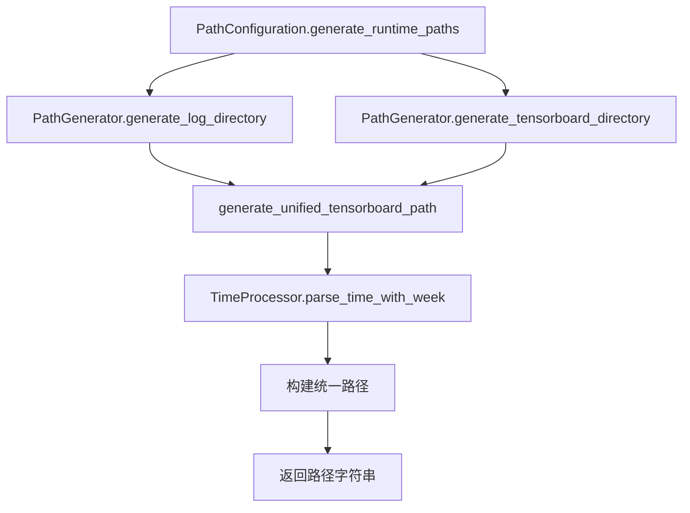

# TensorBoard目录统一技术设计

## 1. 设计概述

### 1.1 设计目标
- 统一`tsb_logs_dir`和`tensorboard_dir`的路径生成逻辑
- 确保两个配置项始终指向相同路径
- 最小化代码修改，降低风险

### 1.2 设计原则
1. **单一职责**: 路径生成逻辑集中在一处
2. **DRY原则**: 避免重复代码
3. **开闭原则**: 对扩展开放，对修改关闭

## 2. 技术方案

### 2.1 核心修改点

#### 2.1.1 修改`PathGenerator.generate_log_directory`方法
当前`tsb_logs_dir`的生成逻辑已经支持周数格式，但路径结构是：
```
{work_dir}/tsb_logs/{yyyy}/{WW}/{mm}/{dd}/{HHMMSS}
```

需要修改为：
```
{work_dir}/{yyyy}/{WW}/{mmdd}/{HHMMSS}
```

#### 2.1.2 修改`PathGenerator.generate_tensorboard_directory`方法
让其直接调用或复用`tsb_logs_dir`的生成逻辑，确保路径一致。

### 2.2 实现策略

#### 方案一：统一生成函数（推荐）
创建一个统一的TensorBoard路径生成函数，两个配置项都调用这个函数：

```python
def generate_unified_tensorboard_path(
    self,
    work_dir: str,
    date_str: str,
    time_str: str,
    first_start_time_str: str
) -> str:
    """生成统一的TensorBoard路径"""
    work_path = Path(work_dir)
    
    if first_start_time_str:
        try:
            year, week, month, day, time = TimeProcessor.parse_time_with_week(first_start_time_str)
            # 新格式：直接在work_dir下创建年/周/月日/时间结构
            return str(work_path / year / week / f"{month}{day}" / time)
        except Exception:
            # 降级到旧格式
            return str(work_path / date_str / time_str)
    else:
        return str(work_path / date_str / time_str)
```

#### 方案二：修改现有函数
直接修改两个现有的生成函数，但这会导致代码重复。

### 2.3 接口设计

#### 2.3.1 PathGenerator类修改
```python
class PathGenerator:
    def generate_log_directory(self, work_dir, date_str, time_str, first_start_time_str):
        """生成日志目录路径"""
        # 生成统一的TensorBoard路径
        tensorboard_path = self.generate_unified_tensorboard_path(
            work_dir, date_str, time_str, first_start_time_str
        )
        
        log_dirs = {
            'paths.tsb_logs_dir': tensorboard_path,
            'paths.log_dir': str(Path(work_dir) / 'logs' / date_str / time_str)
        }
        return log_dirs
    
    def generate_tensorboard_directory(self, work_dir, date_str, time_str, first_start_time_str):
        """生成TensorBoard目录路径"""
        # 复用统一的路径生成逻辑
        tensorboard_path = self.generate_unified_tensorboard_path(
            work_dir, date_str, time_str, first_start_time_str
        )
        
        return {
            'paths.tensorboard_dir': tensorboard_path
        }
```

### 2.4 数据流设计



## 3. 详细设计

### 3.1 路径组件格式
- **年份（yyyy）**: 4位数字，如"2025"
- **周数（WW）**: "W"前缀+2位周数，如"W02"、"W52"
- **月日（mmdd）**: 4位数字，月份和日期各2位，如"0108"
- **时间（HHMMSS）**: 6位数字，时分秒各2位，如"143025"

### 3.2 周数计算规则
使用ISO 8601标准：
- 每周从周一开始
- 第一周是包含该年第一个周四的那一周
- 使用Python的`datetime.isocalendar()`方法获取周数

### 3.3 异常处理
1. **时间解析失败**: 降级到使用date_str和time_str的简单格式
2. **路径创建权限问题**: 不在路径生成阶段处理，由调用方负责
3. **非法字符处理**: 时间组件都是数字，不存在非法字符问题

## 4. 兼容性设计

### 4.1 向后兼容
- 保持原有的函数签名不变
- 如果first_start_time_str为空或解析失败，使用原有的简单格式
- 不改变配置文件的结构

### 4.2 迁移策略
- 新生成的路径使用新格式
- 已存在的旧路径不做迁移
- 通过配置的自动更新机制，逐步过渡到新格式

## 5. 测试设计

### 5.1 单元测试
1. 测试统一路径生成函数的各种输入场景
2. 测试两个配置项生成相同路径
3. 测试异常情况的处理

### 5.2 集成测试
1. 测试完整的配置生成流程
2. 测试多进程环境下的路径一致性
3. 测试跨平台路径生成

## 6. 性能考虑

### 6.1 优化点
- 路径生成是纯计算操作，无I/O
- 时间解析结果可以缓存，避免重复计算
- 使用Path对象的join操作，比字符串拼接更高效

### 6.2 性能指标
- 路径生成时间 < 1ms
- 内存占用增长 < 1KB

## 7. 风险评估

### 7.1 技术风险
- **风险**: 修改路径生成逻辑可能影响现有功能
- **缓解**: 充分的测试覆盖，包括回归测试

### 7.2 兼容性风险
- **风险**: 新旧路径格式不一致
- **缓解**: 提供降级机制，支持两种格式

## 8. 实施建议

### 8.1 实施步骤
1. 实现`generate_unified_tensorboard_path`函数
2. 修改`generate_log_directory`使用新函数
3. 修改`generate_tensorboard_directory`使用新函数
4. 更新相关测试用例
5. 进行完整的回归测试

### 8.2 验证方法
1. 运行所有现有测试用例
2. 手动验证生成的路径格式
3. 检查两个配置项的值是否一致
4. 在不同操作系统上测试