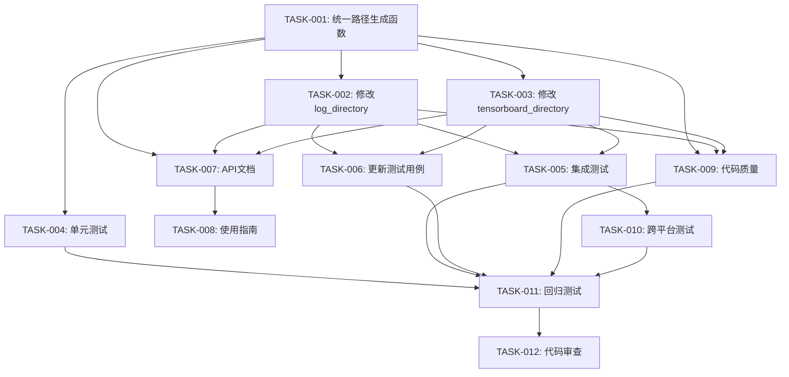

# TensorBoard目录统一实施任务列表

## 1. 任务概览

本文档定义了实现TensorBoard目录统一功能的具体任务列表，包括优先级、依赖关系和验收标准。

## 2. 任务列表

### 2.1 核心开发任务

#### TASK-001: 实现统一的TensorBoard路径生成函数
- **优先级**: P0（最高）
- **预计工时**: 2小时
- **依赖**: 无
- **描述**: 
  - 在`PathGenerator`类中添加`generate_unified_tensorboard_path`方法
  - 实现新的路径格式：`{work_dir}/{yyyy}/{WW}/{mmdd}/{HHMMSS}`
  - 包含异常处理和降级逻辑
- **验收标准**:
  - 函数能正确生成符合新格式的路径
  - 异常情况能正确降级到旧格式
  - 通过单元测试

#### TASK-002: 修改generate_log_directory方法
- **优先级**: P0
- **预计工时**: 1小时
- **依赖**: TASK-001
- **描述**:
  - 修改`PathGenerator.generate_log_directory`方法
  - 调用统一的路径生成函数生成`tsb_logs_dir`
  - 保持`log_dir`的原有逻辑不变
- **验收标准**:
  - `tsb_logs_dir`使用新的路径格式
  - 其他日志目录不受影响
  - 现有测试用例通过

#### TASK-003: 修改generate_tensorboard_directory方法
- **优先级**: P0
- **预计工时**: 1小时
- **依赖**: TASK-001
- **描述**:
  - 修改`PathGenerator.generate_tensorboard_directory`方法
  - 调用统一的路径生成函数
  - 确保返回值与`tsb_logs_dir`一致
- **验收标准**:
  - `tensorboard_dir`与`tsb_logs_dir`路径相同
  - 方法签名保持不变
  - 相关测试用例通过

### 2.2 测试任务

#### TASK-004: 编写统一路径生成函数的单元测试
- **优先级**: P0
- **预计工时**: 2小时
- **依赖**: TASK-001
- **描述**:
  - 测试正常时间解析场景
  - 测试异常时间解析场景
  - 测试边界条件（如年初、年末）
  - 测试不同平台的路径分隔符
- **验收标准**:
  - 测试覆盖率 > 90%
  - 所有测试用例通过
  - 包含正常和异常场景

#### TASK-005: 编写路径一致性集成测试
- **优先级**: P1
- **预计工时**: 1.5小时
- **依赖**: TASK-002, TASK-003
- **描述**:
  - 测试完整配置生成流程
  - 验证两个配置项始终相等
  - 测试配置更新后的一致性
- **验收标准**:
  - 集成测试覆盖主要使用场景
  - 验证路径一致性
  - 测试在CI/CD环境通过

#### TASK-006: 更新现有测试用例
- **优先级**: P1
- **预计工时**: 2小时
- **依赖**: TASK-002, TASK-003
- **描述**:
  - 识别受影响的测试用例
  - 更新测试用例中的路径期望值
  - 确保所有测试通过
- **验收标准**:
  - 所有现有测试用例更新完成
  - 测试套件100%通过
  - 无新增的测试失败

### 2.3 文档任务

#### TASK-007: 更新API文档
- **优先级**: P2
- **预计工时**: 1小时
- **依赖**: TASK-001, TASK-002, TASK-003
- **描述**:
  - 更新函数的docstring
  - 添加新路径格式的说明
  - 更新配置示例
- **验收标准**:
  - 所有修改的函数都有完整的文档
  - 文档包含新路径格式示例
  - 文档通过审查

#### TASK-008: 更新使用指南
- **优先级**: P2
- **预计工时**: 0.5小时
- **依赖**: TASK-007
- **描述**:
  - 更新README中的相关说明
  - 添加路径格式变更说明
  - 更新demo代码（如需要）
- **验收标准**:
  - README反映最新的路径格式
  - 包含迁移说明（如需要）
  - demo代码能正常运行

### 2.4 质量保证任务

#### TASK-009: 代码质量检查
- **优先级**: P1
- **预计工时**: 0.5小时
- **依赖**: TASK-001, TASK-002, TASK-003
- **描述**:
  - 运行ruff检查并修复问题
  - 确保代码符合项目规范
  - 检查类型提示完整性
- **验收标准**:
  - ruff检查无错误
  - 代码风格一致
  - 类型提示完整

#### TASK-010: 跨平台测试
- **优先级**: P2
- **预计工时**: 1小时
- **依赖**: TASK-005
- **描述**:
  - 在Linux环境测试
  - 在Windows环境测试（如可用）
  - 验证路径分隔符处理正确
- **验收标准**:
  - Linux环境测试通过
  - 路径在不同平台正确生成
  - 无平台相关的bug

### 2.5 部署任务

#### TASK-011: 回归测试
- **优先级**: P0
- **预计工时**: 1小时
- **依赖**: 所有开发和测试任务
- **描述**:
  - 运行完整的测试套件
  - 验证无功能退化
  - 检查性能指标
- **验收标准**:
  - 全部测试用例通过
  - 性能无明显下降
  - 无新增的错误日志

#### TASK-012: 代码审查和合并
- **优先级**: P0
- **预计工时**: 1小时
- **依赖**: TASK-011
- **描述**:
  - 提交代码审查
  - 响应审查意见
  - 合并到主分支
- **验收标准**:
  - 代码通过审查
  - 所有反馈已处理
  - 成功合并到主分支

## 3. 任务依赖关系图

## 4. 时间估算

### 4.1 总体估算
- **开发任务**: 4小时
- **测试任务**: 5小时
- **文档任务**: 1.5小时
- **质量保证**: 1.5小时
- **部署任务**: 2小时
- **总计**: 14小时

### 4.2 关键路径
最长路径：TASK-001 → TASK-002/003 → TASK-005 → TASK-010 → TASK-011 → TASK-012
预计完成时间：8小时（如并行执行部分任务）

## 5. 风险和缓解措施

### 5.1 技术风险
- **风险**: 路径格式变更影响现有数据
- **缓解**: 保留降级机制，支持旧格式

### 5.2 时间风险
- **风险**: 测试发现问题导致延期
- **缓解**: 预留20%的缓冲时间

### 5.3 质量风险
- **风险**: 遗漏边界条件
- **缓解**: 充分的测试覆盖和代码审查

## 6. 成功标准

1. 所有任务完成并通过验收
2. 代码覆盖率不低于现有水平
3. 无新增的P0/P1级别bug
4. 文档更新完整
5. 代码审查通过并合并

## 7. 后续工作

1. 监控新路径格式的使用情况
2. 收集用户反馈
3. 考虑是否需要提供旧数据迁移工具
4. 评估是否需要在其他路径配置中应用类似格式